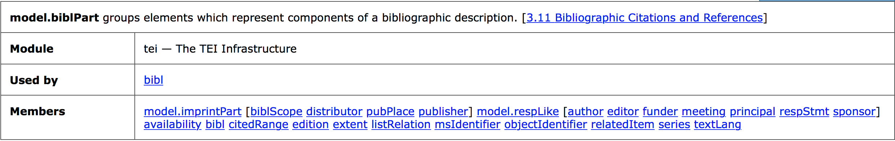
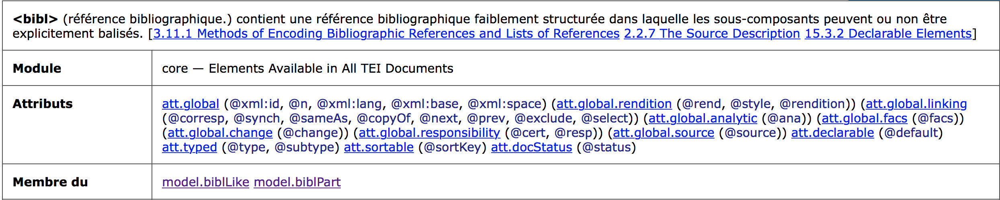

```{r setup, include=FALSE}
knitr::opts_chunk$set(echo = TRUE)
```

```{r include=FALSE}
library(formattable) # for digits
library(ggplot2) #(conflit with tidypackage)
library(methods)
library(plyr)
library(stringi) # to replace character
library(stringr) # Character manipulation, e.g., grep, agrep, gsub
library(XML)
library(xml2)
library(XML2R)

# to display in a browser
library(markdown)
library(htmltools)
```


<div style="margin-top: 20px"><b>Dans le cadre des formations “Humanités numériques” EPHE-PSL</b></div>

<h1 style="color:#B22222; text-transform: uppercase;">Introduction à l'encodage TEI</h1>

<div style="color: #696969">Enseignement : <a href="http://vanessabigot-juloux.xyz" target="_blank" style="color:#696969; border-bottom: 1px dashed #999; display: inline;">Vanessa Bigot Juloux</a> (EPHE-PSL, Andrews University)</div>

<br>

<div style="margin-top:15px;">

</div>
<hr style="height: 2px; border: 0; color: black; background-color: black;">

<h2 style="font-size: 20px; color: #808080"><a id="tei_sommaire" style="color: #808080">Sommaire</a></h2>
<h3 style="font-size: 16px"> Séance du 17 avril 2019</h3>

<ul style="list-style-type:upper-roman; text-align: justify; font-size: 14px">
<li><a href="#tei_xml_bref">En bref...</a></li>
<li><a href="#abcdaire_semantique">Bref abécédaire sémantique</a>.</li>
<li><a href="#tei_vs_xml"><code>TEI</code> versus <code>XML</code></a>.</li>
<li><a href="#pourquoi_tei">Pourquoi utiliser l’encodage <code>TEI</code></a>.</li>
<li><a href="#tei_questions_semantique">Questions de sémantique : module (notamment pour les <i>primary sources</i>), classes, <code>&lt;element&gt;</code>, <code>@attribut</code>.</a></li>
<li><a href="#tei_autres_langages">Autres langages à appréhender pour afficher les données <code>TEI</code> dans un navigateur : <code>CSS</code> et <code>XSLT</code></a> (brève introduction au cours de la <a>6e séance</a>).</li>
<li><a href="#tei_assistance">Assistance et groupes d’entraide en ligne (liste francophone Renater, liste anglophone TEI-L, TEI GitHub, Slack, Stackoverflow)</a>.</li>
</ul>


<hr style="height: 1px; border: 0; color: black; background-color: black;">
<h2 style="font-size: 20px; color: #808080">I. <a id="tei_xml_bref" style="color: #808080">En bref...</a></h2>

<ul style="text-align: justify">
<li>L'<i>Extensible Markup Language</i> (abr. <code>XML</code>) a été développé en 1996. </li>
<li> La <i>Text Encoding Initiative</i> (abr. <code>TEI</code>) a été créé en 1987. En 2000, le consortium <code>TEI-C</code> voit le jour ; <a href="https://tei-c.org/about/mission/" target="_blank">sa mission</a> : développer et maintenir les lignes directrices de la <code>TEI</code> -- il s'agit principalement d'un groupement de chercheurs internationaux qui collaborent au développement de la <code>TEI</code>, élus pour une période de 3 ans renouvelables au sein du <a href="https://tei-c.org/activities/Council/" target="_blank"><code>TEI</code> Technical Council</a>. Les recommandations sont disponibles sur le site <a href="https://www.tei-c.org/release/doc/tei-p5-doc/en/html/index.html" target="_blank">tei-c.org</a> et régulièrement mises à jour -- actuellement, version 3.5.0 de <code>TEI P5</code>.</li>

<hr style="border-style: dotted; border-color: #D3D3D3; margin-top: 50px; width: 250px;  margin-left: 0px" />
<p style="text-align: justify">Complément de lecture :<br>BURNARD, Lou. Qu’est-ce que la Text Encoding Initiative ? Nouvelle édition [en ligne]. Marseille : OpenEdition Press, 2015. Disponible sur Internet : <a href="http://books.openedition.org/oep/1237" target="_blank">http://books.openedition.org/oep/1237</a>. ISBN : 9782821855816. DOI : 10.4000/books.oep.1237.</p>


<p style="font-size:11px; background-color: #708090; width: 100px; padding: 5px;"><b><a href="#tei_sommaire" style="color: white">Sommaire &#8682;</a></b></p>


<br>
<hr>
<br>
<h2 style="font-size: 20px; color: #808080">II. <a id="abcdaire_semantique" style="color: #808080">Bref abécédaire sémantique</a></h2>

<ul style="text-align: justify">
<li><i>Markup language</i> : un système pour annoter un document à partir d'une codification syntaxique qui est aisément identifiable par rapport au contenu à analyser. <i>Markup languages</i> : <code>LaTeX</code>, <code>HTML</code>, <code>XHTML</code>, ainsi que les langages issus de <code>XML</code>, Resource Description Framework, (abr. <code>RDF</code>), Web Ontology Language (abr. <code>OWL</code>) et bien sûr, <code>TEI</code> -- il n'est pas rare de lire <code>TEI-XML</code>.</li>
<li>Balise(s) (= <i>tag(s)</i>) : Une balise est une <u>unité syntaxique</u> qui sera comprise et interprétée par un programme. Elle est entourée de deux chevrons ouvrant et fermant “<code>&lt;</code>” et “<code>&gt;</code>” ; par exemple pour indiquer respectivement le commencement et la fin d'un paragraphe : <br>
<code>&lt;p&gt;</code> “texte du paragraphe” <code>&lt;p&gt;</code>. "p" qui suit le chevron ouvrant de la balise ouvrante indique ici que l'information contenue entre la balise ouvrante et fermante est un paragraphe (voir III. <a href="#tei_element">Questions de sémantique : <code>&lt;element&gt;</code></a>)<br>
On parle de <u>balises ouvrante et fermante</u> -- ou de balises de début et de fin. Notez que pour la balise fermante (qui suit le contenu), le chevron fermant est précédé de <code>/</code>.<br>
Il existe également une <u>balise d'élément vide</u> lorsque il n'y a pas d'information à ajouter entre une balise ouvrante et une balise fermante. 
```{html}
<!-- Par exemple : <code>&lt;img src="adresse de l'image à insérer" /&gt;</code> -->

<!-- ou encore un saut de ligne <code>&lt;br /&gt;</code> -->
<br />
```
Notez que le chevron fermant la balise d'élément vide est précédé de <code>/</code>.</li>
</ul>
<br>
<p style="font-size:11px; background-color: #708090; width: 100px; padding: 5px;"><b><a href="#tei_sommaire" style="color: white">Sommaire &#8682;</a></b></p>


<br>
<hr>
<br>
<h2 style="font-size: 20px; color: #808080">III. <a id="tei_vs_xml" style="color: #808080"><code>TEI</code> versus <code>XML</code></a></h2>

<h3 style="font-size: 16px">Principaux points communs entre l'encodage <code>TEI</code> et <code>XML</code> </h3>
<ul style="text-align: justify">
<li> <code>TEI</code> et <code>XML</code> sont une forme de <i>Standard Generalized Markup Language</i>, abr. <code>SGML</code>, autrement dit un <b>langage de description</b> à balises (= <i>tag(s)</i>), permettant ainsi d'enrichir l'information désirée.</li>
<li> Un document <code>TEI</code> et <code>XML</code> a des <b>balises</b> insérées qui permettent de <u>structurer</u> l'information, par exemple en titre, chapitre, paragraphe, etc., en fonction du matériel étudié (livre, manuscrit, tablette...). </li>
<li>Pour situer un contenu balisé dans un document <code>TEI</code> et <code>XML</code>, le vocabulaire généalogique est utilisé : parent, enfant, frère, ancêtre, descendant (<i>parent, child, sibling, ancestor, descendent</i>) -- Voir <code>XPath</code>, <a href="">séance 2</a>.</li>
<li><code>TEI</code> et <code>XML</code> sont des <b>métalangages</b>, c'est-à-dire qu'ils ont tous les deux une grammaire particulière avec une syntaxe et une sémantique qu'ils leur sont propres. </li>
<li><code>TEI</code> et <code>XML</code> sont tous les deux <b>extensibles</b> : en fonction des besoins, l'utilisateur peut créer ses propres balises (<i>tags</i>) ou langage.</li>
</ul>

<h3 style="font-size: 16px">Différences entre l'encodage <code>TEI</code> et <code>XML</code></h3>

<ul style="text-align: justify">
<li>L'encodage <code>XML</code> est encodé selon la norme du <code>XML</code> décrite par le <i><a href="http://www.w3c.org/xml" target="_blank">World Wide Web Consortium</a></i><a href="#1"><sup style="font-size: 15px">1</sup></a>, abr. W3C (<a href="http://www.w3c.org/xml" target="_blank">http://www.w3c.org/xml</a>) ; tandis que l'encodage <code>TEI</code> est encodé selon la norme du <i><a href="https://www.tei-c.org" target="_blank">Text Encoding Initiative Consortium</a></i> (<a href="https://www.tei-c.org" target="_blank">https://www.tei-c.org</a>).</li>
<li><code>XML</code> est très largement utilisé pour distribuer les données sur Internet, permettre l'échange d'information entre les programmes, ainsi que par les traitements de texte ; tandis que l'encodage <code>TEI</code> va être utilisé pour une utilisation plus spécifique en particulier l'analyse de <a href="#tei_primary_sources">sources primaires</a>.</li>
<li><code>XML</code> est interopérable, c'est-à-dire qu'il permet la communication entre différents outils existants ou futurs, sans qu'il ne soit nécessaire de modifier le code ; tandis que la <code>TEI</code> est interchangeable, c'est-à-dire qu'elle permet l'échange de communication pour l'analyse des textes de différents corpus -- d'ailleur le “I” de <code>TEI</code> a quelques fois valeur de <i>interchange</i> -- au sujet de la <code>TEI</code> interopérable <i>vs</i> interchangeable : <cite>« TEI tags are usually of type 1, because they are the result of human interpretation. Most other XML tags, however, are of type 2 ».</cite> (Schmidt, 2014<a href="#2"><sup style="font-size: 15px">2</sup></a>).</li>
<li>La syntaxe de <code>XML</code> est moins précise que celle de la <code>TEI</code> pour l'encodage de documents textuels.  </li>
</ul>

<hr style="border-style: dotted; border-color: #D3D3D3; margin-top: 50px; width: 250px;  margin-left: 0px" />
<p style="text-align: justify">Complément de lecture :<br> BURNARD, Lou. La TEI et le XML In : Qu’est-ce que la Text Encoding Initiative ? [en ligne]. Marseille : OpenEdition Press, 2015. Disponible sur Internet : <a href="http://books.openedition.org/oep/1298" target="_blank">http://books.openedition.org/oep/1298</a>. ISBN : 9782821855816. DOI : 10.4000/books.oep.1298.</p>

<p style="font-size:10px; text-align: justify"><a id="1">[1]</a> : <a href="https://www.w3.org/Consortium/" target="_blank">https://www.w3.org/Consortium/</a><br>
<a id="2">[2]</a> : Desmond Schmidt, « Towards an Interoperable Digital Scholarly Edition », Journal of the Text Encoding Initiative [Online], Issue 7 | November 2014, Online since 01 January 2014. URL : <a href="http://journals.openedition.org/jtei/979" target="_blank">http://journals.openedition.org/jtei/979</a> ; DOI : 10.4000/jtei.979.
</p>

<p style="font-size:11px; background-color: #708090; width: 100px; padding: 5px;"><b><a href="#tei_sommaire" style="color: white">Sommaire &#8682;</a></b></p>

<br>
<hr>
<br>
<h2 style="font-size: 20px; color: #808080">IV. <a id="pourquoi_tei" style="color: #808080">Pourquoi utiliser l’encodage <code>TEI</code></a> </h2>


<br><br>
<p style="text-align: justify"><cite><i>La TEI met l’accent sur ce qui est partagé par tous les types de documents, qu’ils soient représentés physiquement sous une forme numérique sur un disque ou une carte mémoire, sous une forme imprimée comme un livre ou un journal, sous une forme écrite comme un manuscrit ou un codex, ou sous une forme inscrite dans la pierre ou sur une tablette de cire. Cette continuité facilite la migration du texte depuis des manifestations plus anciennes, comme l’imprimé ou le manuscrit, vers d’autres plus récentes comme le disque ou l’écran. C’est pourquoi la vision de la TEI de ce qu’est le texte est largement conditionnée par ce que le texte a été dans le passé, sans toutefois trop compromettre ce que le texte peut devenir dans le futur. Elle essaie de traiter tous les types de documents numériques de la même façon, qu’ils soient « nativement numériques » ou non.</i></cite> -- source : Burnard, Lou. 2015, Qu’est-ce que la Text Encoding Initiative ? Nouvelle édition [en ligne]. Marseille : OpenEdition Press, 2015. Disponible sur Internet : <a href="http://books.openedition.org/oep/1237" target="_blank">http://books.openedition.org/oep/1237</a>. ISBN : 9782821855816. DOI : 10.4000/books.oep.1237.</p>

Voir également la vidéo suivante :<br><br> [](https://player.vimeo.com/video/14671161 "Julia Flanders - Lecture from Center for Digital Humanities")


<p style="font-size:11px; background-color: #708090; width: 100px; padding: 5px;"><b><a href="#tei_sommaire" style="color: white">Sommaire &#8682;</a></b></p>

<br>
<hr>
<br>
<h2 style="font-size: 20px; color: #808080">V. <a id="tei_questions_semantique" style="color: #808080">Questions de sémantique : module (notamment pour les <i>primary sources</i>), classes, <code>&lt;element&gt;</code>, <code>@attribut</code></a> </h2>

<p style="text-align: justify">Un document <code>TEI</code> est constitué de plusieurs <b>modules</b>, imbriqués ou non, dans lesquels se trouvent plusieurs <code>&lt;element&gt;</code>s et <code>@attribut</code>s ordonnés dans des <b>classes</b>.</p>

<h3 style="font-size: 16px">Au sujet des classes de modèles (relatives aux <code>&lt;element&gt;</code>s) : </h3>
<p>Une <a href="https://www.tei-c.org/release/doc/tei-p5-doc/en/html/ST.html#STECCM" target="_blank">classe de modèle</a> permet d'ordonner les <code>&lt;element&gt;</code>s. Les classes peuvent être imbriquées : il y a des classes supérieures et inférieures -- les <code>&lt;element&gt;</code>s d'une classe B héritent alors de la classe supérieure A (voir l'exemple <a href="tei_model_biblPart">ci-dessous</a>) ; autrement dit, les classes de modèles sont <b>ordonnées hiérarchiquement</b> selon une logique sémantique au sein d'un module.
Il existe à ce jour <a href="https://www.tei-c.org/release/doc/tei-p5-doc/en/html/REF-CLASSES-MODEL.html" target="_blank">119 classes de modèles</a> ou classes d'<code>&lt;element&gt;</code>s référencés Conventionnellement, une classe d'<code>&lt;element&gt;</code> est préfixée de “model.” et s'écrit “model.+ <code>&lt;element&gt;</code> principal”.<br>
Exemple pour <a id="tei_model_biblPart">model.biblPart</a> :<br><br>
<a href="https://www.tei-c.org/release/doc/tei-p5-doc/en/html/ref-model.biblPart.html" target="_blank"></a><br><br>
Explication : la classe d'<code>&lt;element&gt;</code> model.biblPart du module [tei] est utilisée par l'élément <a href="https://www.tei-c.org/release/doc/tei-p5-doc/fr/html/ref-bibl.html" target="_blank"><code>&lt;bibl&gt;</code></a> et deux autres classes d'<code>&lt;element&gt;</code>s sont membres de model.biblPart, <a href="https://www.tei-c.org/release/doc/tei-p5-doc/fr/html/ref-model.imprintPart.html" target="_blank">model.imprintPart</a> et <a href="https://www.tei-c.org/release/doc/tei-p5-doc/fr/html/ref-model.respLike.html" target="_blank">model.respLike</a>.</p><br>
```{xml}
<!-- Source : https://www.tei-c.org/release/doc/tei-p5-doc/fr/html/ref-bibl.html -->
<bibl>
 <title level="a">L'Enracinement</title>
 <author>Simone Weil</author>, <title>Prélude à une déclaration des devoirs envers l'être
   humain </title>. <publisher>Gallimard</publisher>
 <date>1968</date>.
</bibl>
```
<br>
<p>Dans l'exemple précédent, on distingue l'utilisation de plusieurs classes d'<code>&lt;element&gt;</code>s : model.biblPart [<code>&lt;bibl&gt;</code>] dans lequel sont inclus (1) model.imprintPart [<code>&lt;publisher&gt;</code>], (2) l'élément <code>&lt;bibl&gt;</code> membre du module [core] et les <code>&lt;element&gt;</code>s <code>&lt;titre&gt;</code> et <code>&lt;date&gt;</code> membre également du module [core]. on remarque bien ici l'imbrication d'<code>&lt;element&gt;</code>s appartenant à des classes d'<code>&lt;element&gt;</code>s contenus dans des modules.<br>
Note : <code>&lt;bibl&gt;</code> est membre à la fois de model.biblLike et model.biblPart. Autrement dit, un <code>&lt;element&gt;</code> peut être membre de plusieurs classes d'<code>&lt;element&gt;</code>s, donc de plusieurs modules. Plus généralement, il faut retenir qu' <b>une classe d'<code>&lt;element&gt;</code> hérite de la classe “parent” dont il est l'enfant</b>.<br><br>
<a href="https://www.tei-c.org/release/doc/tei-p5-doc/fr/html/ref-bibl.html" target="_blank"></a></p>  <br></p>

<h3 style="font-size: 16px">Au sujet des classes d'<code>@attribut</code>s : </h3>
<p>Une classe d'<code>@attribut</code>s permet d'ordonner les <code>@attribut</code>s, selon la même logique que pour les classes d'<code>&lt;element&gt;</code>s. Il existe actuellement <a href="https://www.tei-c.org/release/doc/tei-p5-doc/en/html/REF-CLASSES-ATTS.html#index-back.1_div.2_div.1" target="_blank">74 classes</a> d'<code>@attribut</code>s disctinctes -- dans certains cas, de nouvelles classes ont été ajoutées aux classes d'<code>@attribut</code>s, comme c'est le cas par exemple de <a href="https://www.tei-c.org/release/doc/tei-p5-doc/en/html/REF-CLASSES-ATTS.html#" target="_blank">att.global.facs</a> qui “appartient” à <a href="https://www.tei-c.org/release/doc/tei-p5-doc/en/html/ST.html#STGA" target="_blank">att.global</a>. On dit alors, par exemple, que la classe att.global est étendue à la classe att.global.facs laquelle ne contient que l'<code>@attribut</code> <code>@facs</code>. Conventionnellement, une classe d'<code>@attribut</code>s est préfixée de “att.” et s'écrit “att.+ <code>@attribut</code> principal”.</p>

<h3 style="font-size: 16px">Au sujet des <code>&lt;element&gt;</code>s :</h3>
<p>Chaque <code>&lt;element&gt;</code> appartient à une <b>classe de modèle</b> <code>&lt;element&gt;</code>s</b>. Il existe à ce jour 573 <code>&lt;element&gt;</code>s (voir le détail de la dernière mise à jour, janvier 2019 : <a href="https://github.com/TEIC/TEI/commit/3c0c64ec4" target="_blank">3c0c64ec4</a> de la TEI P5 <a href="https://www.tei-c.org/release/doc/tei-p5-doc/readme-3.5.0.html" target="_blank">version 3.5.0</a>. </p>

<h4 style="font-size: 14px">Qu'est-ce qu'un <a id="tei_element"><code>&lt;element&gt;</code></a> :</h4>
<p><cite><i>In the context of Text Encoding Initiative (<code>TEI</code>), an element, which is a markup tag, is the first criterion to analyze data (text, image, sound, etc.). An element is conventionally marked up <code>&lt;element&gt;</code>. The markup data in between the opening tag “<” and the closing tag “>” indicates the type of information analyzed: for example, <code>&lt;persName&gt;</code>ʿAnatu<code>&lt;/persName&gt;</code>. One can easily understand that the element refers
to a personal name, in this example ʿAnatu … Generally, the semantic of an <element> is very close in its abbreviation to its English vocabulary. For example, <code>&lt;interp&gt;</code> stands for interpretation, <code>&lt;w&gt;</code> for word, <code>&lt;l&gt;</code> for line, and <code>&lt;text&gt;</code> for text.</i></cite> (Bigot Juloux, Vanessa. 2018, <a href=https://brill.com/view/title/34932?format=HC" target="_blank"><i>CyberResearch on the Ancient Near East and Neighboring Regions. Case Studies on Archaeological Data, Objects, Texts, and Digital Archiving</i></a>, Vanessa Bigot Juloux, Amy Rebecca Gansell, Alessandro di Ludovico (eds.), Leiden: Brill)</p>

<h3 style="font-size: 16px">Au sujet des <code>@attribut</code>s :</h3>
<p>Chaque <code>@attribut</code> appartient à une <a href="https://www.tei-c.org/release/doc/tei-p5-doc/en/html/REF-CLASSES-ATTS.html#" target="_blank">classe d'<code>@attribut</code>s</a>. 
Il existe 261 <code>@attribut</code>s. Un élément a généralement un <code>@attribut</code> auquel on ajoute une valeur.</p>

<h4 style="font-size: 14px">Qu'est-ce qu'un <code>@attribut</code> :</h4>
<p><cite><i>an attribute adds useful precision both for text analysis and for interpretation during the process of the exchange of data. An attribute stands within the element tag.</i></cite>(<i>Ibidem</i> Bigot Juloux 2018)</p>

<h3 style="font-size: 16px"> Liste détaillée des modules incluant les éléments inclus dans chacun des modules</h3>
<ul>
<li><a href="https://www.tei-c.org/release/doc/tei-p5-doc/en/html/AI.html" target="_blank">Simple analytic mechanisms</a> [analysis] :<br>
&#8594; <code>c</code> | <code>cl</code> | <code>interpGrp</code> | <code>m</code> | <code>pc</code> | <code>phr</code> | <code>s</code> | <code>span</code> | <code>spanGrp</code> | <code>w</code>
</li>
<li><a href="https://www.tei-c.org/release/doc/tei-p5-doc/en/html/CE.html" target="_blank">Certainty, precision, and responsability</a> [certainty] :<br>
&#8594; <code>certainty</code> | <code>precision</code> | <code>respons</code></li>
<li><a href="https://www.tei-c.org/release/doc/tei-p5-doc/en/html/CO.html" target="_blank">Elements common to all TEI documents</a> [core] :<br>
&#8594; <code>abbr</code> | <code>add</code> | <code>addrLine</code> | <code>address</code> | <code>analytic</code> | <code>author</code> | <code>bibl</code> | <code>biblScope</code> | <code>biblStruct</code> | <code>binaryObject</code> | <code>cb</code> | <code>choice</code> | <code>cit</code> | <code>citedRange</code> | <code>corr</code> | <code>date</code> | <code>del</code> | <code>desc</code> | <code>distinct</code> | <code>divGen</code> | <code>editor</code> | <code>email</code> | <code>emph</code> | <code>expan</code> | <code>foreign</code> | <code>gap</code> | <code>gb</code> | <code>gloss</code> | <code>graphic</code> | <code>head</code> | <code>headItem</code> | <code>headLabel</code> | <code>hi</code> | <code>imprint</code> | <code>index</code> | <code>item</code> | <code>l</code> | <code>label</code> | <code>lb</code> | <code>lg</code> | <code>list</code> | <code>listBibl</code> | <code>measure</code> | <code>measureGrp</code> | <code>media</code> | <code>meeting</code> | <code>mentioned</code> | <code>milestone</code> | <code>monogr</code> | <code>name</code> | <code>note</code> | <code>num</code> | <code>orig</code> | <code>p</code> | <code>pb</code> | <code>postBox</code> | <code>postCode</code> | <code>ptr</code> | <code>pubPlace</code> | <code>publisher</code> | <code>q</code> | <code>quote</code> | <code>ref</code> | <code>reg</code> | <code>relatedItem</code> | <code>resp</code> | <code>respStmt</code> | <code>rs</code> | <code>said</code> | <code>series</code> | <code>sic</code> | <code>soCalled</code> | <code>sp</code> | <code>speaker</code> | <code>stage</code> | <code>street</code> | <code>teiCorpus</code> | <code>term</code> | <code>textLang</code> | <code>time</code> | <code>title</code> | <code>unclear</code> | <code>unit</code></li>
<li><a href="https://www.tei-c.org/release/doc/tei-p5-doc/en/html/CC.html" target="_blank">Corpus texts</a> [corpus] :<br>
&#8594; <code>activity</code> | <code>channel</code> | <code>constitution</code> | <code>derivation</code> | <code>domain</code> | <code>factuality</code> | <code>interaction</code> | <code>locale</code> | <code>particDesc</code> | <code>preparedness</code> | <code>purpose</code> | <code>setting</code> | <code>settingDesc</code> | <code>textDesc</code></li>
<li><a href="https://www.tei-c.org/release/doc/tei-p5-doc/en/html/DI.html" target="_blank">Dictionaries</a> [dictionaries] :<br>
&#8594; <code>case</code> | <code>colloc</code> | <code>def</code> | <code>dictScrap</code> | <code>entry</code> | <code>entryFree</code> | <code>etym</code> | <code>form</code> | <code>gen</code> | <code>gram</code> | <code>gramGrp</code> | <code>hom</code> | <code>hyph</code> | <code>iType</code> | <code>lang</code> | <code>lbl</code> | <code>mood</code> | <code>number</code> | <code>oRef</code> | <code>orth</code> | <code>pRef</code> | <code>per</code> | <code>pos</code> | <code>pron</code> | <code>re</code> | <code>sense</code> | <code>stress</code> | <code>subc</code> | <code>superEntry</code> | <code>syll</code> | <code>tns</code> | <code>usg</code> | <code>xr</code></li>
<li><a href="https://www.tei-c.org/release/doc/tei-p5-doc/en/html/DR.html" target="_blank">Performance texts</a> [drama] :<br>
&#8594; <code>actor</code> | <code>camera</code> | <code>caption</code> | <code>castGroup</code> | <code>castItem</code> | <code>castList</code> | <code>epilogue</code> | <code>move</code> | <code>performance</code> | <code>prologue</code> | <code>role</code> | <code>roleDesc</code> | <code>set</code> | <code>sound</code> | <code>spGrp</code> | <code>tech</code> | <code>view</code></li>
<li><a href="https://www.tei-c.org/release/doc/tei-p5-doc/en/html/FT.html" target="_blank">Tables, formulæ, notated music, and figures</a> [figures] :<br>
&#8594; <code>cell</code> | <code>figDesc</code> | <code>figure</code> | <code>formula</code> | <code>notatedMusic</code> | <code>row</code> | <code>table</code></li>
<li><a href="https://www.tei-c.org/release/doc/tei-p5-doc/en/html/WD.html" target="_blank">Character and glyph documentation</a> [gaiji] :<br>
&#8594; <code>char</code> | <code>charDecl</code> | <code>charName</code> | <code>charProp</code> | <code>g</code> | <code>glyph</code> | <code>glyphName</code> | <code>localName</code> | <code>mapping</code> | <code>unicodeName</code> | <code>value</code></li>
<li><a href="https://www.tei-c.org/release/doc/tei-p5-doc/en/html/HD.html" target="_blank">The <code>TEI</code> header</a> [header] :<br>
&#8594; <code>abstract</code> | <code>appInfo</code> | <code>application</code> | <code>authority</code> | <code>availability</code> | <code>biblFull</code> | <code>cRefPattern</code> | <code>calendar</code> | <code>calendarDesc</code> | <code>catDesc</code> | <code>catRef</code> | <code>category</code> | <code>change</code> | <code>classCode</code> | <code>classDecl</code> | <code>correction</code> | <code>correspAction</code> | <code>correspContext</code> | <code>correspDesc</code> | <code>creation</code> | <code>distributor</code> | <code>edition</code> | <code>editionStmt</code> | <code>editorialDecl</code> | <code>encodingDesc</code> | <code>extent</code> | <code>fileDesc</code> | <code>funder</code> | <code>geoDecl</code> | <code>handNote</code> | <code>hyphenation</code> | <code>idno</code> | <code>interpretation</code> | <code>keywords</code> | <code>langUsage</code> | <code>language</code> | <code>licence</code> | <code>listChange</code> | <code>listPrefixDef</code> | <code>namespace</code> | <code>normalization</code> | <code>notesStmt</code> | <code>prefixDef</code> | <code>principal</code> | <code>profileDesc</code> | <code>projectDesc</code> | <code>publicationStmt</code> | <code>punctuation</code> | <code>quotation</code> | <code>refState</code> | <code>refsDecl</code> | <code>rendition</code> | <code>revisionDesc</code> | <code>samplingDecl</code> | <code>schemaRef</code> | <code>scriptNote</code> | <code>segmentation</code> | <code>seriesStmt</code> | <code>sourceDesc</code> | <code>sponsor</code> | <code>stdVals</code> | <code>styleDefDecl</code> | <code>tagUsage</code> | <code>tagsDecl</code> | <code>taxonomy</code> | <code>teiHeader</code> | <code>textClass</code> | <code>titleStmt</code> | <code>xenoData</code></li>
<li><a href="https://www.tei-c.org/release/doc/tei-p5-doc/en/html/FS.html" target="_blank">Feature structures</a> [iso-fs] :<br>
&#8594; <code>bicond</code> | <code>binary</code> | <code>cond</code> | <code>default</code> | <code>f</code> | <code>fDecl</code> | <code>fDescr</code> | <code>fLib</code> | <code>fs</code> | <code>fsConstraints</code> | <code>fsDecl</code> | <code>fsDescr</code> | <code>fsdDecl</code> | <code>fsdLink</code> | <code>fvLib</code> | <code>if</code> | <code>iff</code> | <code>numeric</code> | <code>string</code> | <code>symbol</code> | <code>then</code> | <code>vAlt</code> | <code>vColl</code> | <code>vDefault</code> | <code>vLabel</code> | <code>vMerge</code> | <code>vNot</code> | <code>vRange</code></li>
<li><a href="https://www.tei-c.org/release/doc/tei-p5-doc/en/html/SA.html" target="_blank">Linking, segmentation and alignment</a> [linking] :<br>
&#8594; <code>ab</code> | <code>alt</code> | <code>altGrp</code> | <code>anchor</code> | <code>join</code> | <code>joinGrp</code> | <code>link</code> | <code>linkGrp</code> | <code>seg</code> | <code>timeline</code> | <code>when</code></li>
<li><a href="https://www.tei-c.org/release/doc/tei-p5-doc/en/html/MS.html" target="_blank">Manuscript Description</a> [msdescription] :<br>
&#8594; <code>accMat</code> | <code>acquisition</code> | <code>additional</code> | <code>additions</code> | <code>adminInfo</code> | <code>altIdentifier</code> | <code>binding</code> | <code>bindingDesc</code> | <code>catchwords</code> | <code>collation</code> | <code>collection</code> | <code>colophon</code> | <code>condition</code> | <code>custEvent</code> | <code>custodialHist</code> | <code>decoDesc</code> | <code>decoNote</code> | <code>depth</code> | <code>dim</code> | <code>dimensions</code> | <code>explicit</code> | <code>filiation</code> | <code>finalRubric</code> | <code>foliation</code> | <code>handDesc</code> | <code>height</code> | <code>heraldry</code> | <code>history</code> | <code>incipit</code> | <code>institution</code> | <code>layout</code> | <code>layoutDesc</code> | <code>locus</code> | <code>locusGrp</code> | <code>material</code> | <code>msContents</code> | <code>msDesc</code> | <code>msFrag</code> | <code>msIdentifier</code> | <code>msItem</code> | <code>msItemStruct</code> | <code>msName</code> | <code>msPart</code> | <code>musicNotation</code> | <code>objectDesc</code> | <code>objectType</code> | <code>origDate</code> | <code>origPlace</code> | <code>origin</code> | <code>physDesc</code> | <code>provenance</code> | <code>recordHist</code> | <code>repository</code> | <code>rubric</code> | <code>scriptDesc</code> | <code>seal</code> | <code>sealDesc</code> | <code>secFol</code> | <code>signatures</code> | <code>source</code> | <code>stamp</code> | <code>summary</code> | <code>support</code> | <code>supportDesc</code> | <code>surrogates</code> | <code>typeDesc</code> | <code>typeNote</code> | <code>watermark</code> | <code>width</code></li>
<li><a href="https://www.tei-c.org/release/doc/tei-p5-doc/en/html/ND.html" target="_blank">Names and dates</a> [namesdates] :<br>
&#8594; <code>addName</code> | <code>affiliation</code> | <code>age</code> | <code>birth</code> | <code>bloc</code> | <code>climate</code> | <code>country</code> | <code>death</code> | <code>district</code> | <code>education</code> | <code>event</code> | <code>faith</code> | <code>floruit</code> | <code>forename</code> | <code>genName</code> | <code>geo</code> | <code>geogFeat</code> | <code>geogName</code> | <code>langKnowledge</code> | <code>langKnown</code> | <code>listEvent</code> | <code>listNym</code> | <code>listObject</code> | <code>listOrg</code> | <code>listPerson</code> | <code>listPlace</code> | <code>listRelation</code> | <code>location</code> | <code>nameLink</code> | <code>nationality</code> | <code>nym</code> | <code>object</code> | <code>objectIdentifier</code> | <code>objectName</code> | <code>occupation</code> | <code>offset</code> | <code>org</code> | <code>orgName</code> | <code>persName</code> | <code>person</code> | <code>personGrp</code> | <code>persona</code> | <code>place</code> | <code>placeName</code> | <code>population</code> | <code>region</code> | <code>relation</code> | <code>residence</code> | <code>roleName</code> | <code>settlement</code> | <code>sex</code> | <code>socecStatus</code> | <code>state</code> | <code>surname</code> | <code>terrain</code> | <code>trait</code></li>
<li><a href="https://www.tei-c.org/release/doc/tei-p5-doc/en/html/GD.html" target="_blank">Graphs, networks, and trees</a> [nets] :<br>
&#8594; <code>arc</code> | <code>eLeaf</code> | <code>eTree</code> | <code>forest</code> | <code>graph</code> | <code>iNode</code> | <code>leaf</code> | <code>listForest</code> | <code>node</code> | <code>root</code> | <code>tree</code> | <code>triangle</code></li>
<li><a href="https://www.tei-c.org/release/doc/tei-p5-doc/en/html/TS.html" target="_blank">Transcribed of speech</a> [spoken] :<br>
&#8594; <code>annotationBlock</code> | <code>broadcast</code> | <code>equipment</code> | <code>incident</code> | <code>kinesic</code> | <code>pause</code> | <code>recording</code> | <code>recordingStmt</code> | <code>scriptStmt</code> | <code>shift</code> | <code>transcriptionDesc</code> | <code>u</code> | <code>vocal</code> | <code>writing</code></li>
<li><a href="https://www.tei-c.org/release/doc/tei-p5-doc/en/html/TD.html" target="_blank">Documentation of <code>TEI</code> modules</a> [tagdocs] :<br>
&#8594; <code>altIdent</code> | <code>alternate</code> | <code>anyElement</code> | <code>att</code> | <code>attDef</code> | <code>attList</code> | <code>attRef</code> | <code>classRef</code> | <code>classSpec</code> | <code>classes</code> | <code>code</code> | <code>constraint</code> | <code>constraintSpec</code> | <code>content</code> | <code>dataFacet</code> | <code>dataRef</code> | <code>dataSpec</code> | <code>datatype</code> | <code>defaultVal</code> | <code>eg</code> | <code>egXML</code> | <code>elementRef</code> | <code>elementSpec</code> | <code>empty</code> | <code>equiv</code> | <code>exemplum</code> | <code>gi</code> | <code>ident</code> | <code>listRef</code> | <code>macroRef</code> | <code>macroSpec</code> | <code>memberOf</code> | <code>model</code> | <code>modelGrp</code> | <code>modelSequence</code> | <code>moduleRef</code> | <code>moduleSpec</code> | <code>outputRendition</code> | <code>param</code> | <code>paramList</code> | <code>paramSpec</code> | <code>remarks</code> | <code>schemaSpec</code> | <code>sequence</code> | <code>specDesc</code> | <code>specGrp</code> | <code>specGrpRef</code> | <code>specList</code> | <code>tag</code> | <code>textNode</code> | <code>val</code> | <code>valDesc</code> | <code>valItem</code> | <code>valList</code></li>
<li><a href="https://www.tei-c.org/release/doc/tei-p5-doc/en/html/TC.html" target="_blank">Critical Apparatus</a> [textcrit] :<br>
&#8594; <code>app</code> | <code>lacunaEnd</code> | <code>lacunaStart</code> | <code>lem</code> | <code>listApp</code> | <code>listWit</code> | <code>rdg</code> | <code>rdgGrp</code> | <code>variantEncoding</code> | <code>wit</code> | <code>witDetail</code> | <code>witEnd</code> | <code>witStart</code> | <code>witness</code></li>
<li><a href="https://www.tei-c.org/release/doc/tei-p5-doc/en/html/DS.html" target="_blank">Default text structure</a> [textstructure] :<br>
&#8594; <code>TEI</code> | <code>argument</code> | <code>back</code> | <code>body</code> | <code>byline</code> | <code>closer</code> | <code>dateline</code> | <code>div</code> | <code>div1</code> | <code>div2</code> | <code>div3</code> | <code>div4</code> | <code>div5</code> | <code>div6</code> | <code>div7</code> | <code>docAuthor</code> | <code>docDate</code> | <code>docEdition</code> | <code>docImprint</code> | <code>docTitle</code> | <code>epigraph</code> | <code>floatingText</code> | <code>front</code> | <code>group</code> | <code>imprimatur</code> | <code>opener</code> | <code>postscript</code> | <code>salute</code> | <code>signed</code> | <code>text</code> | <code>titlePage</code> | <code>titlePart</code> | <code>trailer</code></li>
<li><a href="https://www.tei-c.org/release/doc/tei-p5-doc/en/html/TC.html" id="tei_primary_sources" target="_blank">Transcription of primary sources</a> [transcr] -- Fac-similé numérique : copie ou reproduction d'une œuvre (texte ou image) identique à la source originale :<br>
&#8594; <code>addSpan</code> | <code>am</code> | <code>damage</code> | <code>damageSpan</code> | <code>delSpan</code> | <code>ex</code> | <code>facsimile</code> | <code>fw</code> | <code>handNotes</code> | <code>handShift</code> | <code>line</code> | <code>listTranspose</code> | <code>metamark</code> | <code>mod</code> | <code>path</code> | <code>redo</code> | <code>restore</code> | <code>retrace</code> | <code>secl</code> | <code>sourceDoc</code> | <code>space</code> | <code>subst</code> | <code>substJoin</code> | <code>supplied</code> | <code>surface</code> | <code>surfaceGrp</code> | <code>surplus</code> | <code>transpose</code> | <code>undo</code> | <code>zone</code>
<ul>
<li>Exemple 1, fac-similé dont la surface n'est pas précisément définie, sans distinction de zone : 
```{xml}
<!-- Source : https://www.tei-c.org/release/doc/tei-p5-doc/en/html/PH.html -->
<facsimile>
 <surfaceGrp n="leaf1">
  <surface>
   <graphic url="page1.png"/>
  </surface>
  <surface>
   <graphic url="page2-highRes.png"/>
   <graphic url="page2-lowRes.png"/>
  </surface>
 </surfaceGrp>
</facsimile>
```
</li>
<li>Exemple 2, fac-similé dont deux des zones à l'intérieur de la surface sont définies précisément : 
```{xml}
<!-- Source : https://www.tei-c.org/release/doc/tei-p5-doc/en/html/PH.html -->
  <facsimile>
 <surface ulx="50" uly="20" lrx="400"
  lry="280">
  <zone ulx="0" uly="0" lrx="500" lry="321">
   <graphic url="http://upload.wikimedia.org/wikipedia/commons/5/50/Handschrift.karlsruhe.blb.jpg"/>
  </zone>
  <zone ulx="50" uly="20" lrx="210" lry="280">
<!-- left hand page -->
  </zone>
  <zone ulx="240" uly="25" lrx="400"
   lry="280">
<!-- right hand page -->
  </zone>
  <zone ulx="90" uly="40" lrx="200" lry="225">
<!--- written part of left hand page -->
  </zone>
 </surface>
</facsimile>
```
</li>
<li>Exemple 3, fac-similé avec une transcription en parallèle de plusieurs zones à l'intérieur de la surface :
```{xml}
<!-- Source : https://www.tei-c.org/release/doc/tei-p5-doc/en/html/PH.html -->
<!-- sélection des zones à transcrire dans la surface -->
<facsimile>
 <surface ulx="0" uly="0" lrx="200" lry="300">
  <zone xml:id="B49r" ulx="0" uly="0"
   lrx="200" lry="300">
   <graphic url="Bovelles-49r.png"/>
  </zone>
  <zone ulx="105" uly="76" lrx="175"
   lry="160">
   <graphic url="Bovelles49r-detail.png"/>
  </zone>
  <zone xml:id="B49rHead" ulx="25" uly="25"
   lrx="180" lry="60"/>
<!-- contains the title -->
  <zone xml:id="B49rPara2" ulx="28" uly="75"
   lrx="175" lry="178"/>
<!-- contains the first paragraph in italics -->
  <zone xml:id="B49rFig1" ulx="105" uly="76"
   lrx="175" lry="160"/>
<!-- contains the figure -->
  <zone xml:id="B49rW457" ulx="45" uly="125"
   lrx="60" lry="130"/>
<!-- contains the word "pendans" -->
 </surface>
</facsimile>
     
<!-- Transcription du contenu textuel/image dans chacune des zones précédemment sélectionnées -->
<pb facs="#B49r"/>
<fw>De Geometrie 49</fw>
<head facs="#B49rHead"> DU SON ET ACCORD DES CLOCHES ET <lb/> des alleures des
 chevaulx, chariotz &amp; charges, des fontaines:&amp; <lb/> encyclie du monde,
 &amp; de la dimension du corps humain.<lb/> Chapitre septiesme</head>
<div n="1">
 <p>Le son &amp; accord des cloches pendans en ung mesme <lb/> axe, est faict en
   contraires parties.</p>
 <p rend="it" facs="#B49rPara2">LEs cloches ont quasi fi<lb/>gures de rondes
   pyra<lb/>mides imperfaictes &amp; <lb/> irregulieres: &amp; leur accord se
 <lb/> fait par reigle geometrique. Com<lb/>me si les deux cloches C &amp; D
 <lb/> sont <w facs="#B49rW457">pendans</w> à ung mesme axe <lb/> ou essieu A B:
   je dis que leur ac<lb/>cord se fera en co<ex>n</ex>traires parties<lb/>
   co<ex>m</ex>me voyez icy figuré. Car qua<ex>n</ex>d <lb/> lune sera en
   hault, laultre declinera embas. Aultrement si elles decli<lb/>nent toutes deux
   ensembles en une mesme partie, elles seront discord, <lb/> &amp; sera leur
   sonnerie mal plaisante à oyr.<figure facs="#B49rFig1">
   <graphic url="Bovelles49r-detail.png"/>
  </figure>
 </p>
</div>     
```
<u>Explication</u> :
La transcription est faite à partir d'un document dont les coordonnées de la surface sont définies : 
<ul>
<li>Coin en haut à gauche, <code>@ulx</code> = 0 et <code>@uly</code> = 0</li>
<li>Coin en bas à droite, <code>@lrx</code> = 200 et <code>@lry</code> = 300.</li>
</ul>
Dans cette surface <code>&lt;surface&gt;</code> (à savoir une image d'une représentation textuelle par exemple), cinq zones <code>&lt;zone&gt;</code> sont identifiées/sélectionnées -- toujours avec des coordonnées <code>@ulx</code> et <code>@uly</code> --, chacune avec un <code>@xml:id</code> <u>unique</u>. Ces <code>@xml:id</code> permettront d'identifier la transcription (ou le commentaire) de chacune des zones (images) sélectionnées : 
<ul>
<li><code>@xml:id="B49r"</code> => <code>@facs="#B49r"</code></li>
<li><code>@xml:id="B49rHead"</code> => <code>@facs="#B49rHead"</code></li>
<li><code>@xml:id="B49rPara2"</code> => <code>@facs="#B49rPara2"</code></li>
<li><code>@xml:id="B49rFig1"</code> => <code>@facs="#B49rFig1"</code></li>
<li><code>@xml:id="B49rW457"</code> => <code>@facs="#B49rW457"</code></li>
</ul>
Note : Conventionnellement, un <code>#</code> précède chaque <code>@facs</code> (membre de la classe d'<code>@attribut</code> <a href="https://www.tei-c.org/release/doc/tei-p5-doc/en/html/ref-att.global.facs.html" target="_blank">att.global.facs</a>) qui pointe (renvoie) vers l'<code>@xml:id</code> (membre de la classe d'<code>@attribut</code>s <a href="https://www.tei-c.org/release/doc/tei-p5-doc/en/html/ST.html#STGA" target="_blank">att.global</a>) correspondant : <code>@facs="<span style="background-color: black; padding: 2px; color: white">#</span>B49r"</code> &#8594; <code>@xml:id="B49r"</code>.
</li>
</ul>
</li>
<li><a href="https://www.tei-c.org/release/doc/tei-p5-doc/en/html/VE.html" target="_blank">Verse structures</a> [verse] :<br>
&#8594; <code>caesura</code> | <code>metDecl</code> | <code>metSym</code> | <code>rhyme</code></li>
<li><a href="https://www.tei-c.org/release/doc/tei-p5-doc/en/html/ST.html" target="_blank">TEI Infrastructure</a> [tei] for the declarations for classes, datatypes, and macros available to all TEI modules -- voir <a id="#tei_infrastructure">section suivante.</li>
</ul>
<br>
<p style="font-size:11px; background-color: #708090; width: 100px; padding: 5px;"><b><a href="#tei_sommaire" style="color: white">Sommaire &#8682;</a></b></p>

<br>
<hr>
<br>
<h2 style="font-size: 20px; color: #808080">VI. <a id="#tei_autres_langages"  style="color: #808080">Autres langages à appréhender pour afficher les données <code>TEI</code> dans un navigateur : <code>CSS</code> et <code>XSLT</code></a></h2>

<h3 style="font-size: 16px">Qu'est-ce que <code>CSS</code></h3>
<p><a href="https://www.w3.org/Style/CSS/Overview.en.html" target="_blank">Cascading Style Sheets</a> (abr. <code>CSS</code>, feuille de style) permet d'ajouter du style aux documents, notamment <code>HTML</code (Hyper Text Markup Language), <code>XML</code> et <code>TEI</code> -- couleur, alignement, polices de caractère, tableaux, espacement... Un groupe du travail du W3C met à jour régulièrement les recommandations pour chaque style -- exemple, <a href="https://www.w3.org/TR/2019/WD-css-color-4-20190305/" target="_blank">color</a>. <br>
Parmi de nombreux sites qui permettent d'appréhender le <code>CSS</code>, celui du <a href="https://www.w3.org/Style/CSS/learning" target="_blank">W3C</a> ; <a href="https://www.alsacreations.com/tuto/liste/2-css.html" target="_blank">alsacreations</a> propose également une série de tutoriels très accessibles, ainsi qu'un <a href="https://forum.alsacreations.com/search.php" target="_blank">forum d'entraide</a> (inscription [gratuite] requise), tout comme <a href="https://stackoverflow.com/questions/tagged/css" target="_blank">stackoverflow</a>. <a href="https://www.w3schools.com/css/default.asp" target="_blank">w3schools.com</a> propose une liste de tous les styles avec des exemples, avec la possibilité de tester un style à  partir d'un des exemples donnés sur le site.</p>
<br>
```{html}
<!-- Source : https://www.w3schools.com/css/css_syntax.asp -->
p {
  color: red;
  text-align: center;
}
```
<br>
<p>Explication : Tous les contenus textuels situés dans les paragraphes (<code>p</code>) seront de couleur rouge et le texte aligné au centre.</p>
<p>Il existe des services de validation en ligne pour vérifier si vos styles sont conformes aux normes recommandées par les W3C, en particulier pour être aux normes “accessibilité pour tous” -- exemple <a href="http://www.css-validator.org/validator.html.fr" target="_blank">CSS Validation Servicew</a>.</p>
<h3 style="font-size: 16px">Qu'est-ce que <code>XSLT</code></h3>
<p>eXtensible Stylesheet Language Transformations (abr. <code>XSLT</code>) permet de transformer un document <code>XML</code> et <code>TEI</code> de sorte qu'il puisse être aisément consultable et fonctionnel. Le format de transformation ne se limite pas à une page <code>HTML</code>, mais aussi au PDF ou à l'impression papier -- plus généralement un document au format texte.</p>
<p>Le W3C met à jour les <a href="https://www.w3.org/TR/xslt-30/" target="_blank">recommandations <code>XSLT</code></a>. 
Connaître <code>XSLT</code> n'est pas suffisant : il est impératif de connaître <code>XPath</code> pour sélectionner le contenu désiré à afficher.</p>
<p> <a href="https://www.w3schools.com/xml/xsl_intro.asp" target="_blank">w3schools.com</a> permet d'appréhender <code>XSLT</code>, avec la possibilité de tester quelques éléments de tranformations dont les <code>template</code>s</p>
<p>Voir la <a href="">section destinée</a> <code>XSLT</code> (dernière séance)

<br>
<div class="footer">
<p style="font-size:11px; background-color: #708090; width: 100px; padding: 5px;"><b><a href="#tei_sommaire" style="color: white">Sommaire &#8682;</a></b></p>
</div>


<hr style="padding-top: 20px; padding-bottom: 10px">
<h2 style="font-size: 20px; color: #808080;"> VII. <a id="tei_assistance" style="color: #808080">Assistance et groupes d’entraide en ligne (liste francophone Renater, liste anglophone `TEI-L`, `TEI` GitHub, Slack, Stackoverflow)</a></h2>

<ul>
<li>Liste francophone Renater <a href="https://groupes.renater.fr/wiki/tei-fr/index" target="_blank">TEI-FR</a> -- seulement accessible aux abonnés</li>
<li>Liste anglophone <a href="https://listserv.brown.edu/archives/cgi-bin/wa?A0=TEI-L" target="_blank">TEI-L</a> (Adresse de message rie pour s'incrire <a href="mailto:TEI-L-subscribe-request@LISTSERV.BROWN.EDU">TEI-L-subscribe-request@LISTSERV.BROWN.EDU</a> ou directement sur la <a href="http://listserv.brown.edu/archives/cgi-bin/wa?SUBED1=tei-l&A=1" target="_blank">page de la liste</a>) -- les <a href="https://listserv.brown.edu/cgi-bin/wa?INDEX&X=OC9503DB3F87D081B81&Y=vanessajuloux%40me.com" target="_blank">archives</a> sont accessibles sans abonnement.</li>
<li>Les wikis de la <code>TEI</code> dont certains sont liés aux <code>SIG</code>s -- voir <a href="">la séance 6</a> consacrée notamment au <code>TEI SIG</code>s.
<li><a href="https://github.com/TEIC/TEI/issues" target="_blank">TEI GitHub</a> -- plutôt pour des questions niveau avancé</li>
<li><a href="https://digitalhumanities.slack.com" target="_blank">Slack</a> -- exemple, <i>channel</i> “<a href="https://digitalhumanities.slack.com/messages/C0CH64EHM/" target=_blank">textencoding</a>”.</li>
<li><a href="https://stackoverflow.com/questions/tagged/tei" target="_blank">Stackoverflow</a> -- <a href="https://stackoverflow.com/questions/ask/wizard" target="_blank"><i>Wizard</i></a> (assitant) pour néophyte sur Stackoverflow</li>
</ul>
<br>
Littérature scientifique : [https://journals.openedition.org/jtei/](https://journals.openedition.org/jtei/)
<br>
Rester informé-e, fil Twitter [`TEI` Consortium](https://twitter.com/TEIconsortium)

<br>
<p style="font-size:11px; background-color: #708090; width: 100px; padding: 5px;"><b><a href="#tei_sommaire" style="color: white">Sommaire &#8682;</a></b></p>


<br>
<hr style="height: 1px; border: 0; color: black; background-color: black;">
<span style="font-size: 14px; color: #708090">Vanessa Bigot Juloux (EPHE-PSL, Andrews University)</span>
