```{r setup, include=FALSE}
knitr::opts_chunk$set(echo = TRUE)
```

```{r include=FALSE}
library(formattable) # for digits
library(ggplot2) #(conflit with tidypackage)
library(methods)
library(plyr)
library(stringi) # to replace character
library(stringr) # Character manipulation, e.g., grep, agrep, gsub
library(XML)
library(xml2)
library(XML2R)

# to display in a browser
library(markdown)
library(htmltools)
```


<div style="margin-top: 20px"><b>Dans le cadre des formations “Humanités numériques” EPHE-PSL</b></div>

<h1 style="color:#B22222; text-transform: uppercase;">Introduction à l'encodage TEI</h1>

<div style="color: #696969">Enseignement : <a href="http://vanessabigot-juloux.xyz" target="_blank" style="color:#696969; border-bottom: 1px dashed #999; display: inline;">Vanessa Bigot Juloux</a> (EPHE-PSL, Andrews University)</div>

<br>

<div style="margin-top:15px;">

</div>
<hr style="height: 2px; border: 0; color: black; background-color: black;">

<h2 style="font-size: 20px; color: #808080"><a id="tei_sommaire" style="color: #808080">Sommaire</a></h2>

<h3 style="font-size: 16px">Séance du 17 avril 2019 (1)</h3>
<ul style="list-style-type:upper-roman; text-align: justify; font-size: 14px">
<li><a href="#tei_xml_bref">En bref...</a></li>
<li><a href="#abcdaire_semantique">Bref abécédaire sémantique</a>.</li>
<li><a href="#tei_vs_xml"><code>TEI</code> versus <code>XML</code></a>.</li>
<li><a href="#pourquoi_tei">Pourquoi utiliser l’encodage <code>TEI</code></a>.</li>
<li><a href="#tei_doc">Comment est structuré un document <code>TEI</code>.</li>
<li><a href="#tei_questions_semantique">Questions de sémantique : module (notamment pour les <i>primary sources</i>), classes, <code>&lt;element&gt;</code>, <code>&#64;attribut</code>.</a></li>
<li><a href="#tei_autres_langages">Autres langages à appréhender pour afficher les données <code>TEI</code> dans un navigateur : <code>CSS</code> et <code>XSLT</code></a> (brève introduction au cours de la <a>6e séance</a>).</li>
<li><a href="#tei_assistance">Assistance et groupes d’entraide en ligne (liste francophone Renater, liste anglophone TEI-L, TEI GitHub, Slack, Stackoverflow)</a>.</li>
</ul>

<h3 style="font-size: 16px">Séance (en ligne) du 7 mai 2019 (2)</h3>
<ul style="list-style-type:upper-roman; text-align: justify; font-size: 14px">
<li><a href="#tei_carte">Carte heuristique (exemple : XMind) : indispensable pour déterminer les besoins, les données à afficher et/ou à manipuler.</a></li>
<li><a href="#tei_intro_ODD">Brève introduction au manuel d’encodage <code>ODD</code>.</a></li>
<li><a href="#tei_intro_SchemaTEI">Introduction à la structuration d’un schéma <code>TEI</code> en particulier le module <code>[tei]</code>.</a></li>
</ul>

<h3 style="font-size: 16px">Séance du 15 mai 2019 (3)</h3>
<ul style="list-style-type:upper-roman; text-align: justify; font-size: 14px">
<li><a href="#tei_intro_SchemaTEI">Introduction à la structuration d’un schéma <code>TEI</code> en particulier le module [tei]</a> (suite).</li>
<li><a href="#tei_td_XmindDico">TD : carte heuristique d'un dictionnaire en ligne pour les 11-13 ans</a></li> 
<li><a href="#tei_modTextstructure">Module [textstructure] : dictionnaire en ligne pour les 11-13 ans</a></li>
</ul>

<h3 style="font-size: 16px">Séance (en ligne) du 21 mai 2019 (4)</h3>
<ul style="list-style-type:upper-roman; text-align: justify; font-size: 14px">
<li><a href="#tei_xpath">Arborescence d’un document <code>TEI</code>, brève introduction à <code>XPath</code></a>.</li>
<li><a href="#tei_modLinking">Module [linking] pour les liens hypertextuels</a></li>
</ul>

<h3 style="font-size: 16px">Séance du 22 mai 2019 (5)</h3>
<ul style="list-style-type:upper-roman; text-align: justify; font-size: 14px">
<li><a href="#tei_schemaTeiHeader">Schéma d’entête <code>&lt;teiHeader&gt;</code></a></li>
<li><a href="#tei_bib">Citations et références bibliographiques</a></li>
<li><a href="#carteHeuristique_corpus">Carte heuristique pour l'encodage d'un manuscrit (préparation du point 3 de la séance du 26 mai)</a></li>
</ul>

<h3 style="font-size: 16px">Séance (en ligne) du 26 mai 2019 (6)</h3>
<ul style="list-style-type:upper-roman; text-align: justify; font-size: 14px">
<li><a href="#tei_relationsNœuds"><code>&#64;attribut</code>s pour créer une relation entre deux ou plusieurs nœuds</a></li>
<li><a href="#tei_teiCorpus-Content">Encodage pour un corpus : <code>&lt;teiCorpus&gt;</code> du module [core] et <i>primary source</i></a></li>
<li><a href="#xslt_intro">Brève introduction à <code>XSLT</code></a></li>
</ul>

<h3 style="font-size: 16px">Séance (en ligne) du 28 mai 2019 (7)</h3>
<ul style="list-style-type:upper-roman; text-align: justify; font-size: 14px">
<li><a id="#tei_modNamesdates">Module [namesdates] pour les noms, dates, personnes et lieux géographiques</a></li>
<li><a href="#regex">Brève introduction aux expressions régulières (REGEX)</a></li>
</ul>


<hr style="height: 1px; border: 0; color: black; background-color: black;">
<h2 style="font-size: 20px; color: #808080">1.I. <a id="tei_xml_bref" style="color: #808080">En bref...</a></h2>

<ul style="text-align: justify">
<li>L'<i>Extensible Markup Language</i> (abr. <code>XML</code>) a été développé en 1996. </li>
<li>La <i>Text Encoding Initiative</i> (abr. <code>TEI</code>) a été créée en 1987 à l'initiative d'un groupe d'experts membres de l'<a href="https://en.wikipedia.org/wiki/Association_for_Computers_and_the_Humanities" target="_blank"><i>Association for Computer and the Humanities</i></a>, de l'<a href="https://en.wikipedia.org/wiki/Association_for_Computational_Linguistics" target="_blank"><i>Association for Computational Linguistics</i></a> et de l'<a href="https://en.wikipedia.org/wiki/Association_for_Literary_and_Linguistic_Computing" target="_blank"><i>Association for Literary and Linguistic Computing</i></a>. C'est au cours d'une conférence à <a href="https://www.tei-c.org/Vault/ED/edp01.htm#b2b1b3b3b3" target="_blank">Poughkeepsie que les recommandations et principes ont été définis</a>. En 2000, le consortium <code>TEI-C</code> (association sans but lucratif) voit le jour ; <a href="https://tei-c.org/about/mission/" target="_blank">sa mission</a> : développer et maintenir les lignes directrices de la <code>TEI</code> &mdash; il s'agit principalement d'un groupement de chercheurs internationaux qui collaborent au développement de la <code>TEI</code>, élus pour une période de 3 ans renouvelables au sein du <a href="https://tei-c.org/activities/Council/" target="_blank"><code>TEI</code> Technical Council</a>. Les recommandations sont disponibles sur le site <a href="https://www.tei-c.org/release/doc/tei-p5-doc/en/html/index.html" target="_blank">tei-c.org</a> et régulièrement mises à jour &mdash; actuellement, version 3.5.0 de <code>TEI P5</code>.</li>

<hr style="border-style: dotted; border-color: #D3D3D3; margin-top: 50px; width: 250px;  margin-left: 0px" />
<p style="text-align: justify">Complément de lecture :<br>BURNARD, Lou. Qu’est-ce que la Text Encoding Initiative ? Nouvelle édition [en ligne]. Marseille : OpenEdition Press, 2015. Disponible sur Internet : <a href="http://books.openedition.org/oep/1237" target="_blank">http://books.openedition.org/oep/1237</a>. ISBN : 9782821855816. DOI : 10.4000/books.oep.1237.</p>


<p style="font-size:11px; background-color: #708090; width: 100px; padding: 5px;"><b><a href="#tei_sommaire" style="color: white">Sommaire &#8682;</a></b></p>


<br>
<hr>
<br>
<h2 style="font-size: 20px; color: #808080">1.II. <a id="abcdaire_semantique" style="color: #808080">Bref abécédaire sémantique</a></h2>

<ul style="text-align: justify">
<li><i>Markup language</i> : un système pour annoter un document à partir d'une codification syntaxique qui est aisément identifiable par rapport au contenu à analyser. <i>Markup languages</i> : <code>LaTeX</code>, <code>HTML</code>, <code>XHTML</code>, ainsi que les langages issus de <code>XML</code>, Resource Description Framework, (abr. <code>RDF</code>), Web Ontology Language (abr. <code>OWL</code>) et bien sûr, <code>TEI</code> &mdash; il n'est pas rare de lire <code>TEI-XML</code>.</li>
<li>Balise(s) (= <i>tag(s)</i>) : Une balise est une <u>unité syntaxique</u> qui sera comprise et interprétée par un programme. Elle est entourée de deux chevrons ouvrant et fermant “<code>&lt;</code>” et “<code>&gt;</code>” ; par exemple pour indiquer respectivement le commencement et la fin d'un paragraphe : <br>
<code>&lt;p&gt;</code> “texte du paragraphe” <code>&lt;p&gt;</code>. "p" qui suit le chevron ouvrant de la balise ouvrante indique ici que l'information contenue entre la balise ouvrante et fermante est un paragraphe (voir III. <a href="#tei_element id="tei_element_content">Questions de sémantique : <code>&lt;element&gt;</code></a>)<br>
On parle de <u>balises ouvrante et fermante</u> &mdash; ou de balises de début et de fin. Notez que pour la balise fermante (qui suit le contenu), le chevron fermant est précédé de <code>/</code>.<br>
Il existe également une <u>balise d'élément vide</u> lorsque il n'y a pas d'information à ajouter entre une balise ouvrante et une balise fermante. 
```{html}
<!-- Par exemple : <code>&lt;img src="adresse de l'image à insérer" /&gt;</code> -->

<!-- ou encore un saut de ligne <code>&lt;br /&gt;</code> -->
<br />
```
Notez que le chevron fermant la balise d'élément vide est précédé de <code>/</code>.</li>
</ul>
<br>
<p style="font-size:11px; background-color: #708090; width: 100px; padding: 5px;"><b><a href="#tei_sommaire" style="color: white">Sommaire &#8682;</a></b></p>


<br>
<hr>
<br>
<h2 style="font-size: 20px; color: #808080">1.III. <a id="tei_vs_xml" style="color: #808080"><code>TEI</code> versus <code>XML</code></a></h2>

<h3 style="font-size: 16px">Principaux points communs entre l'encodage <code>TEI</code> et <code>XML</code> </h3>
<ul style="text-align: justify">
<li> <code>TEI</code> et <code>XML</code> sont une forme de <i>Standard Generalized Markup Language</i>, abr. <code>SGML</code>, autrement dit un <b>langage de description</b> à balises (= <i>tag(s)</i>), permettant ainsi d'enrichir l'information désirée.</li>
<li> Un document <code>TEI</code> et <code>XML</code> a des <b>balises</b> insérées qui permettent de <u>structurer</u> l'information, par exemple en titre, chapitre, paragraphe, etc., en fonction du matériel étudié (livre, manuscrit, tablette...). </li>
<li>Pour situer un contenu balisé dans un document <code>TEI</code> et <code>XML</code>, le vocabulaire généalogique est utilisé : parent, enfant, frère, ancêtre, descendant (<i>parent, child, sibling, ancestor, descendent</i>) &mdash; Voir <code>XPath</code>, <a href="">séance 2</a>.</li>
<li><code>TEI</code> et <code>XML</code> sont des <b>métalangages</b>, c'est-à-dire qu'ils ont tous les deux une grammaire particulière avec une syntaxe et une sémantique qu'ils leur sont propres. </li>
<li><code>TEI</code> et <code>XML</code> sont tous les deux <b>extensibles</b> : en fonction des besoins, l'utilisateur peut créer ses propres balises (<i>tags</i>) ou langage.</li>
</ul>

<h3 style="font-size: 16px">Différences entre l'encodage <code>TEI</code> et <code>XML</code></h3>

<ul style="text-align: justify">
<li>L'encodage <code>XML</code> est encodé selon la norme du <code>XML</code> décrite par le <i><a href="http://www.w3c.org/xml" target="_blank">World Wide Web Consortium</a></i><a href="#1" id="1-back"><sup style="font-size: 10px">1</sup></a>, abr. W3C (<a href="http://www.w3c.org/xml" target="_blank">http://www.w3c.org/xml</a>) ; tandis que l'encodage <code>TEI</code> est encodé selon la norme du <i><a href="https://www.tei-c.org" target="_blank">Text Encoding Initiative Consortium</a></i> (<a href="https://www.tei-c.org" target="_blank">https://www.tei-c.org</a>).</li>
<li><code>XML</code> est très largement utilisé pour distribuer les données sur Internet, permettre l'échange d'information entre les programmes, ainsi que par les traitements de texte ; tandis que l'encodage <code>TEI</code> va être utilisé pour une utilisation plus spécifique en particulier l'analyse de <a href="#tei_primary_sources">sources primaires</a>.</li>
<li><code>XML</code> est interopérable, c'est-à-dire qu'il permet la communication entre différents outils existants ou futurs, sans qu'il ne soit nécessaire de modifier le code ; tandis que la <code>TEI</code> est interchangeable, c'est-à-dire qu'elle permet l'échange de communication pour l'analyse des textes de différents corpus &mdash; d'ailleur le “I” de <code>TEI</code> a quelques fois valeur de <i>interchange</i> &mdash; au sujet de la <code>TEI</code> interopérable <i>vs</i> interchangeable : <cite>« TEI tags are usually of type 1, because they are the result of human interpretation. Most other XML tags, however, are of type 2 ».</cite> (Schmidt, 2014<a href="#2" id="2-back"><sup style="font-size: 10px">2</sup></a>).</li>
<li>La syntaxe de <code>XML</code> est moins précise que celle de la <code>TEI</code> pour l'encodage de documents textuels.  </li>
</ul>

<hr style="border-style: dotted; border-color: #D3D3D3; margin-top: 50px; width: 250px;  margin-left: 0px" />
<p style="text-align: justify">Complément de lecture :<br> BURNARD, Lou. La TEI et le XML In : Qu’est-ce que la Text Encoding Initiative ? [en ligne]. Marseille : OpenEdition Press, 2015. Disponible sur Internet : <a href="http://books.openedition.org/oep/1298" target="_blank">http://books.openedition.org/oep/1298</a>. ISBN : 9782821855816. DOI : 10.4000/books.oep.1298.</p>

<p style="font-size:10px; text-align: justify"><a id="1" style="color: #808080">[1]</a> : <a href="https://www.w3.org/Consortium/" target="_blank">https://www.w3.org/Consortium/</a> <a href="#1-back"><b>&#8613;</b><br>
<a id="2" style="color: #808080">[2]</a> : Desmond Schmidt, « Towards an Interoperable Digital Scholarly Edition », Journal of the Text Encoding Initiative [Online], Issue 7 | November 2014, Online since 01 January 2014. URL : <a href="http://journals.openedition.org/jtei/979" target="_blank">http://journals.openedition.org/jtei/979</a> ; DOI : 10.4000/jtei.979.<a href="#2-back"><b>&#8613;</b>
</p>

<p style="font-size:11px; background-color: #708090; width: 100px; padding: 5px;"><b><a href="#tei_sommaire" style="color: white">Sommaire &#8682;</a></b></p>

<br>
<hr>
<br>
<h2 style="font-size: 20px; color: #808080">1.IV. <a id="pourquoi_tei" style="color: #808080">Pourquoi utiliser l’encodage <code>TEI</code></a> </h2>


<br><br>
<p style="text-align: justify"><cite><i>La TEI met l’accent sur ce qui est partagé par tous les types de documents, qu’ils soient représentés physiquement sous une forme numérique sur un disque ou une carte mémoire, sous une forme imprimée comme un livre ou un journal, sous une forme écrite comme un manuscrit ou un codex, ou sous une forme inscrite dans la pierre ou sur une tablette de cire. Cette continuité facilite la migration du texte depuis des manifestations plus anciennes, comme l’imprimé ou le manuscrit, vers d’autres plus récentes comme le disque ou l’écran. C’est pourquoi la vision de la TEI de ce qu’est le texte est largement conditionnée par ce que le texte a été dans le passé, sans toutefois trop compromettre ce que le texte peut devenir dans le futur. Elle essaie de traiter tous les types de documents numériques de la même façon, qu’ils soient « nativement numériques » ou non.</i></cite> &mdash; source : Burnard, Lou. 2015, Qu’est-ce que la Text Encoding Initiative ? Nouvelle édition [en ligne]. Marseille : OpenEdition Press, 2015. Disponible sur Internet : <a href="http://books.openedition.org/oep/1237" target="_blank">http://books.openedition.org/oep/1237</a>. ISBN : 9782821855816. DOI : 10.4000/books.oep.1237.</p>

Voir également la vidéo suivante :<br><br> [](https://player.vimeo.com/video/14671161 "Julia Flanders - Lecture from Center for Digital Humanities")


<p style="font-size:11px; background-color: #708090; width: 100px; padding: 5px;"><b><a href="#tei_sommaire" style="color: white">Sommaire &#8682;</a></b></p>

<br>
<hr>
<br>

<h2 style="font-size: 20px; color: #808080">1.V. <a id="tei_doc" style="color: #808080">Comment est structuré un document <code>TEI</code></a></h2>

<h3 style="font-size: 16px;">Déclaration de la structure du schéma</h3>
<p style="text-align: justify">Par défaut dans Oxygen, à la création d'un nouveau document <code>TEI</code>, voici le code qui précède les <code>&lt;element&gt;</code>s :</p>

```{xml}
<?xml version="1.0" encoding="UTF-8"?>
<?xml-model href="http://www.tei-c.org/release/xml/tei/custom/schema/relaxng/tei_all.rng" type="application/xml" schematypens="http://relaxng.org/ns/structure/1.0"?>
<?xml-model href="http://www.tei-c.org/release/xml/tei/custom/schema/relaxng/tei_all.rng" type="application/xml"
	schematypens="http://purl.oclc.org/dsdl/schematron"?>
```

<h4 style="font-size: 14px;">Explications :</h4>
<ul style="text-align: justify">
<li><code>&lt;?xml version="1.0" encoding="UTF-8"?&gt;</code> : déclaration du jeu de caractères ; dans le cas précis <a href="https://fr.wikipedia.org/wiki/UTF-8" target="_blank">Universal Character Set Transformation Format - 8 bits</a> (abr. “UTF-8”) &mdash; <a href="http://www.iana.org/assignments/character-sets/character-sets.xhtml" target="_blank">liste de jeu de caractères possible</a>. <code>version="..."</code> permet de définir la version de <code>XML</code> utlisée sachant que la “version 1.0” est celle qui est la plus courante.</li>
<li><code>&lt;?xml-model href="IRI-reference" type="application/xml" schematypens="IRI-reference"?&gt;</code> : indication du modèle de schéma à suivre pour que le processeur puisse lire les instructions ; dans le cas précis le <a href="https://fr.wikipedia.org/wiki/Langage_de_description_de_format_de_document" target="_blank">langage de description</a>  “<a href="https://fr.wikipedia.org/wiki/Relax_NG" target="_blank">Regular Language for XML Next Generation</a>” (abr. “Relax NG”) qui spécifie la structure des documents <code>XML</code>.<br>
<p style="text-align: justify">&#8594; <code>href</code> précise la localisation du schéma de référence grâce un type d'adresse informatique <code>&lt;IRI-reference&gt;</code> (“<a href="https://fr.wikipedia.org/wiki/Internationalized_Resource_Identifier" target="_blank">Internationalized Resource Identifier</a>”, abr. ‘IRI”)<br>
&#8594; <a href="https://www.w3.org/TR/xml-model/#PA-type" target="_blank"><code>type</code></a> specifie le type de contenu référencé dans le schéma ; dans le cas précis <code>XML</code><br> 
&#8594; <a href="https://www.w3.org/TR/xml-model/#PA-schematypens" target="_blank"><code>schematypens</code></a> specificie le nom du <code>namespace</code> du langage de schéma ; dans le cas précis <code>schematron</code> &mdash; <a href="https://www.w3.org/TR/xml-model/#d0e689" target="_blank"><code>type</code> et <code>schematypens</code></a> permettent l'identification des schémas utilisés. </p>
</li>
</ul>

<p>Un langage de schéma : un schéma permet de définir les règles de validité qui suit le vocabulaire <code>XML</code><br>
<a href="http://schematron.com" target="_blank">Schematron</a> est un langage qui permet de valider la structure d'un document <code>XML</code>. Lire également le schéma <a href="https://tei-c.org/release/doc/tei-p5-doc/en/html/ST.html#STIN" target="_blank"><code>TEI</code></a>.</p>

<h3 style="font-size: 16px;">Déclaration du <a id="tei_namespace" style="color: #808080"><code>namespace</code></a> relatif à l'encodage <code>TEI</code></h3>

```{xml}
<TEI xmlns="http://www.tei-c.org/ns/1.0">
```

<h4 style="font-size: 14px;">Explications :</h4>
<p>Une fois les déclarations de schémas faites, il faut définir le <code>namespace</code> de référence dans le plus haut niveau du document “TEI”.<br>
&#8594; Un <a href="https://fr.wikipedia.org/wiki/Espace_de_noms_XML" target="_blank"><code>namespace</code></a> permet d'indiquer à quel domaine les <code>&lt;element&gt;</code>s et <code>&#64;attribut</code>s font référence ; un <a href="https://www.w3.org/TR/xml-names/" target="_blank"><code>namespace</code></a> est unique et suit les recommandations du W3C. A lire également les “<a href="https://tei-c.org/release/doc/tei-p5-doc/en/html/USE.html#CFNS" target="_blank">TEI namespaces</a>”. Sa <a href="https://www.w3.org/TR/xml-names/#ns-decl" target="_blank">syntaxe</a> se compose d'un attribut <code>xmlns</code> suivi de l'<i>Uniform Resource Identifier</i> (abr. “URI”) de référence ; dans le cas précis, celle de la “TEI” <code>http://www.tei-c.org/ns/1.0</code>. Ainsi pour chaque <code>namespace</code> dans le document “TEI”, l'URI permettra de comparer sa conformité ou non.<br>
&#8594; L'élement <code>TEI</code>, membre du module du <i>Default Text Structure</i> [textstructure]. Si le document est composé de plusieurs <code>TEI</code>, <code>teiCorpus</code> (pour le moment) est à privilégier, suivi de plusieurs <code>TEI</code> &mdash; voici d'autres exemples de <a href="https://tei-c.org/release/doc/tei-p5-doc/en/html/examples-TEI.html" target="_blank"><i>Default Text Structure</i></a>.</p>

<hr style="border-style: dotted; border-color: #D3D3D3; margin-top: 50px; width: 250px;  margin-left: 0px" />
<p style="text-align: justify">Complément de lecture :<br>
<a href="https://www.w3.org/TR/xml-model/" target="_blank"><i>Associating Schemas with XML documents 1.0 (Third Edition)</i></a><br>
<a href="https://www.w3.org/TR/xmlschema-2/" target="_blank" target="_blank">XML Schema Part 2: Datatypes Second Edition</a>
</p>

<p style="font-size:11px; background-color: #708090; width: 100px; padding: 5px;"><b><a href="#tei_sommaire" style="color: white">Sommaire &#8682;</a></b></p>

<br>
<hr>
<br>

<h2 style="font-size: 20px; color: #808080">1.VI. <a id="tei_questions_semantique" style="color: #808080">Questions de sémantique : module (notamment pour les <i>primary sources</i>), classes, <code>&lt;element&gt;</code>, <code>&#64;attribut</code></a> </h2>

<p style="text-align: justify">Un document <code>TEI</code> est constitué de plusieurs <b>modules</b>, imbriqués ou non, dans lesquels se trouvent plusieurs <code>&lt;element&gt;</code>s et <code>&#64;attribut</code>s ordonnés dans des <b>classes</b>.</p>

<h3 style="font-size: 16px">Au sujet des <a id="tei_classeModel" style="color: #000">classes de modèles</a> <a href="#tei_schemaNote01-back"><b>&#8613;</b> (relatives aux <code>&lt;element&gt;</code>s) : </h3>
<p style="text-align: justify">Une <a href="https://www.tei-c.org/release/doc/tei-p5-doc/en/html/ST.html#STECCM" target="_blank">classe de modèle</a> permet d'ordonner les <code>&lt;element&gt;</code>s. Les classes peuvent être imbriquées : il y a des classes supérieures et inférieures &mdash; les <code>&lt;element&gt;</code>s d'une classe B héritent alors de la classe supérieure A (voir l'exemple <a href="tei_model_biblPart">ci-dessous</a>) ; autrement dit, les classes de modèles sont <b>ordonnées hiérarchiquement</b> selon une logique sémantique au sein d'un module.
Il existe à ce jour <a href="https://www.tei-c.org/release/doc/tei-p5-doc/en/html/REF-CLASSES-MODEL.html" target="_blank">119 classes de modèles</a> ou classes d'<code>&lt;element&gt;</code>s référencés Conventionnellement, une classe d'<code>&lt;element&gt;</code> est préfixée de “model.” et s'écrit “model.+ <code>&lt;element&gt;</code> principal”.<br>
Exemple pour <a id="tei_model_biblPart" style="color: #808080">model.biblPart</a> :<br><br>
<a href="https://www.tei-c.org/release/doc/tei-p5-doc/en/html/ref-model.biblPart.html" target="_blank"></a><br><br>
Explication : la classe d'<code>&lt;element&gt;</code> model.biblPart du module [tei] est utilisée par l'élément <a href="https://www.tei-c.org/release/doc/tei-p5-doc/fr/html/ref-bibl.html" target="_blank"><code>&lt;bibl&gt;</code></a> et deux autres classes d'<code>&lt;element&gt;</code>s sont membres de model.biblPart, <a href="https://www.tei-c.org/release/doc/tei-p5-doc/fr/html/ref-model.imprintPart.html" target="_blank">model.imprintPart</a> et <a href="https://www.tei-c.org/release/doc/tei-p5-doc/fr/html/ref-model.respLike.html" target="_blank">model.respLike</a>.</p><br>
```{xml}
<!-- Source : https://www.tei-c.org/release/doc/tei-p5-doc/fr/html/ref-bibl.html -->
<bibl>
 <title level="a">L'Enracinement</title>
 <author>Simone Weil</author>, <title>Prélude à une déclaration des devoirs envers l'être
   humain </title>. <publisher>Gallimard</publisher>
 <date>1968</date>.
</bibl>
```
<br>
<p style="text-align: justify">Dans l'exemple précédent, on distingue l'utilisation de plusieurs classes d'<code>&lt;element&gt;</code>s : model.biblPart [<code>&lt;bibl&gt;</code>] dans lequel sont inclus (1) model.imprintPart [<code>&lt;publisher&gt;</code>], (2) l'élément <code>&lt;bibl&gt;</code> membre du module [core] et les <code>&lt;element&gt;</code>s <code>&lt;titre&gt;</code> et <code>&lt;date&gt;</code> membre également du module [core]. on remarque bien ici l'imbrication d'<code>&lt;element&gt;</code>s appartenant à des classes d'<code>&lt;element&gt;</code>s contenus dans des modules.<br>
Note : <code>&lt;bibl&gt;</code> est membre à la fois de model.biblLike et model.biblPart. Autrement dit, un <code>&lt;element&gt;</code> peut être membre de plusieurs classes d'<code>&lt;element&gt;</code>s, donc de plusieurs modules. Plus généralement, il faut retenir qu' <b>une classe d'<code>&lt;element&gt;</code> hérite de la classe “parent” dont il est l'enfant</b>.<br><br>
<a href="https://www.tei-c.org/release/doc/tei-p5-doc/fr/html/ref-bibl.html" target="_blank"></a></p>  <br></p>

<h3 style="font-size: 16px">Au sujet des classes d'<code>&#64;attribut</code>s : </h3>
<p style="text-align: justify">Une classe d'<code>&#64;attribut</code>s permet d'ordonner les <code>&#64;attribut</code>s, selon la même logique que pour les classes d'<code>&lt;element&gt;</code>s. Il existe actuellement <a href="https://www.tei-c.org/release/doc/tei-p5-doc/en/html/REF-CLASSES-ATTS.html#index-back.1_div.2_div.1" target="_blank">74 classes</a> d'<code>&#64;attribut</code>s disctinctes &mdash; dans certains cas, de nouvelles classes ont été ajoutées aux classes d'<code>&#64;attribut</code>s, comme c'est le cas par exemple de <a href="https://www.tei-c.org/release/doc/tei-p5-doc/en/html/REF-CLASSES-ATTS.html#" target="_blank">att.global.facs</a> qui “appartient” à <a href="https://www.tei-c.org/release/doc/tei-p5-doc/en/html/ST.html#STGA" target="_blank">att.global</a>. On dit alors, par exemple, que la classe att.global est étendue à la classe att.global.facs laquelle ne contient que l'<code>&#64;attribut</code> <code>&#64;facs</code>. Conventionnellement, une classe d'<code>&#64;attribut</code>s est préfixée de “att.” et s'écrit “att.+ <code>&#64;attribut</code> principal”.</p>

<h3 style="font-size: 16px">Au sujet des <code>&lt;element&gt;</code>s :</h3>
<p style="text-align: justify">Chaque <code>&lt;element&gt;</code> appartient à une <b>classe de modèle</b> <code>&lt;element&gt;</code>s</b>. Il existe à ce jour 573 <code>&lt;element&gt;</code>s (voir le détail de la dernière mise à jour, janvier 2019 : <a href="https://github.com/TEIC/TEI/commit/3c0c64ec4" target="_blank">3c0c64ec4</a> de la TEI P5 <a href="https://www.tei-c.org/release/doc/tei-p5-doc/readme-3.5.0.html" target="_blank">version 3.5.0</a>. </p>

<h4 style="font-size: 14px">Qu'est-ce qu'un <a id="tei_element" style="color: #808080"><code>&lt;element&gt;</code></a> :</h4>
<p style="text-align: justify"><cite><i>In the context of Text Encoding Initiative (<code>TEI</code>), an element, which is a markup tag, is the first criterion to analyze data (text, image, sound, etc.). An element is conventionally marked up <code>&lt;element&gt;</code>. The markup data in between the opening tag “<” and the closing tag “>” indicates the type of information analyzed: for example, <code>&lt;persName&gt;</code>ʿAnatu<code>&lt;/persName&gt;</code>. One can easily understand that the element refers
to a personal name, in this example ʿAnatu … Generally, the semantic of an <element> is very close in its abbreviation to its English vocabulary. For example, <code>&lt;interp&gt;</code> stands for interpretation, <code>&lt;w&gt;</code> for word, <code>&lt;l&gt;</code> for line, and <code>&lt;text&gt;</code> for text.</i></cite> (Bigot Juloux, Vanessa. 2018, <a href=https://brill.com/view/title/34932?format=HC" target="_blank"><i>CyberResearch on the Ancient Near East and Neighboring Regions. Case Studies on Archaeological Data, Objects, Texts, and Digital Archiving</i></a>, Vanessa Bigot Juloux, Amy Rebecca Gansell, Alessandro di Ludovico (eds.), Leiden: Brill)</p>

<h3 style="font-size: 16px">Au sujet des <code>&#64;attribut</code>s :</h3>
<p style="text-align: justify">Chaque <code>&#64;attribut</code> appartient à une <a href="https://www.tei-c.org/release/doc/tei-p5-doc/en/html/REF-CLASSES-ATTS.html#" target="_blank">classe d'<code>&#64;attribut</code>s</a>. 
Il existe 261 <code>&#64;attribut</code>s. Un élément a généralement un <code>&#64;attribut</code> auquel on ajoute une valeur.</p>

<h4 style="font-size: 14px">Qu'est-ce qu'un <code>&#64;attribut</code> :</h4>
<p style="text-align: justify"><cite><i>an attribute adds useful precision both for text analysis and for interpretation during the process of the exchange of data. An attribute stands within the element tag.</i></cite>(<i>Ibidem</i> Bigot Juloux 2018)</p>

<h3 style="font-size: 16px"> Liste détaillée des modules incluant les éléments inclus dans chacun des modules</h3>
<ul>
<li><a href="https://www.tei-c.org/release/doc/tei-p5-doc/en/html/AI.html" target="_blank">Simple analytic mechanisms</a> [analysis] :<br>
&#8594; <code>c</code> | <code>cl</code> | <code>interpGrp</code> | <a href="#tei_m" id="tei_m-back"><code>m</code></a> | <code>pc</code> | <code>phr</code> | <code>s</code> | <code>span</code> | <code>spanGrp</code> | <a href="#tei_w" id="tei_w-back"><code>w</code></a>
</li>
<li><a href="https://www.tei-c.org/release/doc/tei-p5-doc/en/html/CE.html" target="_blank">Certainty, precision, and responsability</a> [certainty] :<br>
&#8594; <code>certainty</code> | <code>precision</code> | <code>respons</code></li>
<li><a href="https://www.tei-c.org/release/doc/tei-p5-doc/en/html/CO.html" target="_blank">Elements common to all TEI documents</a> [core] :<br>
&#8594; <code>abbr</code> | <code>add</code> | <code>addrLine</code> | <code>address</code> | <code>analytic</code> | <code>author</code> | <code>bibl</code> | <code>biblScope</code> | <code>biblStruct</code> | <code>binaryObject</code> | <code>cb</code> | <code>choice</code> | <a href="#tei_cit" id="tei_cit-back"><code>cit</code></a> | <code>citedRange</code> | <code>corr</code> | <code>date</code> | <code>del</code> | <code>desc</code> | <code>distinct</code> | <code>divGen</code> | <code>editor</code> | <code>email</code> | <code>emph</code> | <code>expan</code> | <code>foreign</code> | <code>gap</code> | <code>gb</code> | <code>gloss</code> | <code>graphic</code> | <code>head</code> | <code>headItem</code> | <code>headLabel</code> | <code>hi</code> | <code>imprint</code> | <code>index</code> | <code>item</code> | <code>l</code> | <code>label</code> | <code>lb</code> | <code>lg</code> | <code>list</code> | <code>listBibl</code> | <code>measure</code> | <code>measureGrp</code> | <code>media</code> | <code>meeting</code> | <code>mentioned</code> | <code>milestone</code> | <code>monogr</code> | <code>name</code> | <code>note</code> | <code>num</code> | <code>orig</code> | <code>p</code> | <code>pb</code> | <code>postBox</code> | <code>postCode</code> | <code>ptr</code> | <code>pubPlace</code> | <code>publisher</code> | <code>q</code> | <a href="#tei_quote" id="tei_quote-back"><code>quote</code></a> | <a href="#tei_ref" id="tei_ref-back"><code>ref</code></a> | <code>reg</code> | <code>relatedItem</code> | <code>resp</code> | <code>respStmt</code> | <code>rs</code> | <code>said</code> | <code>series</code> | <code>sic</code> | <code>soCalled</code> | <code>sp</code> | <code>speaker</code> | <code>stage</code> | <code>street</code> | <a href="#tei_teiCorpus_content" id="tei_teiCorpus"><code>teiCorpus</code></a> | <code>term</code> | <code>textLang</code> | <code>time</code> | <code>title</code> | <code>unclear</code> | <code>unit</code></li>
<li><a href="https://www.tei-c.org/release/doc/tei-p5-doc/en/html/CC.html" target="_blank">Corpus texts</a> [corpus] :<br>
&#8594; <code>activity</code> | <code>channel</code> | <code>constitution</code> | <code>derivation</code> | <code>domain</code> | <code>factuality</code> | <code>interaction</code> | <code>locale</code> | <code>particDesc</code> | <code>preparedness</code> | <code>purpose</code> | <code>setting</code> | <code>settingDesc</code> | <code>textDesc</code></li>
<li><a href="https://www.tei-c.org/release/doc/tei-p5-doc/en/html/DI.html" target="_blank">Dictionaries</a> [dictionaries] :<br>
&#8594; <code>case</code> | <code>colloc</code> | <a href="#tei_def" id="tei_def-back"><code>def</code></a> | <code>dictScrap</code> | <code>entry</code> | <a href="#tei_entryFree" id="tei_entryFree-back"><code>entryFree</code></a> | <code>etym</code> | <a href="#tei_form" id="tei_form-back"><code>form</code></a> | <a href="#tei_gen" id="tei_gen-back"><code>gen</code></a> | <a href="#tei_gram" id="tei_gram-back"><code>gram</code></a> | <a href="#tei_gramGrp" id="tei_gramGrp-back"><code>gramGrp</code></a> | <code>hom</code> | <code>hyph</code> | <code>iType</code> | <code>lang</code> | <a href="#tei_lbl" id="tei_lbl-back"><code>lbl</code></a> | <code>mood</code> | <code>number</code> | <code>oRef</code> | <code>orth</code> | <code>pRef</code> | <code>per</code> | <code>pos</code> | <code>pron</code> | <code>re</code> | <code>sense</code> | <code>stress</code> | <code>subc</code> | <code>superEntry</code> | <code>syll</code> | <code>tns</code> | <code>usg</code> | <a href="#tei_xr" id="tei_xr-back"><code>xr</code></a></li>
<li><a href="https://www.tei-c.org/release/doc/tei-p5-doc/en/html/DR.html" target="_blank">Performance texts</a> [drama] :<br>
&#8594; <code>actor</code> | <code>camera</code> | <code>caption</code> | <code>castGroup</code> | <code>castItem</code> | <code>castList</code> | <code>epilogue</code> | <code>move</code> | <code>performance</code> | <code>prologue</code> | <code>role</code> | <code>roleDesc</code> | <code>set</code> | <code>sound</code> | <code>spGrp</code> | <code>tech</code> | <code>view</code></li>
<li><a href="https://www.tei-c.org/release/doc/tei-p5-doc/en/html/FT.html" target="_blank">Tables, formulæ, notated music, and figures</a> [figures] :<br>
&#8594; <code>cell</code> | <code>figDesc</code> | <code>figure</code> | <code>formula</code> | <code>notatedMusic</code> | <code>row</code> | <code>table</code></li>
<li><a href="https://www.tei-c.org/release/doc/tei-p5-doc/en/html/WD.html" target="_blank">Character and glyph documentation</a> [gaiji] :<br>
&#8594; <code>char</code> | <code>charDecl</code> | <code>charName</code> | <code>charProp</code> | <code>g</code> | <code>glyph</code> | <code>glyphName</code> | <code>localName</code> | <code>mapping</code> | <code>unicodeName</code> | <code>value</code></li>
<li><a href="https://www.tei-c.org/release/doc/tei-p5-doc/en/html/HD.html" target="_blank">The <code>TEI</code> header</a> [header] :<br>
&#8594; <code>abstract</code> | <code>appInfo</code> | <code>application</code> | <code>authority</code> | <code>availability</code> | <code>biblFull</code> | <code>cRefPattern</code> | <code>calendar</code> | <code>calendarDesc</code> | <code>catDesc</code> | <code>catRef</code> | <code>category</code> | <code>change</code> | <code>classCode</code> | <code>classDecl</code> | <code>correction</code> | <code>correspAction</code> | <code>correspContext</code> | <code>correspDesc</code> | <code>creation</code> | <code>distributor</code> | <code>edition</code> | <code>editionStmt</code> | <code>editorialDecl</code> | <code>encodingDesc</code> | <code>extent</code> | <code>fileDesc</code> | <code>funder</code> | <code>geoDecl</code> | <code>handNote</code> | <code>hyphenation</code> | <code>idno</code> | <code>interpretation</code> | <code>keywords</code> | <code>langUsage</code> | <code>language</code> | <code>licence</code> | <code>listChange</code> | <code>listPrefixDef</code> | <code>namespace</code> | <code>normalization</code> | <code>notesStmt</code> | <code>prefixDef</code> | <code>principal</code> | <code>profileDesc</code> | <code>projectDesc</code> | <code>publicationStmt</code> | <code>punctuation</code> | <code>quotation</code> | <code>refState</code> | <code>refsDecl</code> | <code>rendition</code> | <code>revisionDesc</code> | <code>samplingDecl</code> | <code>schemaRef</code> | <code>scriptNote</code> | <code>segmentation</code> | <code>seriesStmt</code> | <code>sourceDesc</code> | <code>sponsor</code> | <code>stdVals</code> | <code>styleDefDecl</code> | <code>tagUsage</code> | <code>tagsDecl</code> | <code>taxonomy</code> | <code>teiHeader</code> | <code>textClass</code> | <code>titleStmt</code> | <code>xenoData</code></li>
<li><a href="https://www.tei-c.org/release/doc/tei-p5-doc/en/html/FS.html" target="_blank">Feature structures</a> [iso-fs] :<br>
&#8594; <code>bicond</code> | <code>binary</code> | <code>cond</code> | <code>default</code> | <code>f</code> | <code>fDecl</code> | <code>fDescr</code> | <code>fLib</code> | <code>fs</code> | <code>fsConstraints</code> | <code>fsDecl</code> | <code>fsDescr</code> | <code>fsdDecl</code> | <code>fsdLink</code> | <code>fvLib</code> | <code>if</code> | <code>iff</code> | <code>numeric</code> | <code>string</code> | <code>symbol</code> | <code>then</code> | <code>vAlt</code> | <code>vColl</code> | <code>vDefault</code> | <code>vLabel</code> | <code>vMerge</code> | <code>vNot</code> | <code>vRange</code></li>
<li><a href="https://www.tei-c.org/release/doc/tei-p5-doc/en/html/SA.html" target="_blank">Linking, segmentation and alignment</a> [linking] :<br>
&#8594; <code>ab</code> | <code>alt</code> | <code>altGrp</code> | <code>anchor</code> | <code>join</code> | <code>joinGrp</code> | <code>link</code> | <code>linkGrp</code> | <code>seg</code> | <code>timeline</code> | <code>when</code></li>
<li><a href="https://www.tei-c.org/release/doc/tei-p5-doc/en/html/MS.html" target="_blank">Manuscript Description</a> [msdescription] :<br>
&#8594; <code>accMat</code> | <code>acquisition</code> | <code>additional</code> | <code>additions</code> | <code>adminInfo</code> | <code>altIdentifier</code> | <code>binding</code> | <code>bindingDesc</code> | <code>catchwords</code> | <code>collation</code> | <code>collection</code> | <code>colophon</code> | <code>condition</code> | <code>custEvent</code> | <code>custodialHist</code> | <code>decoDesc</code> | <code>decoNote</code> | <code>depth</code> | <code>dim</code> | <code>dimensions</code> | <code>explicit</code> | <code>filiation</code> | <code>finalRubric</code> | <code>foliation</code> | <code>handDesc</code> | <code>height</code> | <code>heraldry</code> | <code>history</code> | <code>incipit</code> | <code>institution</code> | <code>layout</code> | <code>layoutDesc</code> | <code>locus</code> | <code>locusGrp</code> | <code>material</code> | <code>msContents</code> | <code>msDesc</code> | <code>msFrag</code> | <code>msIdentifier</code> | <code>msItem</code> | <code>msItemStruct</code> | <code>msName</code> | <code>msPart</code> | <code>musicNotation</code> | <code>objectDesc</code> | <code>objectType</code> | <code>origDate</code> | <code>origPlace</code> | <code>origin</code> | <code>physDesc</code> | <code>provenance</code> | <code>recordHist</code> | <code>repository</code> | <code>rubric</code> | <code>scriptDesc</code> | <code>seal</code> | <code>sealDesc</code> | <code>secFol</code> | <code>signatures</code> | <code>source</code> | <code>stamp</code> | <code>summary</code> | <code>support</code> | <code>supportDesc</code> | <code>surrogates</code> | <code>typeDesc</code> | <code>typeNote</code> | <code>watermark</code> | <code>width</code></li>
<li><a href="https://www.tei-c.org/release/doc/tei-p5-doc/en/html/ND.html" target="_blank">Names and dates</a> [namesdates] :<br>
&#8594; <code>addName</code> | <code>affiliation</code> | <code>age</code> | <code>birth</code> | <code>bloc</code> | <code>climate</code> | <code>country</code> | <code>death</code> | <code>district</code> | <code>education</code> | <code>event</code> | <code>faith</code> | <code>floruit</code> | <code>forename</code> | <code>genName</code> | <code>geo</code> | <code>geogFeat</code> | <code>geogName</code> | <code>langKnowledge</code> | <code>langKnown</code> | <code>listEvent</code> | <code>listNym</code> | <code>listObject</code> | <code>listOrg</code> | <code>listPerson</code> | <code>listPlace</code> | <code>listRelation</code> | <code>location</code> | <code>nameLink</code> | <code>nationality</code> | <code>nym</code> | <code>object</code> | <code>objectIdentifier</code> | <code>objectName</code> | <code>occupation</code> | <code>offset</code> | <code>org</code> | <code>orgName</code> | <code>persName</code> | <code>person</code> | <code>personGrp</code> | <code>persona</code> | <code>place</code> | <code>placeName</code> | <code>population</code> | <code>region</code> | <code>relation</code> | <code>residence</code> | <code>roleName</code> | <code>settlement</code> | <code>sex</code> | <code>socecStatus</code> | <code>state</code> | <code>surname</code> | <code>terrain</code> | <code>trait</code></li>
<li><a href="https://www.tei-c.org/release/doc/tei-p5-doc/en/html/GD.html" target="_blank">Graphs, networks, and trees</a> [nets] :<br>
&#8594; <code>arc</code> | <code>eLeaf</code> | <code>eTree</code> | <code>forest</code> | <code>graph</code> | <code>iNode</code> | <code>leaf</code> | <code>listForest</code> | <code>node</code> | <code>root</code> | <code>tree</code> | <code>triangle</code></li>
<li><a href="https://www.tei-c.org/release/doc/tei-p5-doc/en/html/TS.html" target="_blank">Transcribed of speech</a> [spoken] :<br>
&#8594; <code>annotationBlock</code> | <code>broadcast</code> | <code>equipment</code> | <code>incident</code> | <code>kinesic</code> | <code>pause</code> | <code>recording</code> | <code>recordingStmt</code> | <code>scriptStmt</code> | <code>shift</code> | <code>transcriptionDesc</code> | <code>u</code> | <code>vocal</code> | <code>writing</code></li>
<li><a href="https://www.tei-c.org/release/doc/tei-p5-doc/en/html/TD.html" target="_blank">Documentation of <code>TEI</code> modules</a> [tagdocs] :<br>
&#8594; <code>altIdent</code> | <code>alternate</code> | <code>anyElement</code> | <code>att</code> | <code>attDef</code> | <code>attList</code> | <code>attRef</code> | <code>classRef</code> | <code>classSpec</code> | <code>classes</code> | <code>code</code> | <code>constraint</code> | <code>constraintSpec</code> | <code>content</code> | <code>dataFacet</code> | <code>dataRef</code> | <code>dataSpec</code> | <code>datatype</code> | <code>defaultVal</code> | <code>eg</code> | <code>egXML</code> | <code>elementRef</code> | <code>elementSpec</code> | <code>empty</code> | <code>equiv</code> | <code>exemplum</code> | <code>gi</code> | <code>ident</code> | <code>listRef</code> | <code>macroRef</code> | <code>macroSpec</code> | <code>memberOf</code> | <code>model</code> | <code>modelGrp</code> | <code>modelSequence</code> | <code>moduleRef</code> | <code>moduleSpec</code> | <code>outputRendition</code> | <code>param</code> | <code>paramList</code> | <code>paramSpec</code> | <code>remarks</code> | <code>schemaSpec</code> | <code>sequence</code> | <code>specDesc</code> | <code>specGrp</code> | <code>specGrpRef</code> | <code>specList</code> | <code>tag</code> | <code>textNode</code> | <code>val</code> | <code>valDesc</code> | <code>valItem</code> | <code>valList</code></li>
<li><a href="https://www.tei-c.org/release/doc/tei-p5-doc/en/html/TC.html" target="_blank">Critical Apparatus</a> [textcrit] :<br>
&#8594; <code>app</code> | <code>lacunaEnd</code> | <code>lacunaStart</code> | <code>lem</code> | <code>listApp</code> | <code>listWit</code> | <code>rdg</code> | <code>rdgGrp</code> | <code>variantEncoding</code> | <code>wit</code> | <code>witDetail</code> | <code>witEnd</code> | <code>witStart</code> | <code>witness</code></li>
<li><a href="https://www.tei-c.org/release/doc/tei-p5-doc/en/html/DS.html" target="_blank">Default text structure</a> [textstructure] :<br>
&#8594; <code>TEI</code> | <code>argument</code> | <code>back</code> | <code>body</code> | <code>byline</code> | <code>closer</code> | <code>dateline</code> | <code>div</code> | <code>div1</code> | <code>div2</code> | <code>div3</code> | <code>div4</code> | <code>div5</code> | <code>div6</code> | <code>div7</code> | <code>docAuthor</code> | <code>docDate</code> | <code>docEdition</code> | <code>docImprint</code> | <code>docTitle</code> | <code>epigraph</code> | <code>floatingText</code> | <code>front</code> | <code>group</code> | <code>imprimatur</code> | <code>opener</code> | <code>postscript</code> | <code>salute</code> | <code>signed</code> | <code>text</code> | <code>titlePage</code> | <code>titlePart</code> | <code>trailer</code></li>
<li><a href="https://www.tei-c.org/release/doc/tei-p5-doc/en/html/TC.html" id="tei_primary_sources" style="color: #808080">Transcription of primary sources</a> [transcr] &mdash; Fac-similé numérique : copie ou reproduction d'une œuvre (texte ou image) identique à la source originale :<br>
&#8594; <code>addSpan</code> | <code>am</code> | <code>damage</code> | <code>damageSpan</code> | <code>delSpan</code> | <code>ex</code> | <a href="#tei_facsimile" id="tei_facsimile-back"><code>facsimile</code></a> | <code>fw</code> | <code>handNotes</code> | <code>handShift</code> | <code>line</code> | <code>listTranspose</code> | <code>metamark</code> | <code>mod</code> | <code>path</code> | <code>redo</code> | <code>restore</code> | <code>retrace</code> | <code>secl</code> | <code>sourceDoc</code> | <code>space</code> | <code>subst</code> | <code>substJoin</code> | <code>supplied</code> | <code>surface</code> | <code>surfaceGrp</code> | <code>surplus</code> | <code>transpose</code> | <code>undo</code> | <code>zone</code>
<ul>
<li>Exemple 1, <a id="tei_facsimile_ex">fac-similé</a> dont la surface n'est pas précisément définie, sans distinction de zone <a href="#tei_facsimile"><b>&#8613;</b></a> : 
```{xml}
<!-- Source : https://www.tei-c.org/release/doc/tei-p5-doc/en/html/PH.html -->
<facsimile>
 <surfaceGrp n="leaf1">
  <surface>
   <graphic url="page1.png"/>
  </surface>
  <surface>
   <graphic url="page2-highRes.png"/>
   <graphic url="page2-lowRes.png"/>
  </surface>
 </surfaceGrp>
</facsimile>
```
</li>
<li>Exemple 2, fac-similé dont deux des zones à l'intérieur de la surface sont définies précisément : 
```{xml}
<!-- Source : https://www.tei-c.org/release/doc/tei-p5-doc/en/html/PH.html -->
  <facsimile>
 <surface ulx="50" uly="20" lrx="400"
  lry="280">
  <zone ulx="0" uly="0" lrx="500" lry="321">
   <graphic url="http://upload.wikimedia.org/wikipedia/commons/5/50/Handschrift.karlsruhe.blb.jpg"/>
  </zone>
  <zone ulx="50" uly="20" lrx="210" lry="280">
<!-- left hand page -->
  </zone>
  <zone ulx="240" uly="25" lrx="400"
   lry="280">
<!-- right hand page -->
  </zone>
  <zone ulx="90" uly="40" lrx="200" lry="225">
<!-- written part of left hand page -->
  </zone>
 </surface>
</facsimile>
```
</li>
<li>Exemple 3, fac-similé avec une transcription en parallèle de plusieurs zones à l'intérieur de la surface :
```{xml}
<!-- Source : https://www.tei-c.org/release/doc/tei-p5-doc/en/html/PH.html -->
<!-- sélection des zones à transcrire dans la surface -->
<facsimile>
 <surface ulx="0" uly="0" lrx="200" lry="300">
  <zone xml:id="B49r" ulx="0" uly="0"
   lrx="200" lry="300">
   <graphic url="Bovelles-49r.png"/>
  </zone>
  <zone ulx="105" uly="76" lrx="175"
   lry="160">
   <graphic url="Bovelles49r-detail.png"/>
  </zone>
  <zone xml:id="B49rHead" ulx="25" uly="25"
   lrx="180" lry="60"/>
<!-- contains the title -->
  <zone xml:id="B49rPara2" ulx="28" uly="75"
   lrx="175" lry="178"/>
<!-- contains the first paragraph in italics -->
  <zone xml:id="B49rFig1" ulx="105" uly="76"
   lrx="175" lry="160"/>
<!-- contains the figure -->
  <zone xml:id="B49rW457" ulx="45" uly="125"
   lrx="60" lry="130"/>
<!-- contains the word "pendans" -->
 </surface>
</facsimile>
     
<!-- Transcription du contenu textuel/image dans chacune des zones précédemment sélectionnées -->
<pb facs="#B49r"/>
<fw>De Geometrie 49</fw>
<head facs="#B49rHead"> DU SON ET ACCORD DES CLOCHES ET <lb/> des alleures des
 chevaulx, chariotz &amp; charges, des fontaines:&amp; <lb/> encyclie du monde,
 &amp; de la dimension du corps humain.<lb/> Chapitre septiesme</head>
<div n="1">
 <p style="text-align: justify">Le son &amp; accord des cloches pendans en ung mesme <lb/> axe, est faict en
   contraires parties.</p>
 <p rend="it" facs="#B49rPara2">LEs cloches ont quasi fi<lb/>gures de rondes
   pyra<lb/>mides imperfaictes &amp; <lb/> irregulieres: &amp; leur accord se
 <lb/> fait par reigle geometrique. Com<lb/>me si les deux cloches C &amp; D
 <lb/> sont <w facs="#B49rW457">pendans</w> à ung mesme axe <lb/> ou essieu A B:
   je dis que leur ac<lb/>cord se fera en co<ex>n</ex>traires parties<lb/>
   co<ex>m</ex>me voyez icy figuré. Car qua<ex>n</ex>d <lb/> lune sera en
   hault, laultre declinera embas. Aultrement si elles decli<lb/>nent toutes deux
   ensembles en une mesme partie, elles seront discord, <lb/> &amp; sera leur
   sonnerie mal plaisante à oyr.<figure facs="#B49rFig1">
   <graphic url="Bovelles49r-detail.png"/>
  </figure>
 </p>
</div>     
```
<u>Explication</u> :
La transcription est faite à partir d'un document dont les coordonnées de la surface sont définies : 
<ul>
<li>Coin en haut à gauche, <code>&#64;ulx</code> = 0 et <code>&#64;uly</code> = 0</li>
<li>Coin en bas à droite, <code>&#64;lrx</code> = 200 et <code>&#64;lry</code> = 300.</li>
</ul>
Dans cette surface <code>&lt;surface&gt;</code> (à savoir une image d'une représentation textuelle par exemple), cinq zones <code>&lt;zone&gt;</code> sont identifiées/sélectionnées &mdash; toujours avec des coordonnées <code>&#64;ulx</code> et <code>&#64;uly</code> &mdash;, chacune avec un <code>&#64;xml:id</code> <u>unique</u>. Ces <code>&#64;xml:id</code> permettront d'identifier la transcription (ou le commentaire) de chacune des zones (images) sélectionnées : 
<ul>
<li><code>&#64;xml:id="B49r"</code> => <code>&#64;facs="#B49r"</code></li>
<li><code>&#64;xml:id="B49rHead"</code> => <code>&#64;facs="#B49rHead"</code></li>
<li><code>&#64;xml:id="B49rPara2"</code> => <code>&#64;facs="#B49rPara2"</code></li>
<li><code>&#64;xml:id="B49rFig1"</code> => <code>&#64;facs="#B49rFig1"</code></li>
<li><code>&#64;xml:id="B49rW457"</code> => <code>&#64;facs="#B49rW457"</code></li>
</ul>
Note : Conventionnellement, un <code>#</code> précède chaque <code>&#64;facs</code> (membre de la classe d'<code>&#64;attribut</code> <a href="https://www.tei-c.org/release/doc/tei-p5-doc/en/html/ref-att.global.facs.html" target="_blank">att.global.facs</a>) qui pointe (renvoie) vers l'<code>&#64;xml:id</code> (membre de la classe d'<code>&#64;attribut</code>s <a href="https://www.tei-c.org/release/doc/tei-p5-doc/en/html/ST.html#STGA" target="_blank">att.global</a>) correspondant : <code>&#64;facs="<span style="background-color: black; padding: 2px; color: white">#</span>B49r"</code> &#8594; <code>&#64;xml:id="B49r"</code>.
</li>
</ul>
</li>
<li><a href="https://www.tei-c.org/release/doc/tei-p5-doc/en/html/VE.html" target="_blank">Verse structures</a> [verse] :<br>
&#8594; <code>caesura</code> | <code>metDecl</code> | <code>metSym</code> | <code>rhyme</code></li>
<li><a href="https://www.tei-c.org/release/doc/tei-p5-doc/en/html/ST.html" target="_blank">TEI Infrastructure</a> [tei] for the declarations for classes, datatypes, and macros available to all TEI modules &mdash; voir <a id="#tei_infrastructure" style="color: #808080">section suivante.</li>
</ul>
<br>
<p style="font-size:11px; background-color: #708090; width: 100px; padding: 5px;"><b><a href="#tei_sommaire" style="color: white">Sommaire &#8682;</a></b></p>

<br>
<hr>
<br>
<h2 style="font-size: 20px; color: #808080">1.VII. <a id="#tei_autres_langages"style="color: #808080">Autres langages à appréhender pour afficher les données <code>TEI</code> dans un navigateur : <code>CSS</code> et <code>XSLT</code></a></h2>

<h3 style="font-size: 16px">Qu'est-ce que <code>CSS</code></h3>
<p style="text-align: justify"><a href="https://www.w3.org/Style/CSS/Overview.en.html" target="_blank">Cascading Style Sheets</a> (abr. <code>CSS</code>, feuille de style) permet d'ajouter du style aux documents, notamment <code>HTML</code (Hyper Text Markup Language), <code>XML</code> et <code>TEI</code> &mdash; couleur, alignement, polices de caractère, tableaux, espacement... Un groupe du travail du W3C met à jour régulièrement les recommandations pour chaque style &mdash; exemple, <a href="https://www.w3.org/TR/2019/WD-css-color-4-20190305/" target="_blank">color</a>. <br>
Parmi de nombreux sites qui permettent d'appréhender le <code>CSS</code>, celui du <a href="https://www.w3.org/Style/CSS/learning" target="_blank">W3C</a> ; <a href="https://www.alsacreations.com/tuto/liste/2-css.html" target="_blank">alsacreations</a> propose également une série de tutoriels très accessibles, ainsi qu'un <a href="https://forum.alsacreations.com/search.php" target="_blank">forum d'entraide</a> (inscription [gratuite] requise), tout comme <a href="https://stackoverflow.com/questions/tagged/css" target="_blank">stackoverflow</a>. <a href="https://www.w3schools.com/css/default.asp" target="_blank">w3schools.com</a> propose une liste de tous les styles avec des exemples, avec la possibilité de tester un style à  partir d'un des exemples donnés sur le site.</p>
<br>
```{html}
<!-- Source : https://www.w3schools.com/css/css_syntax.asp -->
p {
  color: red;
  text-align: center;
}
```
<br>
<p style="text-align: justify">Explication : Tous les contenus textuels situés dans les paragraphes (<code>p</code>) seront de couleur rouge et le texte aligné au centre.</p>
<p style="text-align: justify">Il existe des services de validation en ligne pour vérifier si vos styles sont conformes aux normes recommandées par les W3C, en particulier pour être aux normes “accessibilité pour tous” &mdash; exemple <a href="http://www.css-validator.org/validator.html.fr" target="_blank">CSS Validation Servicew</a>.</p>
<h3 style="font-size: 16px">Qu'est-ce que <code>XSLT</code></h3>
<p style="text-align: justify">eXtensible Stylesheet Language Transformations (abr. <code>XSLT</code>) permet de transformer un document <code>XML</code> et <code>TEI</code> de sorte qu'il puisse être aisément consultable et fonctionnel. Le format de transformation ne se limite pas à une page <code>HTML</code>, mais aussi au PDF ou à l'impression papier &mdash; plus généralement un document au format texte.</p>
<p style="text-align: justify">Le W3C met à jour les <a href="https://www.w3.org/TR/xslt-30/" target="_blank">recommandations <code>XSLT</code></a>. 
Connaître <code>XSLT</code> n'est pas suffisant : il est impératif de connaître <code>XPath</code> pour sélectionner le contenu désiré à afficher (ou à manipuler).</p>
<p style="text-align: justify"> <a href="https://www.w3schools.com/xml/xsl_intro.asp" target="_blank">w3schools.com</a> permet d'appréhender <code>XSLT</code>, avec la possibilité de tester quelques éléments de tranformations dont les <code>template</code>s</p>
<p style="text-align: justify">Voir la <a href="">section destinée</a> <code>XSLT</code> (dernière séance)

<br>
<div class="footer">
<p style="font-size:11px; background-color: #708090; width: 100px; padding: 5px;"><b><a href="#tei_sommaire" style="color: white">Sommaire &#8682;</a></b></p>
</div>


<hr style="padding-top: 20px; padding-bottom: 10px">
<h2 style="font-size: 20px; color: #808080;"> 1.VII. <a id="tei_assistance" style="color: #808080">Assistance et groupes d’entraide en ligne (liste francophone Renater, liste anglophone TEI-L, TEI GitHub, Slack, Stackoverflow)</a></h2>

<ul>
<li>Liste francophone Renater <a href="https://groupes.renater.fr/wiki/tei-fr/index" target="_blank">TEI-FR</a> &mdash; seulement accessible aux abonnés</li>
<li>Liste anglophone <a href="https://listserv.brown.edu/archives/cgi-bin/wa?A0=TEI-L" target="_blank">TEI-L</a> (Adresse de message rie pour s'incrire <a href="mailto:TEI-L-subscribe-request&#64;lISTSERV.BROWN.EDU">TEI-L-subscribe-request&#64;lISTSERV.BROWN.EDU</a> ou directement sur la <a href="http://listserv.brown.edu/archives/cgi-bin/wa?SUBED1=tei-l&A=1" target="_blank">page de la liste</a>) &mdash; les <a href="https://listserv.brown.edu/cgi-bin/wa?INDEX&X=OC9503DB3F87D081B81&Y=vanessajuloux%40me.com" target="_blank">archives</a> sont accessibles sans abonnement.</li>
<li>Les wikis de la <code>TEI</code> dont certains sont liés aux <code>SIG</code>s &mdash; voir <a href="">la séance 6</a> consacrée notamment au <code>TEI SIG</code>s.
<li><a href="https://github.com/TEIC/TEI/issues" target="_blank">TEI GitHub</a> &mdash; plutôt pour des questions niveau avancé</li>
<li><a href="https://digitalhumanities.slack.com" target="_blank">Slack</a> &mdash; exemple, <i>channel</i> “<a href="https://digitalhumanities.slack.com/messages/C0CH64EHM/" target=_blank">textencoding</a>”.</li>
<li><a href="https://stackoverflow.com/questions/tagged/tei" target="_blank">Stackoverflow</a> &mdash; <a href="https://stackoverflow.com/questions/ask/wizard" target="_blank"><i>Wizard</i></a> (assitant) pour néophyte sur Stackoverflow</li>
</ul>
<br>
Littérature scientifique : [https://journals.openedition.org/jtei/](https://journals.openedition.org/jtei/)
<br>
Rester informé-e, fil Twitter [`TEI` Consortium](https://twitter.com/TEIconsortium)

<br>
<p style="font-size:11px; background-color: #708090; width: 100px; padding: 5px;"><b><a href="#tei_sommaire" style="color: white">Sommaire &#8682;</a></b></p>

<hr style="padding-top: 20px; padding-bottom: 10px">
<h2 style="font-size: 20px; color: #808080;">2.I. <a id="tei_carte" style="color: #808080">Carte heuristique (exemple : XMind) : indispensable pour déterminer les besoins, les données à afficher et/ou à manipuler.</a></h2>

<p style="text-align: justify">La carte heuristique (ang. conventionnellement appelée <a href="https://www.tonybuzan.edu.sg/about/mind-maps/" target="_blank"<i>mind map®</i></a> &mdash; marque déposée) aide à structurer un projet (plus généralement ses pensées). Un premier témoignage de schématisation des concepts daterait du Moyen-Âge : le philosophe, écrivain et théologien majorquin <a href="http://classes.bnf.fr/dossitsm/b-lulle.htm" target="_blank">Raymond Lulle</a> a réalisé des schémas circulaires de concepts pour son arbre des sciences <i>Arbor scientiae</i>.<br><br><br>
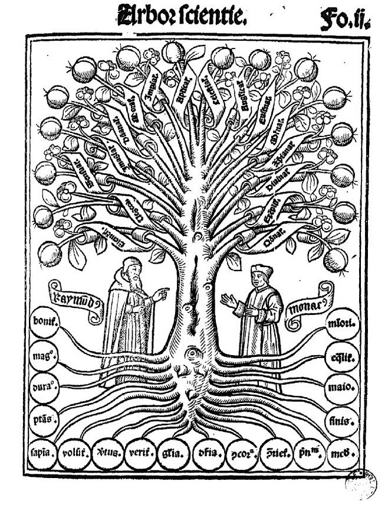
<span style="font-size: 10px; margin-left: 45%">Source image : <a href="https://gallica.bnf.fr/ark:/12148/bpt6k79225g/f4.item" target="_blank">Gallica BNF</a></span><br><br><br>
Il fut suivi par d'autres scientifiques qui ont schématisé des relations de parenté entre des groupes d'êtres vivants (arbres phylogénétiques), notamment le paléonthologue américain <a href="https://fr.wikipedia.org/wiki/Edward_Hitchcock" target="_blank">Edward Hitchock</a> ou encore <a href="https://fr.wikipedia.org/wiki/Charles_Darwin" target="_blank">Charles Darwin</a> dans le cadre de <a href="https://fr.wikipedia.org/wiki/Arbre_phylogénétique#/media/File:Darwin_tree.png" target="_blank">ses réflexions sur l'origine des espèces</a>. Cependant, c'est au psychologue <a href="https://fr.wikipedia.org/wiki/Tony_Buzan" target="_blank">Antony P. Buzan</a> (dit Tony Buzan) que nous devons le concept de la “<a href="https://www.youtube.com/watch?v=p9jEL_LgAm4" target="_blank">carte heuristique”</a> (<i>mind map®</i>) dans les années 70.</p>

<p style="text-align: justify">Il existe pléthores de logiciels pour réaliser une carte heuristique, parmi lesquels <a href="https://www.xmind.net" target="_blank">XMind</a> &mdash; la version gratuite sans période d'essai est <a href="https://www.xmind.net/fr/download/xmind8" target="_blank">XMind 8</a>.</p>
<p style="text-align: justify">Note : la version payante de <a href="https://www.xmind.net/xmind8-pro/" target="_blank">XMind Pro</a> permet de partager ses cartes heuristiques avec d'autres applications comme <a href="https://evernote.com" target="_blank">Evernote</a>. Ce qui est plutôt pratique pour les utilisateurs d'Evernote — une application hautement recommandée pour les recherches et la prise de note.<br>
<div style="display: block;">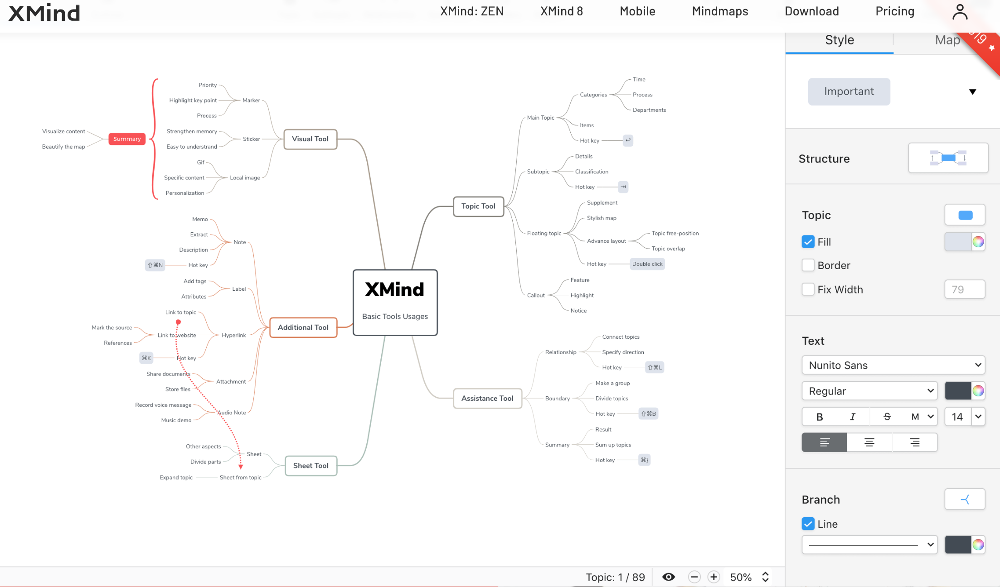</div><br>
<a href="https://www.xmind.net/fr/zen/" target="_blank">XMind Zen</a> permet une utilisation à la fois sur les téléphones portables, tablettes et ordinateurs.<br>
Pour les versions payantes, <a href="https://www.xmind.net/fr/pricing/?lang=fr">différents modes de paiements</a> sont proposés, ainsi que des tarifs pour les étudiants.</p>

<p style="font-size:11px; background-color: #708090; width: 100px; padding: 5px;"><b><a href="#tei_sommaire" style="color: white">Sommaire &#8682;</a></b></p>

<hr style="padding-top: 20px; padding-bottom: 10px">
<h2 style="font-size: 20px; color: #808080;">2.II. <a id="tei_intro_ODD" style="color: #808080">Brève introduction au manuel d’encodage <code>ODD</code>.</a></h2>

<p style="text-align: justify"><b><code>ODD</code> = "One Document Does it all"</b>. Une <code>ODD</code> contient une documentation d'un modèle à suivre.</p>
<p style="text-align: justify">Elle sert à personnaliser un <b>schéma de spécification</b> <code>TEI</code> (dont <code>&lt;element&gt;</code>, <code>&#64;attribut</code>), appelé <a href="https://www.tei-c.org/release/doc/tei-p5-doc/en/html/ref-schemaSpec.html" target="_blank"><code>&lt;schemaSpec&gt;</code></a> &mdash; autrement dit qui suit une sémantique &mdash; de sorte de rendre le schéma valide valide. <cite>“Un schéma combine des références aux modules ou aux groupes de spécifications avec d'autres déclarations atomiques. Le traitement d'un élément de schéma doit résoudre tous les conflits entre les déclarations qu'il contient ou les références. Des processeurs ODD différents peuvent générer des schémas et une documentation en utilisant différentes syntaxes concrètes.”</cite> (Source : <a href="https://tei-c.org/release/doc/tei-p5-doc/fr/html/ref-schemaSpec.html" target="_blank"><code>&lt;schemaSpec&gt;</code></a>)<br><br>
Par défaut, une <code>ODD</code> est proposée &mdash; qui suit un schéma validé dans Oxygen.<br> 
Cependant, dans des cas bien précis, il peut être nécessaire de modifier l'<code>ODD</code> de sorte de rendre le document <code>TEI</code> valide. On parle alors de “<b>modification</b>". On distingue deux types de modifications : (1) modification propre (“clean modification”), (2) modification sale (“unclean modification”).<br>
A l'inverse d'une modification sale, la modification propre n'empêche pas la validité du document conformément aux <a href="#tei_module">modules</a> de la <code>TEI</code>.</p>
<br>
<ul>
<li>ajout de nouveaux <code>&lt;element&gt;</code>s</li>
<li>suppression d'<code>&lt;element&gt;</code>s</li>
<li>changement de nom d'<code>&lt;element&gt;</code>s</li>
<li>modification d'un modèle de contenu</li>
<li>modification d'une liste d'<code>&#64;attribut</code>s ou de valeurs d'<code>&#64;attribut</code>s, d’un type de contenu</li>
<li>modification de l'appartenance à une classe</li>
</ul>
<br>
<p style="text-align: justify">Une ODD personnalisée ne peut contenir qu'un seul <a href="https://www.tei-c.org/release/doc/tei-p5-doc/en/html/USE.html#IM-unified" target="_blank"><code>&lt;schemaSpec&gt;</code></a>. En outre, elle peut contenir quatre types d'information appartenant à des modèles : </p>
<ol>
<li>des <code>&lt;element&gt;</code>s de <a href="https://www.tei-c.org/release/doc/tei-p5-doc/fr/html/ref-model.oddDecl.html" target="_blank">model.oddDecl</a> pour spécifier le langage d'encodage</li>
<li>des références à un groupe de spécifications <a href="https://www.tei-c.org/release/doc/tei-p5-doc/fr/html/ref-specGrpRef.html" target="_blank">specGrpRef</a></li>
<li>des <code>&lt;element&gt;</code>s du <a href="https://www.tei-c.org/release/doc/tei-p5-doc/fr/html/ref-moduleRef.html" target="_blank">moduleRef</a> &mdash; membre de <a href="https://tei-c.org/Vault/P5/3.5.0/doc/tei-p5-doc/en/html/ref-model.oddRef.html" target="_blank">model.oddRef</a> &mdash; qui fait référence aux modules <code>TEI</code> utilisés</li>
<li><a href="https://www.tei-c.org/release/doc/tei-p5-doc/fr/html/ref-moduleRef.html" target="_blank">moduleRef</a> peut aussi faire référence à des modules externes compatibles à incorporer dans un schéma ; dans ce cas, on utilisera les <code>&#64;attribut</code>s optionnels suivants appartenant aux types de données <a href="https://tei-c.org/release/doc/tei-p5-doc/fr/html/ref-teidata.xmlName.html" target="_blank">teidata.xmlName</a> (précise la valeur d'un <code>&#64;attribut</code>) <a href="https://tei-c.org/release/doc/tei-p5-doc/fr/html/ST.html#DTYPES" target="_blank">datatype</a>) en fonction du contenu à importer : <code>&#64;key</code>, <code>&#64;except</code>, <code>&#64;include</code>, <code>&#64;prefix</code>, <code>&#64;url</code></li>
</ul>
<p style="text-align: justify">Voici un exemple d'<code>ODD</code> prêt à être modifié si nécessaire :

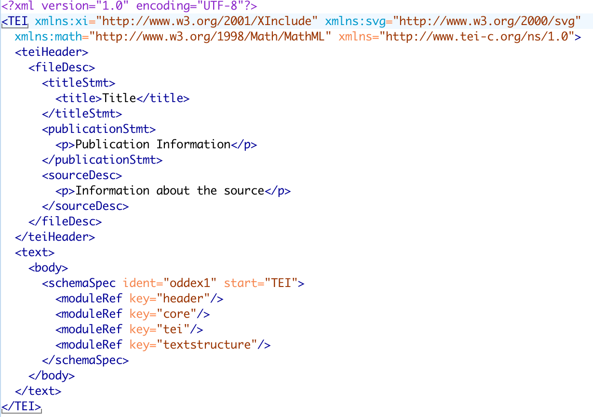</p>

<p style="text-align: justify">Dans l'exemple ci-dessus, le schéma de spécification <code>&lt;schemaSpec&gt;</code> fait référence à quatre <a href="#tei_module">modules</a> qui suivent la valeur de <code>&#64;start</code> "TEI" (c'est-à-dire le module <code>TEI</code>) et identifié par <code>&#64;key</code> : "<a href="https://www.tei-c.org/release/doc/tei-p5-doc/en/html/HD.html">header</a>", "<a href="https://www.tei-c.org/release/doc/tei-p5-doc/en/html/CO.html#COOV" target="_blank">core</a>", "<a href="https://www.tei-c.org/release/doc/tei-p5-doc/en/html/ST.html" target="_blank">tei</a>" et "<a href="https://www.tei-c.org/release/doc/tei-p5-doc/en/html/DS.html" target="_blank">textstructure</a>". On peut compléter chaque <code>&lt;moduleRef&gt;</code> par les <code>&#64;attribut</code>s optionnels précédemment énumérés (point 4 ci-dessus).</p>

<p style="text-align: justify">Lien du wiki de la TEI <a href="https://wiki.tei-c.org/index.php?title=ODD" target="_blank">wiki.tei-c.org</a>.</p>
<p style="text-align: justify">Complément de lecture :<br>
Bauman, Syd, and Julia Flanders. 2018. <a href="https://wwp.northeastern.edu/outreach/seminars/uvic_advanced_2016/presentations/basic_odd/basic_odd_simple_00.xhtml" target="_blank">Introduction to Writing ODDs</a><br>
Bauman, Syd, and Julia Flanders. 2010. <a href=https://wwp.northeastern.edu/outreach/seminars/uvic_advanced_2016/handouts/elementList_odd.xhtml" target="_blank"><i>Element list for ODD</i></a>.<br>
Lüngen, Harald  et C. M. Sperberg-McQueen, 2012. « A TEI P5 Document Grammar for the IDS Text Model », Journal of the Text Encoding Initiative [Online], Issue 3. URL : http://journals.openedition.org/jtei/508 ; DOI : 10.4000/jtei.508</p>
</p>

<p style="font-size:11px; background-color: #708090; width: 100px; padding: 5px;"><b><a href="#tei_sommaire" style="color: white">Sommaire &#8682;</a></b></p>

<hr style="padding-top: 20px; padding-bottom: 10px">
<h2 style="font-size: 20px; color: #808080;">2.III. <a id="tei_intro_SchemaTEI" style="color: #808080">Introduction à la structuration d’un schéma <code>TEI</code> en particulier le module <code>[tei]</code>.</a></h2>

<h3 style="font-size: 16px">Qu'est-ce qu'un schéma <code>TEI</code> ?</h3>
<p style="text-align: justify">Un schéma <code>TEI</code> pourrait se résumer ainsi : « <cite>[...] les conventions élaborées dans le cadre du TEI visent à permettre la description de la manière dont un document a été créé ainsi que la façon dont il a été structuré : pages, paragraphes, lignes, chapitres, dialogues, soulignements, ajouts marginaux, ratures, etc. »</cite> (Source : Fabre et Marcotte<a href="#3" id="3-back"><sup style="font-size: 10px">3</sup></a>)</p>
<p style="text-align: justify">Il est ainsi impératif de <b>toujours</b> se référer aux <a href="#tei_classeModel" id="tei_schemaNote01-back">classes de modèle</a> pour chaque <a href="#tei_module">module</a>.<br><br>
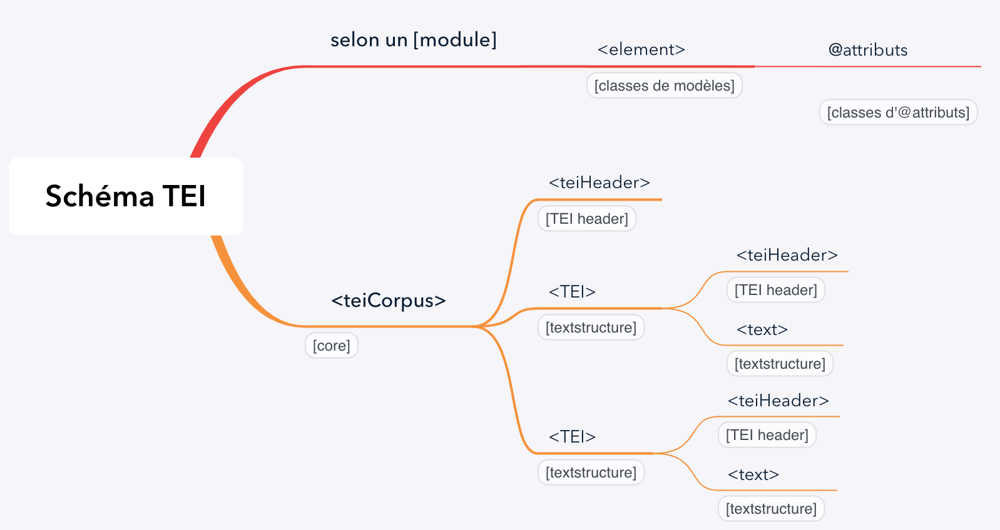</p>
<br><br>

<br><br>
<ul>
  <li><a href="https://www.tei-c.org/release/doc/tei-p5-doc/en/html/CO.html" target="_blank"><code>[Core]</code></a> <a href="https://www.tei-c.org/release/doc/tei-p5-doc/en/html/ref-teiCorpus.html" target="_blank"><code>&lt;teiCorpus&gt;</code></a><br>
  - <a href="https://www.tei-c.org/release/doc/tei-p5-doc/en/html/HD.html" target="_blank"><code>[TEI Header]</code></a>  <code>&lt;teiHeader&gt;</code><br>
  - <a href="https://www.tei-c.org/release/doc/tei-p5-doc/en/html/DS.html" target="_blank"><code>[textstructure]</code> <a href="https://www.tei-c.org/release/doc/tei-p5-doc/en/html/ref-TEI.html" target="_blank"><code>&lt;tei&gt;</code></a><br>
  - <a href="https://www.tei-c.org/release/doc/tei-p5-doc/en/html/HD.html" target="_blank"><code>[TEI Header]</code></a> <code>&lt;teiHeader&gt;</code>
  </li>   
</ul>

<hr>
<p style="font-size: 9px"><a id="3" style="color: #808080">[3]</a> : Grégory Fabre et Sophie Marcotte. 2014, <i>Pratiques de l'édition numériques, Montréal, Presses de l'Université de Montréal</i>. (ISBN <a href="https://fr.wikipedia.org/wiki/Spécial:Ouvrages_de_référence/978-2-7606-3203-5" target="_blank">978-2-7606-3203-5</a>, <a href="https://www.pum.umontreal.ca/catalogue/pratiques-de-ledition-numerique" target="_blank">lire en ligne</a>), chap. 10 (« L'organisation des métadonnées »), p. 175.<a href="#3-back"><b>&#8613;</b></p> 

<hr style="padding-top: 20px; padding-bottom: 10px">
<h2 style="font-size: 20px; color: #808080;">3.I. <a id="tei_modTextstructure" style="color: #808080">Module [textstructure] : exemple pratique pour un dictionnaire</a></h2>

<p style="text-align: justify">Les différents <code>&lt;element&gt;</code>s disponibles dans le <a href="https://www.tei-c.org/release/doc/tei-p5-doc/en/html/DS.html#DSSTRUC" target="_blank">module [textstructure]</a></p>
<br>
<h3 style="font-size: 16px"><a id="tei_td_XmindDico" style="color: #808080">Projet : dictionnaire en ligne pour les 11-13 ans</a></h3>
<p style="text-align: justify">Voir la <a href="/carte_heuristique/carte_heuristique_Dictionnaire.xmind" download>carte heuristique XMind</a> du projet.</p>
<br>
<h4 style="font-size: 12px">Exemple d'une entrée pour un lemme de type substantif : </h4>

```{xml}
<!-- Toutes les définitions ci-dessous sont empruntées au CNRTL en ligne https://www.cnrtl.fr -->
<entryFree n="1" xml:id="pays-subst">
   <form type="lemma" xml:id="pays-baseF">
      <orth>pays</orth>
      <gramGrp>
        <gram type="pos" value="subst"/>
        <gen value="m"/>      
      </gramGrp>
   </form>
   <form type="inflected">
      <orth sameAs="#pays-baseF"/>
   </form>
   <sense n="1" xml:id="pays-syn-01">
      <def><!-- texte de la définition sense 1 --></def>
      <cit type="example">
        <quote><!-- texte de la citation --></quote>
        <bibl>
           <author n="1">
              <name>Dupont</name>
           </author>
        </bibl>
      </cit>
      <xr type="syn">
        <lbl>Syn. de</lbl>
        <!-- dans le cas où ce lemme a été ajouté au dictionnaire -->
        <ref n="1" target="#terre-sense03">terre</ref>
      </xr>
    </sense>
    <sense n="2" xml:id="pays-syn-02">
      <def><!-- texte de la définition sense 2 --></def>
      <xr type="syn">
        <lbl>Syn. de</lbl>
        <!-- dans le cas où ces deux lemmes ont été ajoutés au dictionnaire -->
        <ref n="1" target="#endroit-sense02">endroit</ref>
        <ref n="2" target="#lieu-sense01">lieu</ref>
      </xr>
    </sense>
</entryFree>
```

<br>
<h4 style="font-size: 12px">Exemple d'une entrée pour un lemme de type adverbe : </h4>

```{xml}
<entryFree n="2" xml:id="lgtps-adv">
   <form type="lemma" xml:id="lgtps-adv-orth">
      <orth>longtemps</orth>
      <gram type="pos" value="adv"/>
   </form>
   <sense n="1" xml:id="lgtps-syn-01">
      <def><!-- texte de la définition sense 1 --></def>
      <xr type="syn">
        <lbl>Syn. de</lbl>
        <!-- dans le cas où ce lemme a été ajouté au dictionnaire -->
        <ref n="1" target="#longuement-sense01">longuement</ref>
      </xr>
   </sense>        
</entryFree>
```

<br>
<h4 style="font-size: 12px">Exemple d'une entrée pour un lemme de type adjectif : </h4>

```{xml}

```

<br>
<h4 style="font-size: 12px">Exemple d'une entrée pour un lemme de type verbe : </h4>

```{xml}
<entryFree n="4" xml:id="partir-verb">
   <form type="lemma" xml:id="partir-baseF">
       <orth>partir</orth>
       <gramGrp>
          <gram type="pos" value="verb"/>
          <mood value="inf"/>
          <subc value="intrans"/>
       </gramGrp>
    </form>
    <sense n="1" xml:id="partir-syn-01">
       <def>
         <ref target="#se-mettre-sense02">Se mettre</ref> en mouvement, <ref target="#quitter-sense01">quitter</ref> un lieu (pour une destination)
       </def>
       <cit type="example">
           <quote>Quand ils agonisent (...) ils vous disent: −Adieu! au revoir, je pars pour un monde meilleur, nous nous retrouverons là-haut!</quote>
           <bibl>
              <author n="1"><name>Borel</name></author>
              <date>1833</date>
              <biblScope unit="p">239</biblScope>
           </bibl>
        </cit>
        <xr type="syn">
          <lbl>Syn. de</lbl>
          <!-- dans le cas où ce lemme a été ajouté au dictionnaire -->
          <ref n="1" target="#quitter-sense01">quitter</ref>
        </xr>
    </sense>  
</entryFree>
```         
<br>
<h4 style="font-size: 12px">Liste des <code>&lt;element&gt;</code>s pour la dictionnaire membre des modules <a href="https://www.tei-c.org/release/doc/tei-p5-doc/en/html/DI.html">[dictionaries]</a>, <a href="https://tei-c.org/release/doc/tei-p5-doc/fr/html/AI.html" target="_blank">[analysis]</a> et <a href="https://www.tei-c.org/release/doc/tei-p5-doc/en/html/CO.html" target="blank">[core]</a> et entre paranthèse les modèles de classes &mdash; classement hiérarchique (la descendance est indiquée par “/” et les <code>&lt;element&gt;</code>s de même niveau par “||”) :</h4>

<ul>
  <li><a href="https://www.tei-c.org/release/doc/tei-p5-doc/en/html/ref-entryFree.html" target="_blank" id="tei_entryFree"><code>entryFree</code></a><a href="#4" id="4-back"><sup style="font-size: 10px">4</sup></a> <a href="#tei_entryFree-back"><b>&#8613;</b> (<a href="https://www.tei-c.org/release/doc/tei-p5-doc/en/html/ref-model.entryLike.html" target="_blank">model.entryLike</a>) :  
  <p style="text-align: justify">&#8702; <a href="https://www.tei-c.org/release/doc/tei-p5-doc/fr/html/ref-form.html" target="_blank"><code>form</code></a> <a href="#tei_form-back"><b>&#8613;</b></a> (<a href="https://www.tei-c.org/release/doc/tei-p5-doc/en/html/ref-model.formPart.html" target="_blank">model.formPart</a>) / <a href="https://www.tei-c.org/release/doc/tei-p5-doc/en/html/ref-w.html" target="_blank" id="tei_w"><code>w</code> <a href="#tei_w-back"><b>&#8613;</b></a> (<a href="https://www.tei-c.org/release/doc/tei-p5-doc/en/html/ref-model.segLike.html" target="_blank">model.segLike</a>) / <a href="https://www.tei-c.org/release/doc/tei-p5-doc/en/html/ref-m.html" target="_blank" id="tei_m"><code>m</code></a> <a href="#tei_m-back"><b>&#8613;</b></a> (<a href="https://www.tei-c.org/release/doc/tei-p5-doc/en/html/ref-model.segLike.html" target="_blank">model.segLike</a>)<br>
  &#8702;  <a href="https://www.tei-c.org/release/doc/tei-p5-doc/en/html/ref-gramGrp.html" target="_blank" id="tei_gramGrp"><code>gramGrp</code></a> <a href="#tei_gramGrp-back"><b>&#8613;</b></a> (<a href="https://www.tei-c.org/release/doc/tei-p5-doc/en/html/ref-model.entryPart.html" target="_blank">model.entryPart</a>) / <a href="https://www.tei-c.org/release/doc/tei-p5-doc/en/html/ref-gram.html" target="_blank" id="tei_gram"><code>gram</code></a> <a href="#tei_gram-back"><b>&#8613;</b></a> (<a href="https://www.tei-c.org/release/doc/tei-p5-doc/en/html/ref-model.morphLike.html" target="_blank">model.morphLike</a>) ||<a href="https://www.tei-c.org/release/doc/tei-p5-doc/en/html/ref-gen.html" target="_blank" id="tei_gen"><code>gen</code></a> <a href="#tei_gen-back"><b>&#8613;</b></a> (<a href="https://www.tei-c.org/release/doc/tei-p5-doc/en/html/ref-model.morphLike.html" target="_blank">model.morphLike</a>) <br>
  &#8702; <a href="https://www.tei-c.org/release/doc/tei-p5-doc/fr/html/ref-sense.html" target="_blank"><code>sense</code></a> (<a href="https://www.tei-c.org/release/doc/tei-p5-doc/en/html/ref-model.entryPart.html" target="_blank">model.entryPart</a>) / <a href="https://www.tei-c.org/release/doc/tei-p5-doc/fr/html/ref-def.html" target="_blank" id="tei_def"><code>def</code></a> <a href="#tei_def-back"><b>&#8613;</b></a> (<a href="https://www.tei-c.org/release/doc/tei-p5-doc/en/html/ref-model.entryPart.html" target="_blank">model.entryPart</a>) || <a href="https://www.tei-c.org/release/doc/tei-p5-doc/fr/html/ref-cit.html" target="_blank" id="tei_cit"><code>cit</code></a> <a href="#tei_cit-back"><b>&#8613;</b></a> (<a href="https://www.tei-c.org/release/doc/tei-p5-doc/fr/html/ref-model.entryPart.top.html" target="_blank">model.entryPart.top</a>) / <a href="https://www.tei-c.org/release/doc/tei-p5-doc/fr/html/ref-quote.html" target="_blank" id="tei_quote"><code>quote</code></a> <a href="#tei_quote-back"><b>&#8613;</b></a> (<a href="https://www.tei-c.org/release/doc/tei-p5-doc/fr/html/ref-model.quoteLike.html" target="_blank">model.quoteLike</a>) || <a href="https://www.tei-c.org/release/doc/tei-p5-doc/en/html/ref-xr.html" target="_blank" id="tei_xr"><code>xr</code></a> <a href="#tei_xr-back"><b>&#8613;</b></a> (<a href="https://www.tei-c.org/release/doc/tei-p5-doc/en/html/ref-model.entryPart.html" target="_blank">model.entryPart</a>) / <a href="https://www.tei-c.org/release/doc/tei-p5-doc/en/html/ref-lbl.html" target="_blank" id="tei_lbl">lbl</a> <a href="#tei_lbl-back"><b>&#8613;</b></a> (<a href="https://www.tei-c.org/release/doc/tei-p5-doc/en/html/ref-model.entryPart.top.html" target="_blank">model.entryPart.top</a>) || <a href="https://www.tei-c.org/release/doc/tei-p5-doc/en/html/ref-ref.html" target="_blank" id="tei_ref"><code>ref</code></a> <a href="#tei_ref-back"><b>&#8613;</b></a> (<a href="https://www.tei-c.org/release/doc/tei-p5-doc/en/html/ref-model.ptrLike.html" target="_blank">model.ptrLike</a>) </p>
  </li>
</ul>

<h4 style="font-size: 12px">Liste des <code>&#64;attribut</code>s par classe d'attributs</h4>
<ul>
  <li> <a href="https://www.tei-c.org/release/doc/tei-p5-doc/en/html/ref-att.linguistic.html" target="_blank">att.linguistic</a> &mdash; module [analysis] : 
  <p style="text-align: justify">&#8702; <code>&#64;lemma</code></p>
  </li>
  <li><a href="https://www.tei-c.org/release/doc/tei-p5-doc/fr/html/ref-att.global.html" target="_blank">att.global</a> &mdash; module [tei] :
  <p style="text-align: justify">&#8702; <code>&#64;xml:id</code><br>
  &#8702; <code>&#64;n</code></p>
  </li>
  <li><a href="https://www.tei-c.org/release/doc/tei-p5-doc/fr/html/ref-att.entryLike.html" target="_blank">att.entryLike</a> &mdash; module [dictionaries] :
  <p style="text-align: justify">&#8702; <code>&#64;type</code></p>
  </li>
  <li><a href="https://www.tei-c.org/release/doc/tei-p5-doc/en/html/ref-att.global.linking.html" target="_blank">att.global.linking</a> &mdash; module [linking] :
  <p style="text-align: justify">&#8702; <code>&#64;sameAs</code></p>
  </li>
  <li><a href="" target="_blank">att.pointing</a> &mdash; module [tei] :
  <p style="text-align: justify">&#8702; <code>&#64;target</code></p>
  </li>
</ul>


<br>

<hr style="border-style: dotted; border-color: #D3D3D3; margin-top: 50px; width: 250px;  margin-left: 0px" />
<p style="text-align: justify">Complément de lecture :<br>
Bowers, Jack  et Laurent Romary. 2016. « Deep Encoding of Etymological Information in TEI », Journal of the Text Encoding Initiative [Online], Issue 10. URL : http://journals.openedition.org/jtei/1643 ; DOI : 10.4000/jtei.1643.<br>
Budin, Gerhard, Stefan Majewski et Karlheinz Mörth. 2012. « Creating Lexical Resources in TEI P5 », <i>Journal of the Text Encoding Initiative</i> [Online], Issue 3. URL : <a href="https://journals.openedition.org/jtei/522" target="_blank">http://journals.openedition.org/jtei/522</a> ; DOI : 10.4000/jtei.522.<br>
Mörth, Karlheinz, Laurent Romary, Gerhard Budin et Daniel Schopper. 2015 « Modeling Frequency Data: Methodological Considerations on the Relationship between Dictionaries and Corpora », Journal of the Text Encoding Initiative [Online], Issue 8. URL : http://journals.openedition.org/jtei/1356 ; DOI : 10.4000/jtei.1356.<br>
Romary, Laurant. 2004. <a href="https://www.tei-c.org/Vault/MembersMeetings/2004-info/romary.pdf" target="_blank"><i>Iso and the TEI. When standards speak to standards</i></a></p>
<br>

<p style="text-align: justify"><a id="4" style="color: #808080; text-align: justify">[4]</a> cet <code>element</code> a été retenu d'une part pour plus de flexibilité par rapport à <a href="https://www.tei-c.org/release/doc/tei-p5-doc/fr/html/ref-entry.html" target="_blank"><code>entry</code></a> qui suit un schéma défini, mais surtout parce qu'il autorise <a href="https://journals.openedition.org/jtei/522#ftn17" target="_blank">30 <code>&lt;element&gt;</code>s</a> en comparaison avec <code>&lt;entry&gt;</code> qui n'en autorise que 10. <a href="#4-back"><b>&#8613;</b></p>

<hr style="padding-top: 20px; padding-bottom: 10px">
<h2 style="font-size: 20px; color: #808080;">4.I. <a id="tei_xpath" style="color: #808080">Arborescence d’un document <code>TEI</code>, brève introduction à <code>XPath</code>.</a><a href="#5" id="5-back"><sup style="font-size: 10px">5</sup></a></h2>

<h3 style="font-size: 16px">Qu'est-ce que <code>XPath</code> ?</h3>

<p style="text-align: justify">Créé en 1999, <b>XML Path Language</b> (abr. <code>XPath</code>) suit les recommandations du W3C ; la version courante est <a href="https://www.w3.org/TR/xpath-3/" target="_blank">3.1</a>. <code>XPath</code> est un langage de requête de <code>XSLT</code> ou <a href="https://www.w3.org/TR/xpath-3/#xquery-31" target="_blank">XML Query Language</a>, abr. <code>XQuery</code>. Il est utilisé dans un fichier <code>XLST</code> (ou <a href="https://www.w3.org/TR/WD-xptr" target="_blank">XML Pointer Language</a>, abr. <code>XPointer</code>) pour accéder à une partie du contenu, appelé <i>node</i> (fr. nœud) dans un document <code>TEI</code> (ou <code>XML</code> et <code>JSON</code>), selon un <b>chemin</b> (<i>Path</i>) précis. Ce chemin peut être comparé à une relation pour naviguer dans <u>une arborescence ou un arbre généalogique</u> ; il existe deux types de chemins, (1) <b>absolu</b> et (2) <b>relatif</b>.</p>
<p style="text-align: justify"><code>XPath</code> est indispensable pour manipuler et/ou afficher les informations désirées grâce à <code>XSLT</code>.</p>

<h3 style="font-size: 16px">Les nœuds :</h3>
<p style="text-align: justify">Un document <code>TEI</code> (<code>XML</code>) contient 7 types de nœuds.</p>
<ol>
  <li>nœud racine</li>
  <li>nœuds d'<code>&lt;element&gt;</code>s &mdash; contient automatiquement un <a href="http://xmlfr.org/w3c/TR/xpath/#dt-expanded-name" target="_blank">nom expansé</a> (<i>expanded-name</i>)</li>
  <li>nœuds d'<code>&#64;attribut</code>s</li>
  <li>nœuds de texte</li>
  <li>nœuds d'espace de noms (<a href="#tei_namespace"><i>namespace</i></a>)
  <li>nœuds d'instuction de traitement</li>
  <li>nœuds commentaire</li>
</ol>  
  
  <h3 style="font-size: 16px">Les chemins :</h3>
<ul>
  <li>Chemin absolu : c'est-à-dire le nœud racine du document <code>TEI</code> ; il peut être suivi d'un chemin relatif et commence par <a href="#xpath_root"><code>/</code></a>. Un chemin absolu est <u>indépendant</u> du nœud courant.</li>
  <li>Chemin relatif : une séquence d'une ou de plusieurs d'étapes de localisation séparée-s par <code>/</code>. A l'inverse du chemin absolu, un chemin relatif est <u>dépendant</u> du nœud courant.</li>
</ul>  

<p style="text-align: justify">Une étape de localisation peut contenir 3 informations, séparées par <code>/</code> : un <a href="#xpath_axe">axe</a>, un <a href="http://xmlfr.org/w3c/TR/xpath/#node-tests" target="_blank">nœud de test</a> et 0 ou n prédicats (option).</p>

<h3 style="font-size: 16px">Les sélecteurs :</h3>
<ul>
  <li><code>/</code> : <a id="xpath_root" style="color: #808080">racine</a> (<i>root</i>)</li>
  <li><code>/</code> : enfant (<i>child</i>) ou le descendant ; <code>/entryFree/w</code> <=> sélectionne les  <code>&lt;w&gt;</code> qui suivent  <code>&lt;entryFree&gt;</code></li>
  <li><code>//</code> : descendants ; <code>//w</code> <=> sélectionne tous les <code>&lt;w&gt;</code> dans le document</li>
  <li><code>.</code> (<=> <code>self::node()</code>) : sélection le nœud (<i>node</i>) courant (expression relative) &mdash; il peut avoir un nombre illimité d'<a href="#xpath_child">enfants</a>, un nombre illimité de <a href="#xpath_fsibling">frères</a> et au minimum un <a href="#xpath_parent">parent</a>.</li>
  <li><code>..</code> : nœud parent</li>
  <li><code>|</code> : opérateur de sélection multiple</li>
</ul>
<p style="text-align: justify"><u>Note 1</u> : l'opérateur de chemin <code>/</code> sert généralement à trouver un node dans une arborescence <code>TEI</code>.
<br>
<u>Note 2</u> : les deux points répétés deux fois <code>::</code> indique la séparation du chemin des nœuds avec des axes. Toutefois, on peut faire l'économie de <code>::</code> en utilisant l'opérateur de chemin <code>/</code> &mdash; <code>/child::entryFree/child::w/attribute::lemma</code> <=> <code>/entryFree/w/&#64;lemma</code></p>


<h3 style="font-size: 16px">Sémantique et syntaxe</h3>
<p style="text-align: justify">Un chemin dans une arborescence <code>TEI</code> peut schématiquement être symbolisé par un <b>axe</b> sur lequel on se déplace en <b>avant</b> ou en <b>arrière</b> &mdash; il se lit de gauche à droite. Le déplacement s'effectue <u>entre le nœud courant</u> (appelé également le nœud contextuel) et <u>les nœuds sélectionnés</u>. L'<a id="xpath_axe" style="color: #808080">axe</a> indique la direction à suivre ; il existe <b>13 axes</b> : </p>
<ul>
  <li><u>Axes avant</u> :
    <p style="text-align: justify">&#8702; <a id="xpath_child" style="color: #808080"><code>child::</code></a> (par défaut) : sélectionne les enfants du nœud courant ; ex. <code>child::w</code> <=> sélectionne tous les <code>w</code> qui sont enfants du nœud courant<br>
    &#8702; <code>descendant::</code> : sélectionne les descendants (enfants, petits-enfant…) du nœud courant ; <code>descendant::w</code> <=> sélectionne tous les descendants de <code>w</code> courant<br>
    &#8702; <code>attribute::</code> : sélectionne tous les attributs du nœud courant ; ex. <code>attribute::&#64;type</code> <=> sélectionne l'attribut <code>&#64;type</code> du nœud courant &mdash; + en option sa <code>"valeur"</code>, ex.  <code>&#64;type="adv"</code> <=> sélectionne uniquement l'attribut <code>&#64;type</code> dont la valeur est “adv”.<br>
      &#8702; <code>descendant-or-self::</code> : sélectionne les descendants (enfants, petits-enfant…) du nœud courant et le nœud courant lui-même ; <code>&lt;entryFree&gt;/&lt;w&gt;//m[&#64;type="adv"]</code> => sélectionne tous les <code>&lt;m[&#64;type="adv"]&gt;</code> qui suivent <code>&lt;w&gt;</code> dans <code>&lt;entryFree&gt;</code><br>
      &#8702; <a id="xpath_fsibling" style="color: #808080"><code>following-sibling::</code></a> : sélectionne tous les “frères” après le nœud courant ; <code>following-sibling::w</code><br>
      &#8702; <code>following::</code> : sélectionne tout après la balise de fermeture du nœud courant<br> 
      &#8702; <code>namespace::</code> : sélectionne tous les nœuds des <a href="#tei_namespace"><code>namespaces</code></a> (espace de noms) du nœud courant</p>
  </li>  
  <li><u>Axes arrière</u> :
    <p style="text-align: justify">&#8702; <a id="xpath_parent" style="color: #808080"><code>parent::</code></a> : sélectionne le parent du nœud courant<br>
    &#8702; <code>ancestor::</code> : sélectionne tous les ancêtres (parent, grand-parent…) du nœud courant ; <=> sélectionne tous les ancêtres de <code>w</code> courant<br>
    &#8702; <code>preceding-sibling::</code> : sélectionne tous les “frères” avant le nœud courant<br>
    &#8702; <code>preceding::</code> : sélectionne tous les nœuds qui apparaissent avant le nœud courant dans le document, à l’exception des ancêtres, des nœuds d’attribut et des nœuds de <code>namespace</code> (espace de noms)<br>
    &#8702; <code>ancestor-or-self::</code> : sélectionne tous les ancêtres (parent, grand-parent…) du nœud courant et le nœud courant lui-même ;  <code>//entryFree/../&#64;type</code> &mdash; les ancêtres qui précèdent <code>&#64;type</code></p>
  </li>  
</ul>

<p style="text-align: justify"><u>Note</u> : il existe des syntaxes abrégées (voir le cours de Peter Stokes), ex. <code>self::node()</code> = <code>.</code></p> 

<h3 style="font-size: 16px">Pour aller un peu plus loin, les précisions optionnelles :</h3>
<ul>
  <li>Les prédicats sont exprimés entre crochets <code>[…]</code> ; ils permettent de filtrer les nœuds, ex. :
    <p style="text-align: justify">&#8702; <code>[.="valeur"]</code> : <code>m[&#64;type="adv"]</code><br>
    &#8702; indice <code>&#64;n</code> du nœud : <code>w[&#64;n="2"]</code></p>
  </li>  
  <li>Les opérateurs, ex. :
    <p style="text-align: justify">&#8702; <code>or</code> : relation logique <a href="http://xmlfr.org/w3c/TR/xpath/#function-boolean" target="_blank">boléenne</a> “OU” = une des deux conditions doit être remplie (retourne vrai/<i>true</i> ou faux/<i>false</i>)<br>
    &#8702; <code>and</code> : relation logique  <a href="http://xmlfr.org/w3c/TR/xpath/#function-boolean" target="_blank">boléenne</a> “ET” = les deux conditions doivent être remplies<br>
    &#8702; <code>==</code> : deux valeurs égales<br>
    &#8702; <code>!=</code> : deux valeurs différentes<br>
    &#8702; <code><=</code> : la première valeur est inférieure ou égale à la seconde<br>
    &#8702; <code><</code> : la première valeur est inférieure à la seconde</p>
  </li>  
  <li>Les opérateurs de comparaison, ex. :
    <p style="text-align: justify">&#8702; <code>w[&#64;n > 3]</code><br>
    &#8702; <code>!</code> [pour différent de]
  </li>
</ul>  

<p style="text-align: justify">Pour aller plus loin, voir la liste des <a href="http://xmlfr.org/w3c/TR/xpath/#corelib" target="_blank">fonctions</a> <code>XPath</code> &mdash; critères de sélection : de type <code>sum()</code>, <code>count()</code>, <code>substring()</code>, <code>string-length()</code>, <code>concat()</code>, etc.</p>

<h4 style="font-size: 14px">Liens utiles</h4>
<ul>
  <li><a href="https://www.w3schools.com/xml/xpath_operators.asp" target="_blank">Les opérateurs XPath</a> </li>
  <li><a href="https://devhints.io/xpath" target="_blank">Exemples de sélecteurs, opérateurs, etc.</a>
  <li><a href="http://scraping.pro/res/xpath-cheat/XSLT-1.pdf" target="_blank"><code>XPath 1.0</code> et <code>XSLT 1.0</code>Quick reference</a></li>
  <li><a href="https://www.mulberrytech.com/quickref/xpath2.pdf" target="_blank"><code>XPath 2.0</code>Quick reference</a></li>
</ul>  

<br>
<p style="text-align: justify"><a id="5" style="color: #808080">[5]</a> Les exemples ci-dessous seront complétés en fonction des travaux pratiques. <a href="#5-back"><b>&#8613;</b></p>

<hr style="padding-top: 20px; padding-bottom: 10px">
<h2 style="font-size: 20px; color: #808080;"><a id="tei_modLinking" style="color: #808080">4.II. Module [linking] pour les liens hypertextuels</a></h2>


<hr style="padding-top: 20px; padding-bottom: 10px">
<h2 style="font-size: 20px; color: #808080;"><a id="tei_schemaTeiHeader" style="color: #808080">5.I. Schéma d’entête <code>&lt;teiHeader&gt;</code></a></h2>

<p>Chapitre du TEI guidelines : <a href="https://www.tei-c.org/release/doc/tei-p5-doc/fr/html/HD.html" target="_blank">The TEI Header</a><br>
Notez que cet élément est <b>obligatoire</b>.</p>

<h3 style="font-size: 16px">Pertinence :</h3>
<ul>
<li>Notice de cataloguage</li>
<li>référence bibliographique destinée à un fichier électronique</li>
</ul>

<h3 style="font-size: 16px"><code>&lt;element&gt;</code>s contenus dans le <code>teiHeader</code> </h3>

<p style="text-align: justify">&#8702; 7 <code>&lt;element&gt;</code>s : <code>editionStmt</code> | <code>extent</code> | <code>notesStmt</code> | <code>publicationStmt</code> | <code>seriesStmt</code> | <code>sourceDesc</code> | <code>titleStmt</code></p>

<ul>
<li><a href="https://www.tei-c.org/release/doc/tei-p5-doc/fr/html/ref-editionStmt.html" target="_blank"><code>editionStmt</code></a> : informations sur l'édition du matériel</li>
<li><a href="https://www.tei-c.org/release/doc/tei-p5-doc/fr/html/ref-extent.html" target="_blank"><code>extent</code></a> : description de la taille approximative (pages, mots...) a</li>
<li><a href="https://www.tei-c.org/release/doc/tei-p5-doc/fr/html/ref-notesStmt.html" target="_blank"><code>notesStmt</code></a> : notes diverses mais pertinentes sur le matériel étudié</li>
<li><a href="https://www.tei-c.org/release/doc/tei-p5-doc/fr/html/ref-publicationStmt.html" target="_blank"><code>publicationStmt</code></a> : informations concernant la publication et/ou la diffusion</li>
<li><a href="https://www.tei-c.org/release/doc/tei-p5-doc/fr/html/ref-seriesStmt.html" target="_blank"><code>seriesStmt</code></a> : information sur la collection dans le cas où elle existe</li>
<li><a href="https://www.tei-c.org/release/doc/tei-p5-doc/fr/html/ref-sourceDesc.html" target="_blank"><code>sourceDesc</code></a> : description de la source dans le cadre d'un format électronique</li>
<li><a href="https://www.tei-c.org/release/doc/tei-p5-doc/fr/html/ref-titleStmt.html" target="_blank"><code>titleStmt</code></a> : titre du l'œuvre et son/ses responsable(s) et/ou institution(s)</li>
</ul>
<br>

<h4 style="font-size: 14px">Carte heuristique d'un schéma <code>teiHeader</code></h4>
<br>

<br><br>
<h4 style="font-size: 14px">Déclaration de classification : &lt;taxonomy&gt;</h4>
<p><a href="https://tei-c.org/release/doc/tei-p5-doc/fr/html/HD.html#HD55" target="_blank">Guidelines TEI</a></p>
<br>
<p>Sa carte heuristique :<br><br>
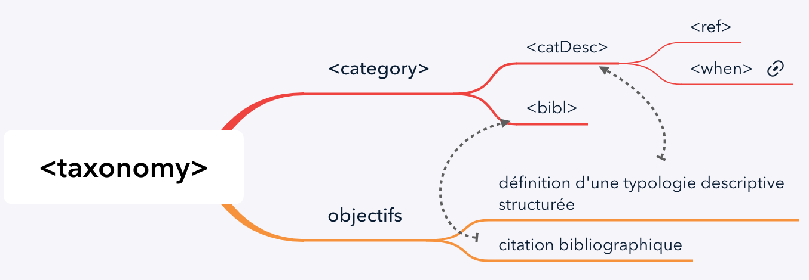
</p>
<br>
<h4 style="font-size: 14px">Exemple et tutoriel</h4>
<br>
<p><a href="https://vbigot-juloux.github.io/hermeneutics-of-action/UserManual/out/webhelp/index.html#categories.html" target="_blank">taxonomie analytique</a> dans le cadre d'une hermeneutique de l'action</p>
<br>


<hr style="padding-top: 20px; padding-bottom: 10px">
<h2 style="font-size: 20px; color: #808080;"><a id="tei_bib" style="color: #808080">5.II. Citations et références bibliographiques</a></h2>

<p>Information dans les <a href="https://tei-c.org/release/doc/tei-p5-doc/en/html/CO.html#COBI" target="_blank">TEI guidelines.</a></p>

<h3 style="font-size: 16px">5 <code>&lt;element&gt;</code>s principaux appartenant au <a href="https://tei-c.org/release/doc/tei-p5-doc/en/html/ref-model.biblLike.html" target="_blank">model.biblLike</a></h3>
<p style="text-align: justify">Regroupe des <code>&lt;element&gt;</code>s contenant des informations relatives aux descriptions bibliographiques : <a href="https://tei-c.org/release/doc/tei-p5-doc/en/html/ref-bibl.html" target="_blank"><code>bibl</code></a> | <a href="https://tei-c.org/release/doc/tei-p5-doc/en/html/ref-biblFull.html" target="_blank"><code>biblFull</code></a> | <a href="https://tei-c.org/release/doc/tei-p5-doc/en/html/ref-biblStruct.html" target="_blank"><code>biblStruc</code></a> | <a href="https://tei-c.org/release/doc/tei-p5-doc/en/html/ref-listBibl.html" target="_blank"><code>listBibl</code></a> | <a href="https://tei-c.org/release/doc/tei-p5-doc/en/html/ref-msDesc.html" target="_blank"><code>msDesc</code></a> </p>

<ul>
<li><code>bibl</code> (module [core]) : citation bibliographique </li>
<li><code>biblFull</code> (module [header]) : citation bibligraphique structurée complète</li>
<li><code>biblStruct</code> (module [core]) : citation bibligraphique structurée</li>
<li><code>listBibl</code> (module [core]) : liste de citations bibliographiques</li>
<li><code>msDesc</code> (module [msdescription]) : description du manuscrit [<a href="https://tei-c.org/release/doc/tei-p5-doc/fr/html/MS.html#msov" target="_blank">1<a/>]</li>
</ul>

<h4 style="font-size: 14px">&#8702; <u>Carte heuristique</u> :</h4>


<br><br>
<p style="text-align: justify">A lire: <a href="https://tei-c.org/release/doc/tei-p5-doc/en/html/CO.html#COBITY" target="_blank">Méthodes d'encodage pour les références bibliographiques et les listes de références</a></p>

<h4 style="font-size: 14px">&#8702; <a id="tei_biblio_ex" style="color: #808080"><u>Exemple</u></a> :</h4>


<br><br>
<p style="text-align: justify">Dans l'exemple ci-dessus, <code>&#64;sortKey</code> (classe <a href="https://tei-c.org/release/doc/tei-p5-doc/fr/html/ref-att.sortable.html" target="_blank">att.sortable</a>) permettra de classer les références (sous réserve de la transformation dans <code>XSLT</code> en indiquant le chemin <code>XPath</code>). Voir une brève introduction <a href="#xslt_intro">ci-dessous</a> pour première immersion en <code>XSLT</code> &mdash; Peter Stokes reviendra plus en détails sur chacune des fonctions.</p>


<hr style="padding-top: 20px; padding-bottom: 10px">
<h2 style="font-size: 20px; color: #808080;"><a id="carteHeuristique_corpus" style="color: #808080">5.III. Carte heuristique pour l'encodage d'un manuscrit</a></h2>

<h3 style="font-size: 16px;">Vue générale</h3>
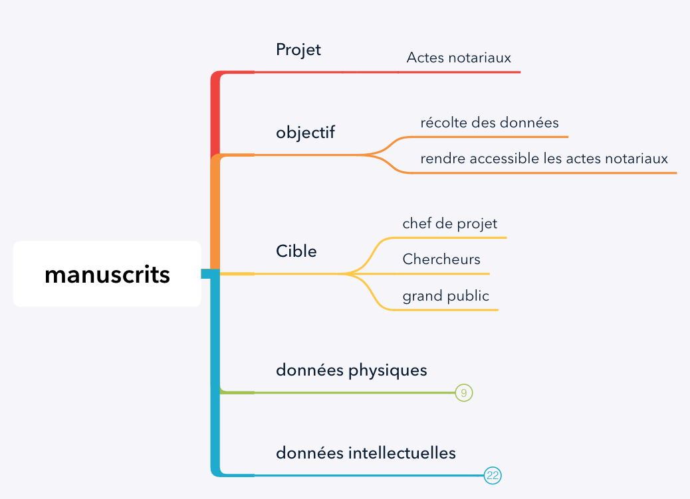
<br><br>
<h4 style="font-size: 14px;">Données physiques</h3>
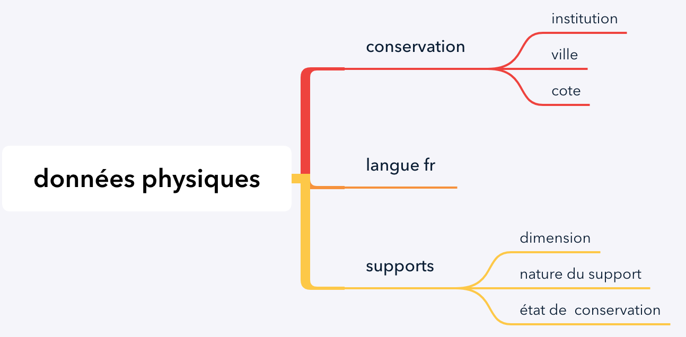
<br><br>
<h4 style="font-size: 14px;">Données intellectuelles</h3>
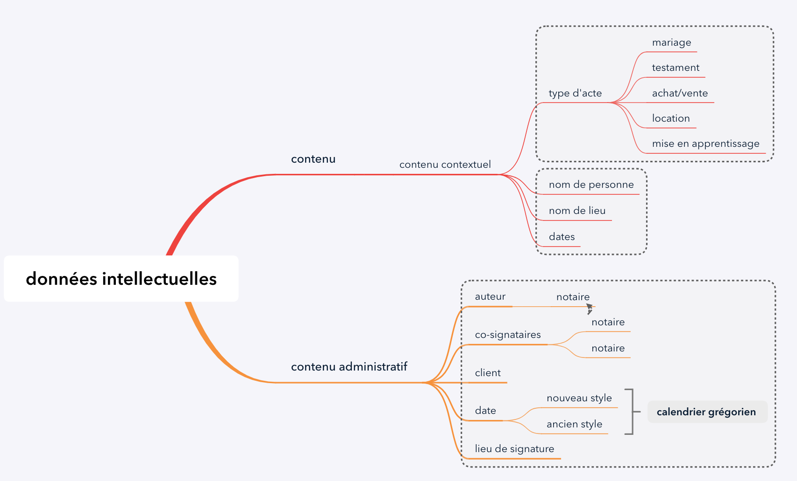
<br><br>

<hr style="padding-top: 20px; padding-bottom: 10px">
<h2 style="font-size: 20px; color: #808080;"><a id="tei_relationsNœuds" style="color: #808080">6.I. <code>&#64;attribut</code>s pour créer une relation entre deux ou plusieurs nœuds </h2>

<p><a href="https://tei-c.org/release/doc/tei-p5-doc/fr/html/ref-teidata.pointer.html" target="_blank">teidata.pointer</a> fournit une URI unique pour pointer vers une donnée interne ou externe au documet.</p> 
<p>Propriétés d'un <code>data.pointer</code> :<br>
&#8702; il pointe vers quelque chose <br>
&#8702; il est formé d'un <b><code>xml:id NCNames</code></b> valide</p>

<p>Note au sujet de la validité du “NCNames” : <a href="https://www.w3.org/TR/xmlschema-2/#NCName" target="_blank"><code>NCNames</code></a> signifie un “nom non-colonisé” (= nom non-qualifié)<a href="#6" id="6-back"><sup style="font-size: 10px">6</sup></a> est une chaîne de caractères dont les symboles suivants sont exclus “@ , $ , % , & , / , + ,,, ;”, ainsi que les espaces et les parenthèses et il ne peut pas commencer par un chiffre, un point ou le signe -.</p>

<h3 style="padding-top: 16px;>Liste des 31 classes utilisées par <code>teidata.pointer</code>, classées par [module]</h3>
<ul>
<li>[namesdates] :<br>
<p>&#8702; <a href="https://www.tei-c.org/release/doc/tei-p5-doc/fr/html/ref-att.datable.custom.html" target="_blank">att.datable.custom</a> (<code>&#64;datingMethod</code> | <code>&#64;datingPoint</code> ) : pour la normalisation des éléments d'évènements datables à un système de datation personnalisé autre que le calendrier Gregorien<br>
```{xml}
<!-- source https://www.tei-c.org/release/doc/tei-p5-doc/fr/html/ref-att.datable.custom.html -->
Contayning the Originall, Antiquity, Increaſe, Moderne eſtate, and deſcription of that Citie, written in the yeare <date when-custom="1598" calendar="#julian" datingMethod="#julian">1598</date>. by Iohn Stow Citizen of London.
```
</p>
</li>
<li>[tei] :<br>
<p>&#8702; <a href="https://www.tei-c.org/release/doc/tei-p5-doc/fr/html/ref-att.ascribed.html" target="_blank">att.ascribed</a> (<code>&#64;who</code>) : action ou parole attribuée à une personne :<br>
```{xml}
<!-- source : https://www.tei-c.org/release/doc/tei-p5-doc/fr/html/ref-att.ascribed.html -->
<castItem type="role">
 <role xml:id="Barnardo">Bernardo</role>
</castItem>
<!-- ... -->
<sp who="#Barnardo">
 <speaker>Bernardo</speaker>
 <l n="1">Who's there?</l>
</sp>
```
&#8702; <a href="https://www.tei-c.org/release/doc/tei-p5-doc/fr/html/ref-att.ascribed.directed.html" target="_blank">att.ascribed.directed</a> (<code>&#64;toWhom</code>) : action ou parole destinée à une personne ou à un groupe<br>
```{xml}
<!-- source https://www.tei-c.org/release/doc/tei-p5-doc/fr/html/ref-att.ascribed.directed.html -->
<castItem type="role">
 <role xml:id="emil">Emilius.</role>
</castItem>
<castItem type="role">
 <role xml:id="lov">Lovisa</role>
</castItem>
<castItem type="role">
 <role xml:id="serv">A servant</role>
</castItem>
<!-- ... -->
<sp who="#emil" toWhom="#lov">
 <speaker>Emil.</speaker>
 <l n="1">My love!</l>
</sp>
<sp who="#lov" toWhom="#emil">
 <speaker>Lov.</speaker>
 <l n="2">I have no Witness of my Noble Birth</l>
 <stage who="emil" toWhom="#serv">Pointing to her Woman.</stage>
 <l>But that poor helpless wretch——</l>
</sp>
```

&#8702; <a href="https://www.tei-c.org/release/doc/tei-p5-doc/fr/html/ref-att.canonical.html" target="_blank">att.canonical</a> (<code>&#64;ref</code>) : pour associer une représentation (nom, titre d'une infromation canonique) relative à l'objet nommée ou auquel il se réfère<br>
```{xml}
<!-- deux @ref qui se suivent sont séparées par un espace -->
<!-- source : https://www.tei-c.org/release/doc/tei-p5-doc/fr/html/ND.html#NDATTSnr -->
That wretched pair <name ref="#DPB1 #EBB1" type="person">the Browns</name> came to dine ...
```

&#8702; <a href="https://www.tei-c.org/release/doc/tei-p5-doc/fr/html/ref-att.datable.html" target="_blank">att.datable</a> (<code>&#64;calendar</code> | <code>&#64;period</code>) : pour des évènements dont la date est définie ou pas encore<br>
```{xml}
<!-- Exemple 1 pour @calendar -->
<!-- source https://www.tei-c.org/release/doc/tei-p5-doc/fr/html/ND.html#NDDATE -->
<p>The Poole by S. <hi>Giles</hi> Churchyarde was a large water in the yeare <date calendar="#julianEngland">1244</date>. </p>
<!-- Exemple 2 pour @period -->
<!-- source https://www.tei-c.org/release/doc/tei-p5-doc/fr/html/ND.html#NDDATE -->
<placeName period="#christian">Stauropolis</placeName>
```
&#8702; <a href="https://www.tei-c.org/release/doc/tei-p5-doc/fr/html/ref-att.datcat.html" target="_blank">att.datcat</a> (<code>&#64;datcat</code> | <code>&#64;valueDatca</code>) : pour la conformité des données <i>Data Categories</i> qui suivent les normes ISO lesquelles sont stockées dans le répertoire <a href="http://www.isocat.org/" target="_blank">ISOCat</a><br>
```{xml}
<!-- source https://www.tei-c.org/release/doc/tei-p5-doc/fr/html/DI.html#DIMVLV -->
<entry>
<!--...-->
 <form>
  <orth>isotope</orth>
 </form>
 <gramGrp>
  <pos dcr:datcat="http://www.isocat.org/datcat/DC-1345"
   dcr:valueDatcat="http://www.isocat.org/datcat/DC-1230">adj</pos>
 </gramGrp>
<!--...-->
</entry>
```

</p> 
</li>
<li>[transr] :<br>
<p> &#8702; <a href="https://www.tei-c.org/release/doc/tei-p5-doc/fr/html/ref-att.coordinated.html" target="_blank">att.coordinated</a> (<code>&#64;start</code>) : relatif à un système de coordonnées<br>
```{xml}
<!-- source https://www.tei-c.org/release/doc/tei-p5-doc/fr/html/examples-surface.html -->
<facsimile>
 <surface start="#PB49R">
  <graphic url="Bovelles-49r.png"/>
 </surface>
</facsimile>
<text>
 <body>
  <div>
<!-- ... -->
   <pb xml:id="PB49R"/>
   <fw>De Geometrie 49</fw>
<!-- ... -->
  </div>
 </body>
</text>
```

</p>
</li>
<li>att.datable</li>
<li>att.datable.custom</li>
<li>att.datcat</li>
<li>att.declaring</li>
<li>att.edition</li>
<li>att.global</li>
<li>att.global.analytic</li>
<li>att.global.change</li>
<li>att.global.facs</li>
<li>att.global.linking</li>
<li>att.global.rendition</li>
<li>att.global.source></li>
<li>att.handFeatures</li>
<li>att.interLike</li>
<li>att.lexicographic</li>
<li>att.linguistic</li>
<li>att.msClass</li>
<li>att.naming</li>
<li>att.pointing</li>
<li>att.pointing.group</li>
<li>att.rdgPart</li>
<li>att.resourced</li>
<li>att.scoping</li>
<li>att.spanning</li>
<li>att.textCritical</li>
<li>att.timed</li>
<li>att.witnessed</li>
<li>att.written</li>
</ul>

<h3 style="padding-top: 16px;>Liste des <code>&lt;element&gt;</code> utilisés par <code>teidata.pointer</code></h3>
<ol>
<li></li>
</ol>

<br>
<p style="text-align: justify"><a id="6" style="color: #808080">[6]</a> A l'inverse du <a href="https://www.w3.org/TR/xmlschema-2/#QName" target="_blank"><code>QName</code></a> qui est un nom qualifié : <code>ns:name</code> &mdash; <code>ns</code> = “namespace” (espace de nom).</p>

<hr style="padding-top: 20px; padding-bottom: 10px">
<h2 style="font-size: 20px; color: #808080;"><a id="tei_teiCorpus-Content" style="color: #808080">6.II. Encodage pour un corpus : <code>&lt;teiCorpus&gt;</code></a> <a href="#tei_teiCorpus"><b>&#8613;</b></a> et <i>primary source</i> </h2>

<h3 style="font-size: 16px;><code>&lt;element&gt;</code>s membre du <code>&lt;teiCorpus&gt;</code> du module [core]</h3>
<p><code>&lt;teiCorpus&gt;</code> peut contenir les <code>&lt;element&gt;</code>s : <a href="https://www.tei-c.org/release/doc/tei-p5-doc/en/html/ref-teiCorpus.html" target="_blank"><code>teiCorpus</code></a> | <a href="https://www.tei-c.org/release/doc/tei-p5-doc/en/html/ref-teiHeader.html" target="_blank"><code>teiHeader</code></a> | <a href="https://www.tei-c.org/release/doc/tei-p5-doc/en/html/ref-fsdDecl.html" target="_blank"><code>fsdDecl</code></a> | <a href="https://www.tei-c.org/release/doc/tei-p5-doc/en/html/ref-TEI.html" target="_blank"><code>TEI</code></a> | <a href="https://www.tei-c.org/release/doc/tei-p5-doc/en/html/ref-text.html" target="_blank"><code>text</code></a> | <a href="https://www.tei-c.org/release/doc/tei-p5-doc/en/html/ref-facsimile.html" target="_blank"><code>facsimile</code></a> | <a href="https://www.tei-c.org/release/doc/tei-p5-doc/en/html/ref-sourceDoc.html" target="_blank"><code>sourceDoc</code></a></p>

<h4 style="font-size: 14px">Sélection des <code>&lt;element&gt;</code>s :</h3>

<ul>
<li><code>teiCorpus</code> : comprend plusieurs <code>TEI</code> et oblligatoirement un <code>teiHeader</code> :
```{xml}
<!-- Source https://www.tei-c.org/release/doc/tei-p5-doc/en/html/examples-teiCorpus.html -->
<teiCorpus version="3.3.0" xmlns="http://www.tei-c.org/ns/1.0">
 <teiHeader>
<!--[en-tête du corpus]-->
 </teiHeader>
 <TEI>
  <teiHeader>
<!--[en-tête du premier texte]-->
  </teiHeader>
  <text>
<!--[premier texte du corpus]-->
  </text>
 </TEI>
 <TEI>
  <teiHeader>
<!--[en-tête du deuxième texte]-->
  </teiHeader>
  <text>
<!--[deuxième texte du corpus]-->
  </text>
 </TEI>
</teiCorpus>
```
Un second exemple à partir des travaux de Liset Díaz :
```{xml}
<teiCorpus version="3.3.0" xmlns="http://www.tei-c.org/ns/1.0">
   <teiHeader>
      <fileDesc>
         <!-- corpus file description-->
         <titleStmt>
            <title>Corpus parallèles et comparables en espagnol et en français: "Crónica de una muerte anunciada"</title>
            <author>Gabriel García Márquez, traducteur Claude Couffon</author>
         </titleStmt>
         <publicationStmt>
            <p>Publication Information</p>
         </publicationStmt>
         <sourceDesc>
            <bibl/>
         </sourceDesc>
      </fileDesc>
  </teiHeader>
  
  <!-- avec <xi:include>, les données sont traitées comme si elles sont incluses dans le <teiCorpus>, autrement dit les datapointers pointeront directement dans ce document “#datapointer” --> 
  <xi:include href="../ENCODAGE_GABO_2019/Cronica_part_1_FINAL.xml"
      xmlns:xi="http://www.w3.org/2001/XInclude"/>
   <!-- Corpus en espagnol "Crónica de una muerte anunciada"  -->

   <xi:include href="../ENCODAGE_GABO_2019/Chronique_part_1_FINAL.xml"
      xmlns:xi="http://www.w3.org/2001/XInclude"/>
   <!-- Corpus en français "Chronique d'une mort annoncée"  -->
</teiCorpus>
```
</li>
<li><code>teiHeader</code> : voir <a href="#tei_schemaTeiHeader" id="teiCorpus_content-teiHeader">l'explication précédente</a> </li>
<li><code>fsdDecl</code> : déclaration de système de traits relatives à une <i>structure de traits</i> (paire trait-valeur) &mdash; voir <a href="https://www.tei-c.org/release/doc/tei-p5-doc/en/html/FS.html#FDEG" target="_blank">l'exemple complet</a>.</li>
<li><code>TEI</code> : comprend obligatoirement un <code>&lt;teiHeader&gt;</code> et un texte</li>
<li><code>text</code> : un texte de manière isolée sans <code>&lt;teiHeader&gt;</code></li>
<li><a id="tei_facsimile"><code>facsimile</code></a> <a href="#tei_facsimile-back"><b>&#8613;</b></a> : représentation d'une image d'une source écrite transcrite &mdash; relative au <i>Primary Source</i>. Voir l'exemple d'encodage dans le <a href="#tei_facsimile_ex">présent document</a>.</li>
<li><code>sourceDoc</code> :une transcription ou une représentation d'une seule source &mdash; ou une collection de sources relative au <i>Primary Source</i></li>
</ul>

<h5 style="font-size: 12px">&#8702; <u>Carte heuristique</u> :</h5>

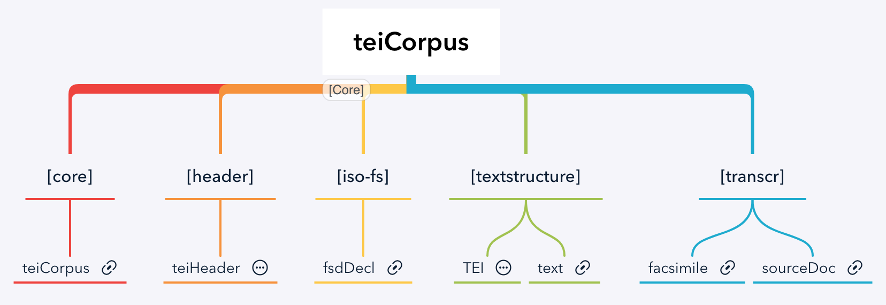

<h3 style="font-size: 16px;"><i>Primary sources</i> &mdash; module [transcr]</h3>

<h4 style="font-size: 14px;">classes d'<code>&#64;attributs</code></h4>
<ul>
<li><a href="https://www.tei-c.org/release/doc/tei-p5-doc/fr/html/ref-att.coordinated.html" target="_blank">att.coordinated<a/> : pour positionner les coordonnées à deux dimensions (x, y) &mdash; liste des membres <code>&lt;line&gt;</code> | <code>&lt;surface&gt;</code> | <code>&lt;zone&gt;</code>
<p>&#8702; teidata.pointer : <code>&#64;start</code> <br>
&#8702; <a href="https://www.tei-c.org/release/doc/tei-p5-doc/en/html/ref-teidata.numeric.html" target="_blank">teidata.numeric</a> : <code>&#64;ulx</code> | <code>&#64;uly</code> | <code>&#64;lrx</code> | <code>&#64;lry</code><br>
&#8702; <a href="https://www.tei-c.org/release/doc/tei-p5-doc/en/html/ref-teidata.point.html" target="_blank">teidata.point</a> : <code>&#64;points</code></p>
</li>
<li><a href="https://www.tei-c.org/release/doc/tei-p5-doc/en/html/ref-att.global.change.html" target="_blank">att.global.change<a/> : pour spécifier à “ses” <code>&lt;element&gt;</code>s membre les différents états ou révisions &mdash; tous les membres de <a href="https://www.tei-c.org/release/doc/tei-p5-doc/fr/html/ref-att.global.html" target="_blank">att.global</a><br>
<p>&#8702; teidata.pointer : <code>&#64;change</code></p>
</li>
<li><a href="https://www.tei-c.org/release/doc/tei-p5-doc/en/html/ref-att.global.facs.html" target="_blank">att.global.facs</a> : pour exprimer la correspondance entre un élément correspondant à une transcription d'une partie d’une image représentant ce texte ou dans son intégralité &mdash; tous les membres de <a href="https://www.tei-c.org/release/doc/tei-p5-doc/fr/html/ref-att.global.html" target="_blank">att.global</a><br>
<p>&#8702; teidata.pointer : <code>&#64;facs</code></p>
</li>
</ul>


<hr style="padding-top: 20px; padding-bottom: 10px">
<h2 style="font-size: 20px; color: #808080;"><a id="xslt_intro" style="color: #808080">6.III. Brève introduction à <code>XSLT</code></a> </h2>
<p style="text-align: justify"><code>XSLT</code> est un langage <code>XML</code>, de ce fait il doit respecter le même schéma sémantique. Un fichier <code>XSLT</code> fait <u>automatiquement référence à un document <code>XML</code> ou <code>TEI</code></u> ; un certain nombre d'instructions sera écrite selon des normes d'encodage rigoureuses (ou des règles sémantiques).</p>

<h3 style="font-size: 16px;"> <code>XSL</code> <i>vs</i> <code>XSLT</code></h3>
<p style="text-align: justify"><code>XSL</code> comprend deux sous-ensembles de transformation eXtensible Stylesheet Language Transformation (abr. “XSLT”) et <a href="https://fr.wikibooks.org/wiki/Programmation_XML/XSL-FO" target="_blank">eXtensible Stylesheet Language Formatting Objects</a> (abr. “XSL-FO”). <code>XSLT</code> permet de transformer un fichier <code>XML</code> ou <code>TEI</code></u> grâce aux instructions transmises en <code>XSL</code>. Cette transformation permettra d'afficher les données encodées ciblées du fichier <code>TEI</code> (ou <code>XML</code>) &mdash; on parle de “moteur” ou de “<i>processor</i>” XSLT ; tandis que l'encodage <code>XSL-FO</code> permet de générer un format de sortie d'un document (PDF par exemple) &mdash; qui ne peut être affiché dans un navigateur. Cependant, aujourd'hui <code>XSL-FO</code> est formellement nommé appelé <code>XSL</code>. <br>
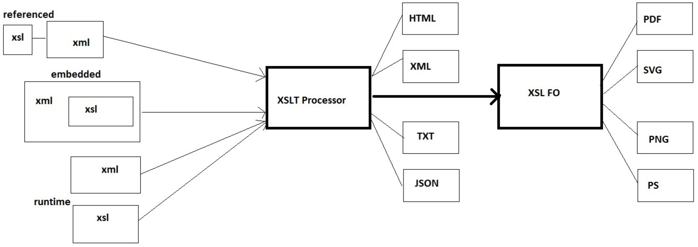<br><br>
<span style="font-size: 10px">Source <a href="https://stackoverflow.com/users/1697099/premraj" target="_blank">Premraj</a> dans la conversation <a href="https://stackoverflow.com/questions/740404/whats-the-difference-between-xslt-and-xsl-fo">What's the difference between XSLT and XSL-FO?</a></span></p>
<br>
<p>La syntaxe varie aussi pour donner les instructions :<br>
&#8702; de transformation avec <code>XSLT</code> : <code>xsl:ELEMENT</code><br>
&#8702; de formattage avec <code>XSL-FO</code> : <code>fo:INSTRUCTION</code><br>
&#8702; exemple :</p>
```{xml}
<!-- Exemple emprunté http://w3schools.sinsixx.com/xslfo/xslfo_xslt.asp.htm -->
<!-- Instruction de formatage d'un document XML ou TEI en utilisant dans l'exemple ci-dessous une syntaxe identique à CSS -->
<!-- Voir également http://w3schools.sinsixx.com/xslfo/xslfo_blocks.asp.htm -->
<fo:block
    font-size="14pt" font-family="verdana" color="red"
    space-before="5mm" space-after="5mm">
    <!-- element “apply-templates”, on selectionne tous les nœuds XML/TEI dans l'ordre -->
    <xsl:apply-templates/>
</fo:block>
```
<br>
<p>Pour les styles, voir également la discussion <a href="https://stackoverflow.com/questions/17495152/using-external-css-in-xsl-fo" target="_blank">Using external CSS in XSL-FO</a>.</p>
<h3 style="font-size: 16px;"> Instructions <code>XSLT</code></h3>
<p style="text-align: justify">A la suite de l'exemple pour <a href="#tei_biblio_ex">les références bibliographiques</a>, voici un exemple d'encodage <code>XSLT</code>.</code>
<p>D'abord le titre de la section dans laquelle les références bibliographiques s'afficheront :
```{xml}
<!-- syntaxe HTML -->
<h2>Linguistics - philology</h2>
<!-- syntaxe XSLT -->
<xsl:apply-templates select="listBibl[@sortKey='linguistics']/bibl">
    <xsl:sort select="author[1]//surname" data-type="text" order="ascending"/>
</xsl:apply-templates>
```
<br>
<p style="text-align: justify"><code>&lt;xsl:element&gt;</code>s <code>XSL</code> : <a href="http://xmlfr.org/w3c/TR/xslt/#element-apply-templates" target="_blank"><code>apply-template</code></a> | <a href="http://xmlfr.org/w3c/TR/xslt/#element-sort" target="_blank"><code>sort</code></a></p>
<p style="text-align: justify">Attributs : <code>select</code> | <code>data-type</code></p>
&#8702; Sélection du <code>XPath</code> de la catégorie à afficher : <code>&lt;listBibl/bibl&gt;</code> dont le <code>&#64;sortKey</code> est “linguistics” dans le doc <code>TEI</code>.<br>
&#8702; La première information bibliographique commence par le nom de famille de l'auteur, par ordre alphabétique croissant.</p>
<p>Puis la sélection de chaque type de références. Il est indispensable de donner le chemin pour chaque descendant de <code>&lt;bibl&gt;</code> de sorte que toutes les informations relatives aux références soient affichées :</p>
```{xml}
<!-- aperçu partiel de l'encodage, voir le fichier complet sur GitHub -->
<xsl:template match="listBibl[@sortKey]/bibl">
    <xsl:variable name="referenced-bibl" select="key('bibl', @xml:id)"/>
    <xsl:variable name="bibl" select="$referenced-bibl/string-join(@xml:id, '')"/>
    <xsl:variable name="bibl-author1" as="xs:string*" select="$referenced-bibl/string-join(author[@n='1']/persName/concat(surname, ', ', forename))"/>
    <xsl:variable name="bibl-author2" as="xs:string*" select="$referenced-bibl/string-join((author[@n='2']/persName/concat(forename, ', ', surname), ''))"/>
    <xsl:variable name="bibl-author3" as="xs:string*" select="$referenced-bibl/string-join((author[@n='3']/persName/concat(forename, ', ', surname), ''))"/>
    <xsl:variable name="bibl-date" as="xs:string*" select="$referenced-bibl/string-join((date[1], '. '), '')"/>
    <xsl:variable name="bibl-article" as="xs:string*" select="$referenced-bibl/string-join(title[@level='a'], '')"/>
    <xsl:variable name="bibl-journal" as="xs:string*" select="$referenced-bibl/string-join(title[@level='j'], '')"/>
    <xsl:variable name="bibl-book-m" as="xs:string*" select="$referenced-bibl/string-join(title[@level='m'],'')"/>
    <xsl:variable name="bibl-book-s" as="xs:string*" select="$referenced-bibl/string-join(title[@level='s'],'')"/>
    <xsl:variable name="bibl-editor" as="xs:string*" select="$referenced-bibl/string-join(descendant-or-self::bibl[@xml:id]/editor[@n]/persName/concat(substring(forename, 1, 1), '. ', surname), ', ')"/>
    <xsl:variable name="bibl-biblScope-page" as="xs:string*" select="$referenced-bibl/string-join(biblScope[@unit='page'], '')"/>
    <xsl:variable name="bibl-biblScope-pp" as="xs:string*" select="$referenced-bibl/string-join(biblScope[@unit='pp'], '')"/>
    <xsl:variable name="bibl-biblScope-issue" as="xs:string*" select="$referenced-bibl/string-join(biblScope[@unit='issue'], '.')"/>
    <xsl:variable name="bibl-publisher" as="xs:string*" select="$referenced-bibl/string-join((publisher, '. '), '')"/>
    <xsl:variable name="bibl-idno" as="xs:string*" select="$referenced-bibl/string-join((idno, '.'), '')"/>
    <xsl:variable name="bibl-h-ref" as="xs:string*" select="$referenced-bibl/string-join(child::ref/@target, ', ')"/>
    <xsl:variable name="bibl-ref-date" as="xs:string*" select="$referenced-bibl/string-join(date[@when], '. ')"/>
```
<br>
<h4 style="font-size: 14px;"> Sélection du contenu à afficher</h3>
<p>Généralement, on affiche que partiellement le contenu des données saisies dans un document <code>TEI</code>. Des règles sémantiques seront alors utilisées.</p>
<ul>
<li>Extraction de la valeur d'un nœud, <code>xsl:value-of</code> + l'attribut <code>select="VALEUR"</code></li>
<li>Filtres, exemple <code>xsl:for-each</code></li>
<li>Conditions, exemple <code>xsl:if</code></li>
</ul>
<p style="text-align: justify"><code>&lt;xsl:element&gt;</code>s <code>XSL</code> : <a href="http://xmlfr.org/w3c/TR/xslt/#element-template" target="_blank"><code>template</code></a> | <a href="http://xmlfr.org/w3c/TR/xslt/#varparam" target="_blank"><code>variable</code></a></p>
<br>
<p style="text-align: justify">Note : Depuis <code>XPath 2.0</code>, <code>&lt;XSLT&gt;</code> peut contenir des fonctions (communes à <code>XSLT 2.0</code> et <code>xQuery 1.0</code>) <code>fn:NOM DE LA FONCTION</code> &mdash; voir la dernière mise à jour des fonctions “<a hre="https://www.w3.org/TR/xpath-functions-31/#func-overloading" target="_blank">XPath and XQuery Functions and Operators 3.1</a>” :<br>
accesseur | erreur et Trace | numérique | chaîne | anyURI | boolean | durée, Date, Heure | QName | nœud | séquence | contexte &mdash; <a href="#xpath_fn">source en français</a>.</p>
<p>Conventionnellement, dans un document de transformation <code>XSL</code>, l'expression <code>fn:</code> n'est pas nécessaire.</p>
<p>Affichage dans un navigateur :</p>
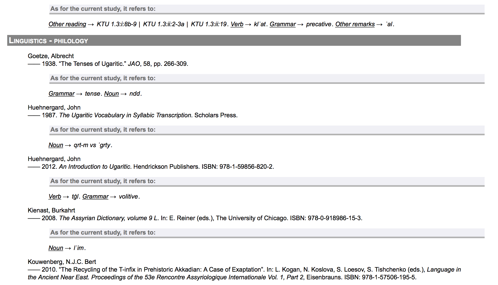


<h4 style="font-size: 14px">Liens utiles</h4>
<ul>
<li><a href="http://xsltfiddle.liberty-development.net" target="_blank">Fiddle</a></li>
<li><a href="https://www.w3schools.com/XML/xsl_elementref.asp" target="_blank">Liste des <code>element</code>s</a></li>
<li>Liste des fonctions <code>fn: prefixe</code> <a href="https://www.w3schools.com/XML/xsl_functions.asp" target="_blank">en anglais</a>, et <a href="http://www.w3bai.com/fr/xsl/xsl_functions.html" target="_blank" id="xpath_fn">en français</a></li>
<li><a href="http://www.w3big.com/fr/schema/default.html" target="_blank">Tutoriel en français</a></li>
<li><a href="https://stackoverflow.com/questions/tagged/xslt" target="_blank">Support dans Stackoverflow</a></li>
<li><a href="https://www.xml.com/pub/a/2003/06/04/tr.html" target="_blank">Expressions régulières utilisées dans <code>XSLT</code></a></li>
</ul>


<hr style="padding-top: 20px; padding-bottom: 10px">
<h2 style="font-size: 20px; color: #808080;"><a id="tei_modNamesdates" style="color: #808080">7.I. Module [namesdates] pour les noms, dates, personnes et lieux géographiques</a></h2>


<ul>
<li><a href="https://www.tei-c.org/release/doc/tei-p5-doc/en/html/ref-att.datable.custom.html" target="_blank">att.datable.custom</a> : normalisation des éléments qui contiennent des évènements datables à la personnalisation des calendriers (autres que grégoriens) ; types de données : <a href=éhttps://www.tei-c.org/release/doc/tei-p5-doc/fr/html/ref-teidata.word.html" target="_blank">teidata.word</a> | <a href="https://www.tei-c.org/release/doc/tei-p5-doc/fr/html/ref-teidata.pointer.html" target="_blank">tei.pointer</a><br>
<p> &#8702; <a href="https://www.tei-c.org/release/doc/tei-p5-doc/en/html/ref-att.datable.html" target="_blank">att.datable</a></li>
<li><a href="https://www.tei-c.org/release/doc/tei-p5-doc/en/html/ref-att.datable.iso.html" target="_blank">att.datable.iso</a> : type de données ISO standards <a href"https://www.tei-c.org/release/doc/tei-p5-doc/fr/html/ref-teidata.temporal.iso.html" target="_blank">teidata.temporal.iso</a> (valeurs temporelles comme une date, une période)<br>
<p> &#8702; <a href="https://www.tei-c.org/release/doc/tei-p5-doc/en/html/ref-att.datable.html" target="_blank">att.datable</a></li>
<li><a href="https://www.tei-c.org/release/doc/tei-p5-doc/en/html/ref-model.persNamePart.html" target="_blank">model.persNamePart</a></li>
</ul>

<h3 style="font-size: 16px">En détail : type de données et classe d'<code>&#64;ttribut</code>s</h3>

<ul>
<li>Relation entre deux ou plusieurs entités (<a href="https://tei-c.org/Vault/P5/2.7.0/doc/tei-p5-doc/fr/html/ref-att.canonical.html" target="_blank">att.canonical</a> [tei] | a href="https://www.tei-c.org/release/doc/tei-p5-doc/en/html/ref-att.naming.html" target="_blank">att.naming</a> [tei] | <a href="https://www.tei-c.org/release/doc/tei-p5-doc/en/html/ref-att.global.responsibility.html" target="_blank">att.global.responsability</a> [tei]<br>
<p> &#8702; data.text : <code>&#64;key</code> (att.canonical) &mdash; chaîne de caractères Unicode
```{xml}
<!-- source https://tei-c.org/Vault/P5/2.7.0/doc/tei-p5-doc/fr/html/ref-att.canonical.html -->
<nationality notBefore="2002-01-15" key="US"/>
```
&#8702; data.pointer : <code>&#64;ref</code> &mdash; localiser une adresse avec une URI | <code>&#64;nymRef</code> &mdash; fait référence au nom canonique <br>
```{xml}
<!-- @ref -->
<!-- source https://tei-c.org/Vault/P5/2.7.0/doc/tei-p5-doc/fr/html/ND.html -->
That silly man <name ref="http://www.example.com/personography.xml#DPB1" type="person">David Paul Brown</name> has suffered

<!--  @nymRef -->
<!-- source https://tei-c.org/Vault/P5/2.7.0/doc/tei-p5-doc/fr/html/ND.html#NDNYM -->
<listNym>
 <nym xml:id="N123">
  <form>Antony</form>
 </nym>
<!-- other nym definitions here -->
</listNym>
<forename nymRef="#N123">Tony</forename> Blair
```

&#8702; <a href="https://tei-c.org/Vault/P5/2.7.0/doc/tei-p5-doc/fr/html/ref-data.enumerated.html" target="_blank"> data.enumerated</a> : <code>&#64;role</code> 
```{xml}
<!-- source https://tei-c.org/Vault/P5/2.7.0/doc/tei-p5-doc/fr/html/ND.html -->
That silly man <name role="politician" type="person">David Paul Brown</name> has suffered ...</a>
```
&#8702; <a href="https://www.tei-c.org/release/doc/tei-p5-doc/en/html/ref-teidata.probCert.html" target="_blank">teidata.probCert</a> : <code>&#64;cert</code> 
```{xml}
<!-- source https://www.tei-c.org/release/doc/tei-p5-doc/en/html/ND.html#NDNA -->
<event type="birth" resp="#XYZ" cert="high">
```
</p>
</li>
<li>Relative aux dates <a href="https://www.tei-c.org/release/doc/tei-p5-doc/en/html/ref-att.datable.html" target="_blank">att.dattable</a> [tei] | <a href="https://www.tei-c.org/release/doc/tei-p5-doc/en/html/ref-att.datable.w3c.html" target="_blank">att.data.w3c [tei]</a> | <a href="https://www.tei-c.org/release/doc/tei-p5-doc/en/html/ref-att.duration.w3c.html" target="_blank">att.duration.w3c</a> [tei]<br>
<p>&#8702; teidata.pointer : <code>&#64;calendar</code> | <code>&#64;period</code><br>
&#8702; <a href="https://www.tei-c.org/release/doc/tei-p5-doc/en/html/ref-teidata.temporal.w3c.html" target="_blank">teidata.temporel.w3c</a> : <code>&#64;when</code> | <code>&#64;noteBefore</code> | <code>&#64;notAfter</code> | <code>&#64;from</code> | <code>&#64;to</code><br>
```{xml}
<!-- source https://www.tei-c.org/release/doc/tei-p5-doc/en/html/ND.html -->
<date when-iso="13">fourteenth
 century</date>
<date when-iso="1301/1400">fourteenth century</date>
<date when-iso="1301/P100Y">fourteenth century</date>
```
&#8702; <a href="https://www.tei-c.org/release/doc/tei-p5-doc/en/html/ref-teidata.duration.w3c.html" target="_blank">teidata.duration.w3c</a> [tei] : <code>&#64;dur</code> &mdash précise la durée<br>
```{xml}
<!-- source https://www.tei-c.org/release/doc/tei-p5-doc/en/html/ND.html -->
I reached the station <time when="14:15:00">
 <time dur="PT30M0S">precisely half an hour</time>
 <offset>after</offset>
 <time when="13:45:00" type="occasion">the departure of the afternoon train to Boston</time>
</time>
```
<li>
</ul>

<hr style="padding-top: 20px; padding-bottom: 10px">
<h2 style="font-size: 20px; color: #808080;"><a id="regex" style="color: #808080">7.II. Brève introduction aux expressions régulières (REGEX)</a></h2>

<hr style="height: 1px; border: 0; color: black; background-color: black;">
<span style="font-size: 14px; color: #708090">Vanessa Bigot Juloux (EPHE-PSL, Andrews University)</span>


