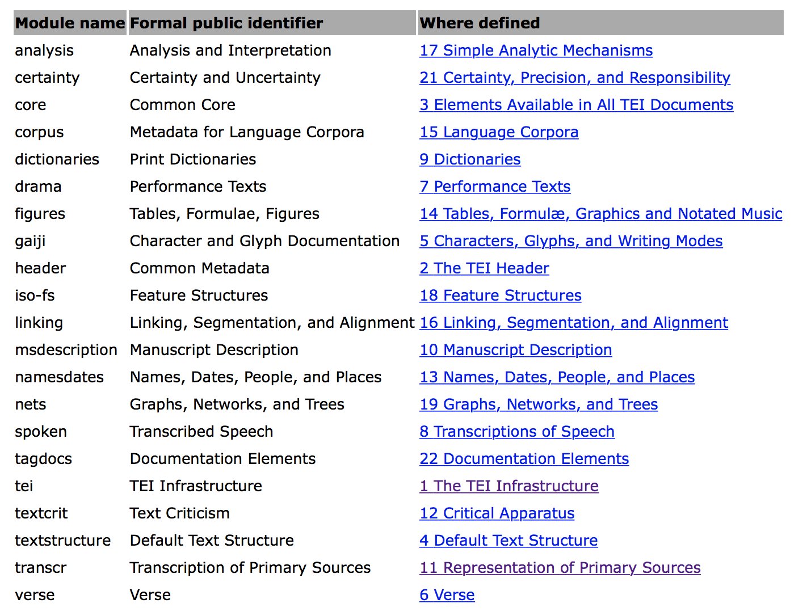
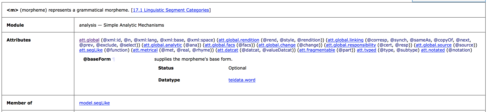
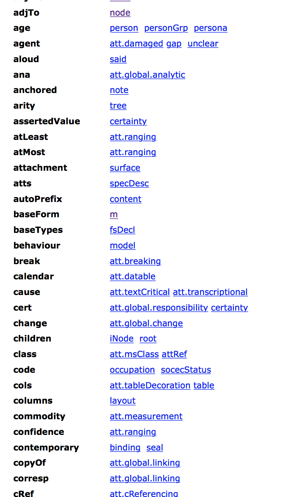
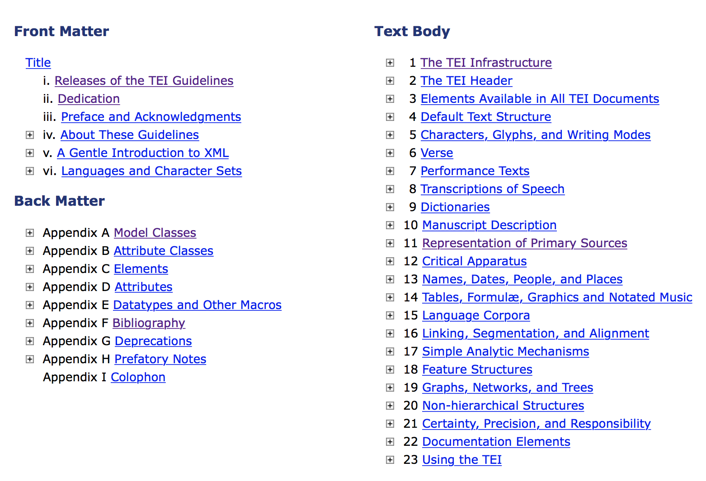

Introduction à l'encodage TEI
========================================================
author: Vanessa Bigot Juloux (EPHE-PSL, Andrews University)
autosize: true
css: Introduction_encodage_TEI.css

## Dans le cadre des formations “Humanités numériques” EPHE-PSL

Introduction à l'encodage TEI (1/15)
========================================================
id: tei_sommaire

## Sommaire

### Séance du 17 avril 2019

<ul style="font-size: 30x; list-style-type:upper-roman">
<li><a href="#/tei_xml_bref">En bref...</a></li>
<li><a href="#/abcdaire_semantique">Bref abécédaire sémantique</a>.</li>
<li><a href="#/tei_vs_xml"><code>TEI</code> versus <code>XML</code></a>.</li>
<li><a href="#/pourquoi_tei">Pourquoi utiliser l’encodage <code>TEI</code></a>.</li>
<li><a href="#/tei_questions_semantique">Questions de sémantique : module (notamment pour les <i>primary sources</i>), <code>&lt;element&gt;</code>, <code>@attribut</code>.</a></li>
<li><a href="#/tei_autres_langages">Autres langages à appréhender pour afficher les données <code>TEI</code> dans un navigateur : <code>CSS</code> et <code>XSLT</code></a> (brève introduction au cours de la <a>6e séance</a>).</li>
<li><a href="#/tei_guidelines">Comprendre les <code>TEI</code> <i>guidelines</i> (tei-c.org) — notamment class, model.</a> </li>
<li><a href="#/tei_assistance">Assistance et groupes d’entraide en ligne (liste francophone Renater, liste anglophone TEI-L, TEI GitHub, Slack, Stackoverflow)</a>.</li>
<li>Exercices pratiques : utilisation des <code>TEI</code> guidelines.</li>
</ul>

Vanessa Bigot Juloux (EPHE-PSL, Andrews University)

Introduction à l'encodage TEI (2/15)
========================================================
id: tei_xml_bref

 
## I. En bref...

- L'<i>Extensible Markup Language</i> (abr. `XML`) a été développé en 1996. 
- La <i>Text Encoding Initiative</i> (abr. `TEI`) a été créé en 1987. En 2000, le consortium `TEI-C` voit le jour ; <a href="https://tei-c.org/about/mission/" target="_blank">sa mission</a> : développer et maintenir les lignes directrices de la `TEI` -- il s'agit principalement d'un groupement de chercheurs internationaux qui collaborent au développement de la `TEI`, élus pour une période de 3 ans renouvelables au sein du <a href="https://tei-c.org/activities/Council/" target="_blank">`TEI` Technical Council</a>. Les recommandations sont disponibles sur le site <a href="https://www.tei-c.org/release/doc/tei-p5-doc/en/html/index.html" target="_blank">tei-c.org</a> et régulièrement mises à jour -- actuellement, version 3.5.0 de `TEI P5`. Voir section “<a href="#/tei_guidelines">Comprendre les guidelines</a>”.

Complément de lecture : BURNARD, Lou. Qu’est-ce que la Text Encoding Initiative ? Nouvelle édition [en ligne]. Marseille : OpenEdition Press, 2015. Disponible sur Internet : <a href="http://books.openedition.org/oep/1237" target="_blank">http://books.openedition.org/oep/1237</a>. ISBN : 9782821855816. DOI : 10.4000/books.oep.1237.

<b><a href="#/tei_sommaire" style="color: white">Sommaire >></a></b>

Vanessa Bigot Juloux (EPHE-PSL, Andrews University)

Introduction à l'encodage TEI (3/15)
========================================================
id: abcdaire_semantique

## II. Bref abécédaire sémantique

<ul>
<li><i>Markup language</i> : un système pour annoter un document à partir d'une codification syntaxique qui est aisément identifiable par rapport au contenu à analyser. <i>Markup languages</i> : <code>LaTeX</code>, <code>HTML</code>, <code>XHTML</code>, ainsi que les langages issus de <code>XML</code>, Resource Description Framework, (abr. <code>RDF</code>), Web Ontology Language (abr. <code>OWL</code>) et bien sûr, <code>TEI</code> -- il n'est pas rare de lire <code>TEI-XML</code>.</li>
<li>Balise(s) (= <i>tag(s)</i>) : Une balise est une <u>unité syntaxique</u> qui sera comprise et interprétée par un programme. Elle est entourée de deux chevrons ouvrant et fermant “</code><</code>” et “<code>></code>” ; par exemple pour indiquer respectivement le commencement et la fin d'un paragraphe :  
&lt;</code>p<code>></code> “texte du paragraphe” &lt;</code>/p<code>></code>. "p" qui suit le chevron ouvrant de la balise ouvrante indique ici que l'information contenue entre la balise ouvrante et fermante est un paragraphe (voir III. <a href="#/tei_element">Questions de sémantique : <code>&lt;element&gt;</code></a>) 
On parle de <u>balises ouvrante et fermante</u> -- ou de balises de début et de fin. Notez que pour la balise fermante (qui suit le contenu), le chevron fermant est précédé de <code>/</code>. 
Il existe également une <u>balise d'élément vide</u> lorsque il n'y a pas d'information à ajouter entre une balise ouvrante et une balise fermante. Par exemple : &lt;</code>img src="adresse de l'image à insérer" /<code>></code> ou encore un saut de ligne  &lt;</code>br /<code>></code>. Notez que le chevron fermant la balise d'élément vide est précédé de <code>/</code>.</li>
</ul>

<b><a href="#/tei_sommaire" style="color: white">Sommaire >></a></b>

Vanessa Bigot Juloux (EPHE-PSL, Andrews University)

Introduction à l'encodage TEI (4/15)
========================================================
id: tei_vs_xml

 
## III. `TEI` versus `XML`

- [Principaux points communs entre l'encodage <i>Text Encoding Initiative</i> (`TEI`) et <i>Extensible Markup Language</i> (`XML`)](#/tei_vs_xml_points_communs)
- [Différences entre l'encodage `TEI` et `XML`](#/tei_vs_xml_differences)

<b><a href="#/tei_sommaire" style="color: white">Sommaire >></a></b>

Vanessa Bigot Juloux (EPHE-PSL, Andrews University)

Introduction à l'encodage TEI (5/15)
========================================================
id: tei_vs_xml_points_communs

 
## III. `TEI` versus `XML` (`1/2`)
### Principaux points communs entre l'encodage `TEI` et `XML` 

<ol style="font-size: 30px">
<li> <code>TEI</code> et <code>XML</code> sont une forme de <i>Standard Generalized Markup Language</i>, abr. <code>SGML</code>, autrement dit un <b>langage de description</b> à balises (= <i>tag(s)</i>), permettant ainsi d'enrichir l'information désirée.</li>
<li> Un document <code>TEI</code> et <code>XML</code> a des <b>balises</b> insérées qui permettent de <u>structurer</u> l'information, par exemple en titre, chapitre, paragraphe, etc., en fonction du matériel étudié (livre, manuscrit, tablette...).  
</li>
<li>Pour situer un contenu balisé dans un document <code>TEI</code> et <code>XML</code>, le vocabulaire généalogique est utilisé : parent, enfant, frère, ancêtre, descendant (<i>parent, child, sibling, ancestor, descendent</i>) -- Voir XPath, <a href="">séance 2</a>.
<li><code>TEI</code> et <code>XML</code> sont des <b>métalangages</b>, c'est-à-dire qu'ils ont tous les deux une grammaire particulière avec une syntaxe et une sémantique qu'ils leur sont propres. </li>
<li><code>TEI</code> et <code>XML</code> sont tous les deux <b>extensibles</b> : en fonction des besoins, l'utilisateur peut créer ses propres balises (<i>tags</i>) ou langage.</li>
</ol>

<b><a href="#/tei_sommaire" style="color: white">Sommaire >></a></b>

Vanessa Bigot Juloux (EPHE-PSL, Andrews University)

Introduction à l'encodage TEI (6/15)
========================================================
id: tei_vs_xml_differences

## III. `TEI` versus `XML` (`2/2`)
### Différences entre l'encodage `TEI` et `XML`

<ul style="list-style-type:decimal; font-size: 30px ; line-height: 1em">
<li>L'encodage <code>XML</code> est encodé selon la norme du <code>XML</code> décrite par le <i><a href="http://www.w3c.org/xml" target="_blank">World Wide Web Consortium</a></i><a href="#1">1</a>, abr. W3C (<a href="http://www.w3c.org/xml" target="_blank">http://www.w3c.org/xml</a>) ; tandis que l'encodage <code>TEI</code> est encodé selon la norme du <i><a href="https://www.tei-c.org" target="_blank">Text Encoding Initiative Consortium</a></i> (<a href="https://www.tei-c.org" target="_blank">https://www.tei-c.org</a>).</li>
<li><code>XML</code> est très largement utilisé pour distribuer les données sur Internet, permettre l'échange d'information entre les programmes, ainsi que par les traitements de texte ; tandis que l'encodage <code>TEI</code> va être utilisé pour une utilisation plus spécifique en particulier l'analyse de sources primaires.</li>
<li><code>XML</code> est interopérable, c'est-à-dire qu'ils permettent la communication entre différents outils existants ou futurs, sans qu'il ne soit nécessaire de modifier le code ; tandis que la <code>TEI</code> est interchangeable, c'est-à-dire qu'elle permet l'échange de communication pour l'analyse des textes de différents corpus -- d'ailleur le “I” de <code>TEI</code> a quelques fois valeur de <i>interchange</i> -- au sujet de la <code>TEI</code> interopérable <i>vs</i> interchangeable : <cite>« TEI tags are usually of type 1, because they are the result of human interpretation. Most other XML tags, however, are of type 2 ».</cite> (Schmidt, 2014<a href="#2">2</a>).</li>
<li>La syntaxe de <code>XML</code> est moins précise que celle de la <code>TEI</code> pour l'encodage de documents textuels.  </li>
</ul>

Complément de lecture :  BURNARD, Lou. La TEI et le XML In : Qu’est-ce que la Text Encoding Initiative ? [en ligne]. Marseille : OpenEdition Press, 2015. Disponible sur Internet : <a href="http://books.openedition.org/oep/1298" target="_blank">http://books.openedition.org/oep/1298</a>. ISBN : 9782821855816. DOI : 10.4000/books.oep.1298.

<a id="1">[1]</a> : <a href="https://www.w3.org/Consortium/" target="_blank">https://www.w3.org/Consortium/</a> 
<a id="2">[2]</a> : Desmond Schmidt, « Towards an Interoperable Digital Scholarly Edition », Journal of the Text Encoding Initiative [Online], Issue 7 | November 2014, Online since 01 January 2014. URL : <a href="http://journals.openedition.org/jtei/979" target="_blank">http://journals.openedition.org/jtei/979</a> ; DOI : 10.4000/jtei.979.

<b><a href="#/tei_sommaire" style="color: white">Sommaire >></a></b>

Vanessa Bigot Juloux (EPHE-PSL, Andrews University)

Introduction à l'encodage TEI (7/15)
========================================================
id: pourquoi_tei

## IV. Pourquoi utiliser l’encodage `TEI` (`1/2`)

<cite><i>La TEI met l’accent sur ce qui est partagé par tous les types de documents, qu’ils soient représentés physiquement sous une forme numérique sur un disque ou une carte mémoire, sous une forme imprimée comme un livre ou un journal, sous une forme écrite comme un manuscrit ou un codex, ou sous une forme inscrite dans la pierre ou sur une tablette de cire. Cette continuité facilite la migration du texte depuis des manifestations plus anciennes, comme l’imprimé ou le manuscrit, vers d’autres plus récentes comme le disque ou l’écran. C’est pourquoi la vision de la TEI de ce qu’est le texte est largement conditionnée par ce que le texte a été dans le passé, sans toutefois trop compromettre ce que le texte peut devenir dans le futur. Elle essaie de traiter tous les types de documents numériques de la même façon, qu’ils soient « nativement numériques » ou non.</i></cite>  

Source : BURNARD, Lou. Qu’est-ce que la Text Encoding Initiative ? Nouvelle édition [en ligne]. Marseille : OpenEdition Press, 2015. Disponible sur Internet : <a href="http://books.openedition.org/oep/1237" target="_blank">http://books.openedition.org/oep/1237</a>. ISBN : 9782821855816. DOI : 10.4000/books.oep.1237.

<b><a href="#/tei_sommaire" style="color: white">Sommaire >></a></b>

Vanessa Bigot Juloux (EPHE-PSL, Andrews University)

Introduction à l'encodage TEI (8/15)
========================================================
id: pourquoi_tei

## IV. Pourquoi utiliser l’encodage `TEI` (`2/2`)

<b><a href="#/tei_sommaire" style="color: white">Sommaire >></a></b>

Vanessa Bigot Juloux (EPHE-PSL, Andrews University)

Introduction à l'encodage TEI (9/15)
========================================================
id: tei_questions_semantique

 
## V. Questions de sémantique : module (notamment pour les <i>primary sources</i>), `<element>`, `@attribut` (`1/4`)

<ul>
<li><a href="#/tei_module">module</a></li>
<li><a href="#/tei_element"><code>&lt;element&gt;</code></a></li>
<li><a href="#/tei_attribut"><code>@attribut</code></a></li>
</ul>

<b><a href="#/tei_sommaire" style="color: white">Sommaire >></a></b>

Vanessa Bigot Juloux (EPHE-PSL, Andrews University)

Introduction à l'encodage TEI (10/15)
========================================================
id: tei_module

## V. Questions de sémantique : module (notamment pour les <i>primary sources</i>), `<element>`, `@attribut` (`2/4`)
### module

Un document `TEI` est constitué de plusieurs modules dans lesquels se trouvent plusieurs [`<element>`s](#/tei_element) et [`@attributs`](#/tei_attribut).  

<b><a href="#/tei_sommaire" style="color: white">Sommaire >></a></b>

Vanessa Bigot Juloux (EPHE-PSL, Andrews University)

Introduction à l'encodage TEI (11/15)
========================================================
id: tei_element

## V. Questions de sémantique : module (notamment pour les <i>primary sources</i>), `<element>`, `@attribut` (`3/4`)
### &lt;</code>element</code>></code>

A ce jour, il existe 573 `<element>`s</code> (voir le détail de la dernière mise à jour, janvier 2019 : [3c0c64ec4](https://github.com/TEIC/TEI/commit/3c0c64ec4)) de la TEI P5 [version 3.5.0](https://www.tei-c.org/release/doc/tei-p5-doc/readme-3.5.0.html)).

<cite><i>In the context of Text Encoding Initiative (<code>TEI</code>), an element, which is a markup tag, is the first criterion to analyze data (text, image, sound, etc.). An element is conventionally marked up <code>&lt;element&gt;</code>. The markup data in between the opening tag “<” and
the closing tag “>” indicates the type of information analyzed: for example, <code>&lt;persName&gt;</code>ʿAnatu<code>&lt;/persName&gt;</code>. One can easily understand that the element refers
to a personal name, in this example ʿAnatu … Generally, the semantic of an <element> is very close in its abbreviation to its English vocabulary. For example, <code>&lt;interp&gt;</code> stands for interpretation, <code>&lt;w&gt;</code> for word, <code>&lt;l&gt;</code> for line, and <code>&lt;text&gt;</code> for text.</i></cite> (Bigot Juloux, 2018<a href="#1">1</a>)

<a id="1">[1]</a> : Bigot Juloux, Vanessa. 2018, <a href=https://brill.com/view/title/34932?format=HC" target="_blank"><i>CyberResearch on the Ancient Near East and Neighboring Regions. Case Studies on Archaeological Data, Objects, Texts, and Digital Archiving</i></a>, Vanessa Bigot Juloux, Amy Rebecca Gansell, Alessandro di Ludovico (eds.), Leiden: Brill. 

<b><a href="#/tei_sommaire" style="color: white">Sommaire >></a></b>

Vanessa Bigot Juloux (EPHE-PSL, Andrews University)

Introduction à l'encodage TEI (12/15)
========================================================
id: tei_attribut

## V. Questions de sémantique : module (notamment pour les <i>primary sources</i>), `<element>`, `@attribut` (`4/4`)
### <code>@attribut</code>

Il existe 261 `@attribut`s. Un élément a généralement un `@attribut` auquel on ajoute une valeur.

<b><a href="#/tei_sommaire" style="color: white">Sommaire >></a></b>

Vanessa Bigot Juloux (EPHE-PSL, Andrews University)

Introduction à l'encodage TEI (13/15)
========================================================
id: tei_autres_langages

 
## V. Autres langages à appréhender pour afficher les données `TEI` dans un navigateur : `CSS` et `XSLT`

- [Cascading Style Sheets](https://www.w3.org/Style/CSS/Overview.en.html) (abr. `CSS`, feuille de style) : permet d'ajouter du style à vos documents qui seront disponibles au format numérique -- couleur, alignement, polices de caractère, tableaux, espacement... Un groupe du travail du `W3C` met à jour régulièrement les recommandations pour chaque style -- exemple, [color](https://www.w3.org/TR/2019/WD-css-color-4-20190305/). [w3schools.com](https://www.w3schools.com/css/default.asp) propose une liste de tous les styles avec des exemples. 
Il existe des services de validation en ligne pour vérifier si vos styles sont conformes aux normes recommandées par les `W3C`, en particulier pour être aux normes “accessibilité pour tous” -- exemple [CSS Validation Service](http://www.css-validator.org/validator.html.fr).
- `XSLT`

<b><a href="#/tei_sommaire" style="color: white">Sommaire >></a></b>

Vanessa Bigot Juloux (EPHE-PSL, Andrews University)

Introduction à l'encodage TEI (14/15)
========================================================
id: tei_guidelines

## VII. Comprendre les `TEI` <i>guidelines</i> (tei-c.org) — notamment class, model.

<b><a href="#/tei_sommaire" style="color: white">Sommaire >></a></b>

Vanessa Bigot Juloux (EPHE-PSL, Andrews University)

Introduction à l'encodage TEI (15/15)
========================================================
id: tei_assistance

## VIII. Assistance et groupes d’entraide en ligne (liste francophone Renater, liste anglophone `TEI-L`, `TEI` GitHub, Slack, Stackoverflow)

<ul>
<li>Liste francophone Renater <a href="https://groupes.renater.fr/wiki/tei-fr/index" target="_blank">TEI-FR</a> -- seulement accessible aux abonnés</li>
<li>Liste anglophone <a href="https://listserv.brown.edu/archives/cgi-bin/wa?A0=TEI-L" target="_blank">TEI-L</a> (Adresse de message rie pour s'incrire <a href="mailto:TEI-L-subscribe-request@LISTSERV.BROWN.EDU">TEI-L-subscribe-request@LISTSERV.BROWN.EDU</a> ou directement sur la <a href="http://listserv.brown.edu/archives/cgi-bin/wa?SUBED1=tei-l&A=1" target="_blank">page de la liste</a>) -- les <a href="https://listserv.brown.edu/cgi-bin/wa?INDEX&X=OC9503DB3F87D081B81&Y=vanessajuloux%40me.com" target="_blank">archives</a> sont accessibles sans abonnement.</li>
<li>Les wikis de la <code>TEI</code> dont certains sont liés aux <code>SIG</code>s -- voir <a href="">la séance 6</a> consacrée notamment au <code>TEI SIG</code>s.
<li><a href="https://github.com/TEIC/TEI/issues" target="_blank">TEI GitHub</a> -- plutôt pour des questions niveau avancé</li>
<li><a href="https://digitalhumanities.slack.com" target="_blank">Slack</a> -- exemple, <i>channel</i> “<a href="https://digitalhumanities.slack.com/messages/C0CH64EHM/" target=_blank">textencoding</a>”.</li>
<li><a href="https://stackoverflow.com/questions/tagged/tei" target="_blank">Stackoverflow</a> -- <a href="https://stackoverflow.com/questions/ask/wizard" target="_blank"><i>Wizard</i></a> (assitant) pour néophyte sur Stackoverflow</li>
</ul>
 
Littérature scientifique : [https://journals.openedition.org/jtei/](https://journals.openedition.org/jtei/)
 
Rester informé-e, fil Twitter [`TEI` Consortium](https://twitter.com/TEIconsortium)

<b><a href="#/tei_sommaire" style="color: white">Sommaire >></a></b>

Vanessa Bigot Juloux (EPHE-PSL, Andrews University)

